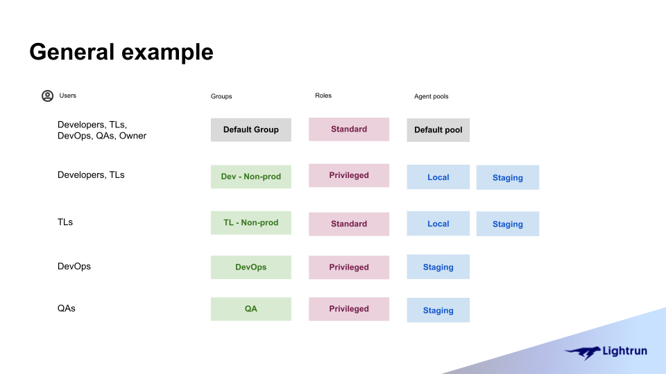
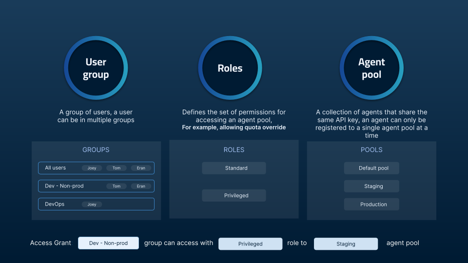

# Groups, Roles and Agent Pools

To debug with Lightrun, you must have a Lightrun agent running alongside your application. As your organization and codebase grow, so will the number of agents and users. It is important to be able to effectively manage how users in your organization interact with the Lightrun agents running in your system. 

In this guide, you will learn how user and agent management works in Lightrun. We will explain the concepts of groups and agent pools, and how to configure a group's access with roles.

## Understanding Groups, Roles, and Agent Pools.

For new users in your organization to debug with Lightrun, they must be part of a group with access to an agent pool. The amount of access a group has to an agent pool depends on the role assigned to the group. 

The following image describes how group access works and how it relates to an organization:

### Groups

A group represents a group of users in Lightrun. With Lightrun groups, you can manage users that all need the same access and permissions to a particular resource, like an agent pool. For example, you can create a group for your DevOps team and grant privileged access to all DevOps-related agent pools to the group instead of adding permissions for each individual user.

When you register a Lightrun account for your organization, you are assigned a default group that comprises every user in your organization. Users with a System admin role can create, manage, and delete groups. System admin users can also assign other users in their organization Group admin roles to help manage a group.

To learn more about groups:

- [Learn about groups](/rbac/groups/)
- [Manage groups](/rbac/manage-groups/)

### Agent Pools

Agent Pools are isolated groups of agents with a unique name and an API key. Lightrun agents can only be assigned to a single agent pool; hence agent pools provide a convenient way to securely isolate a group of agents from other agents in your system. 

You are assigned a default agent pool when you create a Lightrun account for your organization. Lightrun users with a System admin or Group admin role can create new agent pools, or grant groups access to an existing agent pool. To add agents to an agent pool, use the API key assigned to the agent pool as your Lightrun secret key. The agent will be assigned to the desired agent pool by the Lightrun server. 
 
To learn more about Agent Pools:

- [Learn about Agent Pools](/rbac/pools/)
- [Manage Agent Pools](/rbac/manage-pools/)

### Roles

With Lightrun roles, you can configure a Group's permissions to its agent pool.

There are two roles currently available in Lightrun:

- **Standard Role** - The standard role grants regular access to an agent pool. This includes creating Lightrun actions with the agents in the agent pool, full access to action data, etc. 

- **Privileged Role** - The privileged role grants a group the ability to ignore agent quota limitations in addition to the permissions granted by the Standard role. 

!!! note
	Lightrun roles are predefined and are not editable.

In addition to the role assigned to a group, individual users can also be assigned elevated roles. Elevated roles grant group members more privileges than others. A DevOps group might have a standard role, but a single user can be granted an elevated privileged role. This elevated privileged role allows them to perform certain actions, like ignoring the preset agent quota limitations, which other group members cannot.

