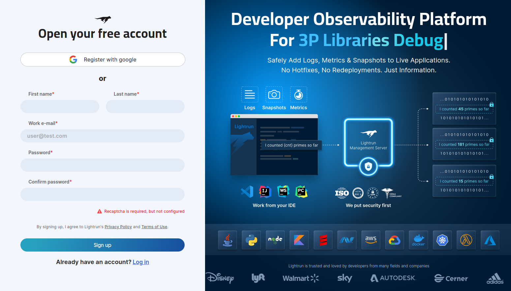

# Create your account

To begin debugging with Lightrun, you must first become a member of your organization's Lightrun account. Your administrator needs to send you a direct invite or a registration link. Administrators can view how to onboard users, see [Onboard new users](/useradmin-roles/#onboard).

## Set up your Lightrun account

1. Click the link in the Welcome to Lightrun email or  directly from the registration link.
2. 
   The **Open your account** page opens.

    

3. Fill in your details, choose a company name, and click **Sign Up**, or click **Register with Google** to use your Google account.

    You will be redirected to the next onboarding stage, which contains instructions on how to [install the Lightrun Plugin](/introduction/plugins/).
