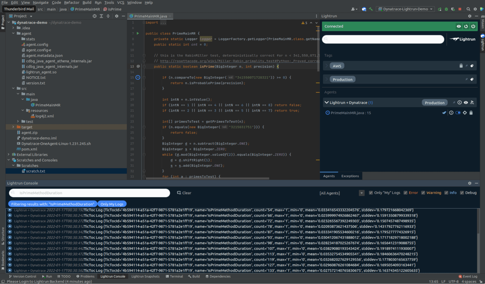

# Dynatrace Old documentation (not relevant)
## Introduction

--8<-- "ux-reference/manager-role-only.md"

Lightrun allows Developers and DevOps Engineers to add real-time logs, metrics and traces to live applications on demand. This means, in practice, that information that was once only accessible by pushing new code with more instrumentation or by profiling your application, can now be added on demand - right from the IDE. 

In this post we’ll share how to integrate Dynatrace and Lightrun in order to allow two complementing ways of understanding your application:

1. We’ll add real-time Lightrun Logs in order to enrich the existing application log stream in [Dynatrace Log Monitoring](https://www.dynatrace.com/support/help/how-to-use-dynatrace/log-monitoring).
1. We’ll add real-time Lightrun Metrics in order to inspect code-level performance issues in the application and display them in a [Dynatrace Dashboard](https://www.dynatrace.com/support/help/how-to-use-dynatrace/dashboards-and-charts).

## Set Up Dynatrace

To get started with Dynatrace, sign up for a Dynatrace SaaS trial [here](https://www.dynatrace.com/trial/).

We’ll need two different components from Dynatrace in order to get started: One [Dynatrace ActiveGate](https://www.dynatrace.com/support/help/setup-and-configuration/dynatrace-activegate) and one (or more) [Dynatrace OneAgents](https://www.dynatrace.com/support/help/setup-and-configuration/dynatrace-oneagent).


### Install Dynatrace’s ActiveGate

Lightrun Metrics - which are added during runtime - need to be pushed into Dynatrace for us to visualize them in a dashboard.

When these [metrics are piped](https://docs.lightrun.com/metrics/#view-metric-output) from the IDE Plugin to the Lightrun Management Server, they can be exported out into a remote StatsD daemon. Since Dynatrace supports StatsD, we could pipe the Metrics from StatsD into Dynatrace - and to do so, an [Environment ActiveGate](https://www.dynatrace.com/support/help/setup-and-configuration/dynatrace-activegate) must be configured and installed with the StatsD module enabled.

Before we dive into the configuration, let’s take a look at the eventual topology of the Lightrun Metrics ingestion:

<figure markdown>
  { width="800" }
  <figcaption>Integration Topology</figcaption>
</figure>

Note that all Lightrun Metrics created in your application will be first piped to the Lightrun Management Server, from there into the StatsD module on Dynatrace’s ActiveGate, and from there into Dynatrace SaaS instance itself.

Now that we’ve got the topology down, let’s start the configuration process:

!!! note "Where should I run this?" 
    For the purposes of this tutorial, it is sufficient to run an ActiveGate on any machine that has a publicly accessible IP address, and on which you can open a dedicated port (whichever port that may be). If you don’t have a dedicated machine for this purpose, you can use your own local machine using a tool like [ngrok](https://ngrok.com/) and its [multiple tunnel](https://ngrok.com/docs#multiple-tunnels) feature. See this [great StackOverflow answer](https://stackoverflow.com/questions/25522360/ngrok-configure-multiple-port-in-same-domain) for a good reference on the needed configuration steps. 

1. [Install ActiveGate](https://www.dynatrace.com/support/help/setup-and-configuration/dynatrace-activegate) on any machine that has at least one incoming port open (we’ll use that port for communication with the Lightrun Management Server).

2. Enable the StatsD module in the ActiveGate [extensionsuser.conf](https://www.dynatrace.com/support/help/how-to-use-dynatrace/metrics/metric-ingestion/ingestion-methods/statsd?_ga=2.64168367.1223238208.1642325491-554820607.1637593864) file. To do so, first locate the file - on Linux, for examplem, it can be found in ` /var/lib/dynatrace/remotepluginmodule/agent/conf/extensionsuser.conf`.

3. Add the following block to the file:

    ```conf
    #STATSD configuration
    statsdenabled=true
    StatsdPort=8125
    ```

4. Reset the `extensionsmodule` and `dynatracegateway` services to apply the changes:

    ```shell
    sudo systemctl restart extensionsmodule
    sudo systemctl restart dynatracegateway
    ```

!!! note "StatsD Ports"
    The 8125 port selection is due to StatsD default port being 8125 - it can be changed to any port you’d like.

Your ActiveGate should now be properly installed and configured.

### Install Dynatrace’s OneAgent(s)

Each host whose logs you’d like to collect and whose metrics you’d like to export would need a [Dynatrace OneAgent](https://www.dynatrace.com/support/help/setup-and-configuration/dynatrace-oneagent) installed on it. Visit [this page](https://www.dynatrace.com/support/help/setup-and-configuration/dynatrace-oneagent/installation-and-operation) to install a Dynatrace OneAgent for each host you’d like to monitor with Dynatrace.

!!! note "Running a Single OneAgent"
    For the purposes of this tutorial, it is sufficient to run a **single** OneAgent on the machine that runs your applications. We will use a simple Java application running on a VM, but any machine that can run a Dynatrace OneAgent will suffice.  

## Set Up Lightrun

### Introduction to Lightrun

Lightrun is an IDE-based, real-time troubleshooting tool for live applications. That means, in practice, that you can ask your applications code-level questions and get on-demand answers, right in your IDE. In addition, information collected by Lightrun Actions (including Logs and Metrics) can be exported into Dynatrace for easy consumption and visualisation.

Lightrun works by adding an agent to your live applications. That agent (which we will install below) allows for real-time instrumentation - and exporting - of Lightrun Actions.

Lightrun’s agent can coexist with Dynatrace’s agents without any issues, as both types of agents rely on different capabilities of the underlying system: Dynatrace’s agent works on the operating system level - it is a separate binary - while Lightrun’s agent works on the runtime level (the JVM, V8 etc…) and usually delivered as a runtime agent or language-level package.

In order to add Lightrun Actions to a Live Application, you need to install one of our IDE plugins (which we will also install below) and spring up a Lightrun Agent with your application.

Let’s install Lightrun!

### Install Lightrun’s IDE Plugin

This example details how to install Lightrun with the Java agent and the IntelliJ plugin, but similar instructions apply to our [Node.js](https://docs.lightrun.com/node/agent/) and [Python](https://docs.lightrun.com/python/agent/) agents as well. 

1. Sign up for a (free!) Lightrun account [here](https://app.lightrun.com/api/oauth/register).
1. Once you’ve signed up, you’ll be directed to the IDE Plugin installation page - please choose the relevant IDE from the screen:

  

1. Once the plugin is installed, the Lightrun sidebar will pop up, asking you to log in to the plugin. Click the “Login” button: 

  

1. Once you’ve installed the IDE plugin, a green “Connected” button should show up on top of the plugin:

  

### Install Lightrun’s Agent

Now that you’ve got the IDE plugin installed and configured, we can spin up our application with the Lightrun agent. 

Before that, though, make sure you have an application ready to work with - the one we’ll add the Lightrun Logs & Metrics to. For the purposes of demonstration in this tutorial, we will use the following sample app. Once you’ve downloaded it to a folder on your computer, follow these steps to install the agent:

1. Go back to the Lightrun Cloud website and click “Next”. In the next page download the Lightrun agent into the same folder your application resides in:

  

1. If you haven’t done so already and you’re using a Java application, compile it:

  ```shell
  javac -g PrimeMainLogToFile.java 
  ```

1. In order for Dynatrace to correctly consume Lightrun Logs and Metrics, we’d need to modify the agent.config file located in the agent’s folder. Find the following line in the 
file:

  ```conf
  com.lightrun.DynamicLog.FileHandler.formatter=none
  ```

  And change it to:

  ```conf
  com.lightrun.DynamicLog.FileHandler.formatter=json
  ```

  This will cause all Lightrun Logs and Metrics to be emitted in JSON format, allowing Dynatrace to consume and parse them in an easier way.

1. Run the application with the Lightrun agent attached (instructions change based on your specific runtime, of course):

  ```shell
  java -agentpath:agent/lightrun_agent.so PrimeMainLogToFile
  ```

1. You should see the Lightrun agent attached to the application in the IDE’s sidebar:

  

!!! note "Compiling With Debug Symbols"

    You might have noted that we compiled our application with debug symbols - the `-g` flag is used for generating debugging information during compilation. While this is done automatically by most IDEs nowadays, it is required for Lightrun to operate well. If you're setting up for using Lightrun in production, make sure your build server or CI agents are set to compile Java with debug information.

!!! note "Configuring The Lightrun Agent"
    The way to specify parameters for agent configuration changes based on the language your application is written in. For Node.js instructions [look here](https://docs.lightrun.com/node/agent-configuration/) and for Python instructions [look here](https://docs.lightrun.com/python/agent-configuration/).

Now that your application is up with the agent, we’d need to do one more step on the Lightrun side - configuring Lightrun’s StatsD integration.

### Enabling Lightrun’s StatsD Integration

In order to pipe Lightrun metrics to Dynatrace, we would need to use a tool called [StatsD](https://github.com/statsd/statsd). We’ve installed StatsD in a previous part of the tutorial as part of the Dynatrace ActiveGate installation, and now need to configure Lightrun to work with the StatsD daemon. 

To do so, we’ll enable the StatsD integration from the Lightrun Management Console:

1. Go to [https://app.lightrun.com/](https://app.lightrun.com/)
1. Click on the “Manager” menu and then on “System Integrations”:

  

1. Click the “Settings” button on the StatsD integration:

  

1. Fill in the URL of the **application host**, i.e. where the Dynatrace ActiveGate is running, and port 8125 (or whichever port you’ve selected in the previous step):

  

Lightrun’s StatsD integration is now active, and will pipe all Lightrun Metrics your users create into the Dynatrace ActiveGate instance.

## Connect Lightrun and Dynatrace

### Our Application

This demonstration will use a simple Java application, but Dynatrace supports a [wide variety of technologies](https://www.dynatrace.com/support/help/technology-support).

The demo application, if you haven’t downloaded it already, is available from here. The application includes a prime number counter that runs through all the numbers in a given range, and outputs - at the end of execution - the amount of primes it found. In addition, throughout the application’s run, it emits a log line every 1000 numbers counted that mentions how many primes were found so far.

We’ve compiled and ran the application in previous stages, so now all that’s left is to add Lightrun Actions and see them in Dynatrace! 

### Enrich existing Dynatrace Logs with Lightrun Logs

Dynatrace auto-instruments a large amount of information for you once you set up your application with it. Specifically, Dynatrace knows how to collect logs from your host system, given that those logs are placed in a folder that’s already collecting system logs.

Our application writes every log line it outputs to `/tmp/PrimeMainMR.log`, which is not located in one of the directories Dynatrace collects from. We’d need to add the log location manually - in Dynatrace, go into Settings -> Log Monitoring -> Log Sources and Storage, and check the checkbox next to `/tmp/PrimeMainMR.log`:

  

While you’re there, we can also choose to collect the Lightrun Log file, which contains all emitted Lightrun Logs and Metrics:

  

!!! note
    Please make sure you’re selecting: 

    `/tmp/lightrun_file_handler_logs1.log`

    And not:

    `/tmp/lightrun_file_handler_logs0.log`

Now go into Dynatrace Log monitoring, and then filter on the left hand side for `/tmp/PrimeMainMR.log`. This will show you all the static application logs, those that were added by developers when they originally developed the application:

  


It’s now time to add some Lightrun Logs too - go back into the IDE, right-click next to line 87 and click on Lightrun -> Log:

  


When the “Create a Log” screen shows up, enter the following information:

* **Format:** `We have counted {i} numbers so far, out of which only {cnt} are prime` 
* **Condition:** `i % 500 == 1000 && i % 1000 != 0`

  

In practice, we’re augmenting the existing logging (that emits how many primes have been found every **1000** numbers counted) with more granular logging (which emits how many primes have been found every **500** numbers counted). This is a great example of Lightrun enriching application logs with more granular information that wasn’t originally available in the existing logs.

Once the log has been accepted by Lightrun, a callout in the IDE’s editor pane will be displayed where the Lightrun Log has been added, and you will see the Lightrun Logs emitted in the Lightrun Console at the bottom of the IDE (and also in the application’s stdout):

  

Going back to Dynatrace, you would also be able to view the Lightrun Logs! Just go into “Logs” from the Dynatrace Sidebar and check the correct file name:

  
  
### Enrich existing Dynatrace Metrics with Lightrun Metrics

In addition to logs, Dynatrace also collects a wide array of metrics from your running hosts and applications. Go to “Metrics” on the Dynatrace sidebar to explore all the possible metrics - in the filtered view below, for example, we can see all the JVM-related metrics that Dynatrace automatically collects from running applications:

  

Lightrun also offers a wide array of metrics you can choose to instrument in real-time:

1. **Counter** - Checks how many times a specific line of code was reached
1. **Method Duration** - Checks how much time a specific method took to execute
1. **TicToc / Measure Duration** - Checks how much time any arbitrarily-selected block of code took to execute
1. **Custom Metric** - Checks what is the value of any code-level variable over time 

In our case, we’d like to focus on Method Duration - and specifically, how much time the `isPrime()` method took to execute. Let’s first add a Lightrun metric in line 13 (right next to the definition of the `isPrime()` method): 

  

In the “Create Method Duration” window that opens, let’s give the Metric a descriptive name - in our case `IsPrimeMethodDuration` - which we will use to later find it in Dynatrace:

  

If we go to the Lightrun Console and filter for IsPrimeMethodDuration, then we will be able to see the emitted Metrics in real-time:

  

!!! note "Lightrun Metrics Are Continiously Emitted"

    Metrics are continuously emitted every roughly 3 seconds **regardless** of whether the method was invoked or not. This allows us to create smooth, continuous graphs without relying on the method to actually be invoked in every window of time.

In our case, we can see a few interesting pieces of information about the method - the **count** of time it was invoked, the **minimum** and **maximum** amount of time it took to execute, the **mean** time it took to execute and the **standard deviation** in the measurements.

Since we set up the ActiveGate, StatsD and Lightrun integration already, if we go to “Metrics” in the Dynatrace sidebar we should be able to immediately see the Lightrun Metrics appear:

  

Clicking on the “Details” arrow next to any of the metrics will show you a graph of that metric:

  

However, this is not very comfortable for ongoing metric visualization. Fortunately, now that the Lightrun Metrics are available within Dynatrace, we can add them to a Dynatrace Dashboard.

### Visualize Lightrun Metrics in a Dynatrace Dashboard

In the Dynatrace sidebar, click “Dashboards” and then “Create a Dashboard” in the window that opens. In the view below you can see we have already created one Dashboard called “Lightrun Metrics”:

  

In the window that opens, click “Edit” and then drag a graph tile into the dashboard and position it wherever you’d like. We named our tile “IsPrimeMethodDuration Graph”:

  

We now need to attach the correct metric to it. Click the tile and then click “Configure Tile”:

  

In the Data Explorer window that opens, search for `IsPrimeMethodDuration.mean`, since this is the Metric we’d like to instrument:

  

Click “Run Query” to get a graph of the metric:

   

Click “Save Changes to Dashboard” and wait for the dashboard to load - our Metric should now appear on the dashboard!

  

## Conclusion

We’ve now seen how to integrate Lightrun Logs and Metrics into Dynatrace Log Monitoring and Dynatrace Dashboards. This integration enables full-cycle observability - the ability to surface issues using Dynatrace, inspect them using Dynatrace itself and add real-time, on-demand, code-level Lightrun Actions that are piped into Dynatrace without ever stopping the application.

If you have any ideas for other integrations or in need of assistance, [reach out to us](mailto:support@lightrun.com) directly and we’ll be happy to talk to you.

## Troubleshooting

For general Lightrun troubleshooting information, please visit [our docs](https://docs.lightrun.com/). 

### Enable piping in the Lightrun Plugin

If you’re not seeing Logs or Metrics in Dynatrace or in the Lightrun Console, make sure to [pipe](https://docs.lightrun.com/getting-around/#piping) the Lightrun Actions - click on the the “pipe” symbol next to the running application, then click on “Both”:

  
 
### Select the correct time frame in Dynatrace

Dynatrace automatically filters displayed information according to a specified time range. If you’re not seeing the relevant Logs or Metrics it might be due to a wrong filter. Click the time range button at the top right of the screen and ensure 

it is configured correctly:

  
