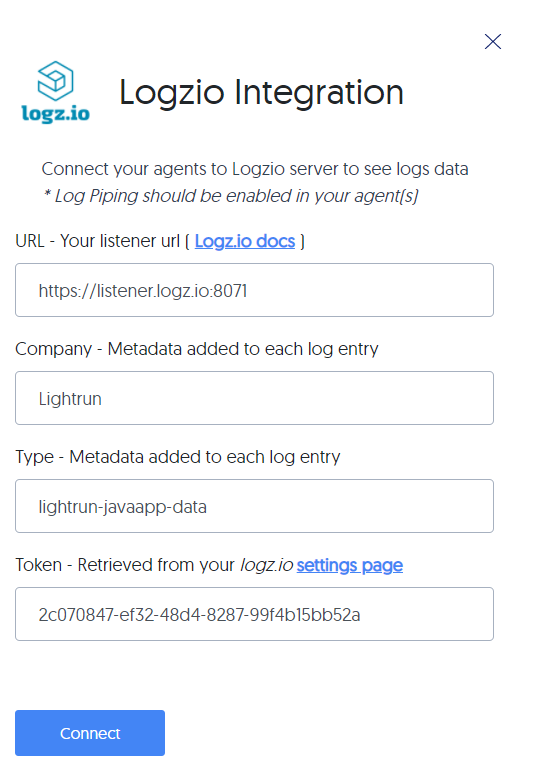

# Integrate with Logz.io

--8<-- "ux-reference/manager-role-only.md"

Logz.io searches and queries your dynamic logs to help you figure out when things go wrong; it receives your metrics and then provides alerts and pattern-based insights, as well as data visualization dashboards. Logz.io can receive data from Lightrun with the help of the Logz.io API key.
 
!!! reqs "Prerequisites"

    Install and configure [Logz.io](https://docs.logz.io/user-guide/tokens/) and then generate and copy a Log shipping API token from your Logz account. For additional help, see their [troubleshooting guide](https://docs.logz.io/user-guide/log-shipping/log-shipping-troubleshooting.html) as well.

    --8<-- "ux-reference/config-pipe.md"

## Connect to and disconnect from Logz.io

--8<-- "ux-reference/navigate-integrations.md"

2. From the **Integrations** page, click **Connect** from the Logz.io card.

    The **Logz.io Integration** window pops up:

    
	
3. Enter the URL for your [Logz.io listener](https://docs.logz.io/user-guide/log-shipping/listener-ip-addresses.html), any metadata you want to have attached to your logs, and paste the Log shipping API token you copied from your Logz.io account.

6.  Click **Connect** and wait for the approval toast message.

7. To disable the configuration, click **Disconnect**.

<!-- 
!!! note 
    If there are several logs per millisecond, sort the logs chronologically per agent by sorting or filtering by the `agentId` field, and then sorting by the `order` field.
-->
