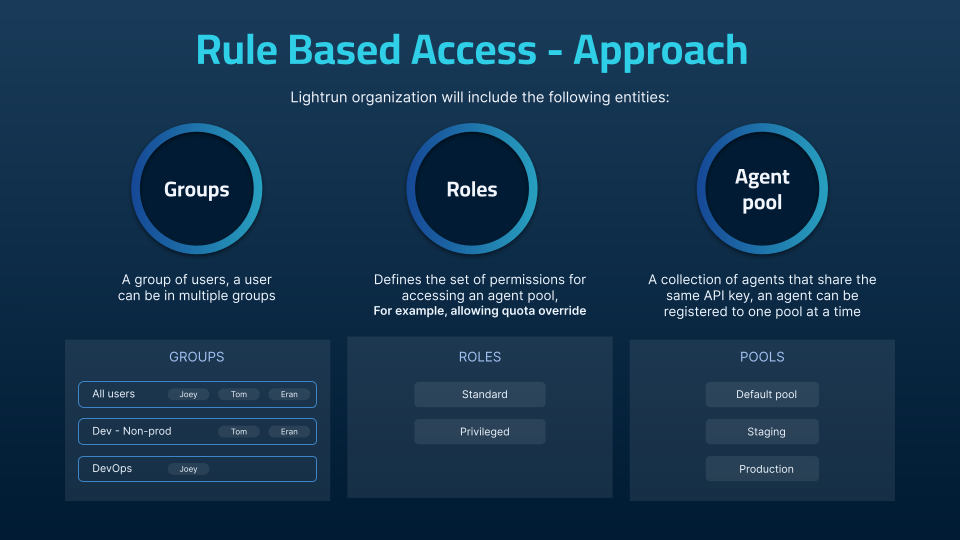

# Lightrun Role-Based Access Control (RBAC)

Lightrun role-based access control (RBAC) helps you manage how users in your organization access and use Lightrun. With RBAC, you can control who has access to your Lightrun resources (like agents), how much access they have (I.e., can limit agent quota limitations), and what resources they can access.

## How Lightrun RBAC works
Lightrun has introduced three main entities to help manage your Lightrun organization:

- Groups
- Roles
- Agent Pools

See [User management concepts](/rbac/concepts/) to learn more about how user management works in Lightrun.

## What can you do with Lightrun RBAC?

The following are some examples of what you can do with the Lightrun role-based access control feature:

- Replicate your organization’s hierarchy in Lightrun - You can organize your Lightrun users into groups based on their position in your organization and assign access to the groups. For example, you can create a group for your Product team and grant Privileged access to every agent pool in your organization.
- Control access to agents -  Organize your Lightrun agents into agent pools, and control who has access or how much access your users have to the agent pools with groups and roles. 
- Allow user groups in your organization to debug independently - Organizing your users and agents into groups and agent pools allows users to debug independently from other users. This process makes scaling and managing troubleshooting efforts easier as your team grows.

## Importance of Lightrun RBAC

- **Improved Security**: Lightrun introduces an enterprise-grade security functionality with the RBAC feature. Lightrun RBAC was designed to enhance both the security and governance of users and agents in your organization.

- **Resource Allocation**: By assigning roles and permissions with Lightrun RBAC, administrators can ensure that employees can perform their job functions while limiting access to unnecessary resources.

- **Separation of Duties**: RBAC can help organizations enforce the principle of separation of duties, which is critical for maintaining security and preventing fraud. By assigning roles and permissions to different individuals, organizations can ensure everyone has equal power and control over critical resources.

## Learn more about Lightrun RBAC

- [User management concepts - Groups, Roles, and Agent Pools](/rbac/concepts/)
- [Tutorial on how to setup your Lightrun organization](/rbac/organization/)
- [Manage Users](/rbac/manage-users/)
- [Learn about Groups](/rbac/groups/)
- [Manage Groups](/rbac/manage-groups/)
- [Learn about Agent Pools](/rbac/pools/)
- [Manage Agent Pools](/rbac/manage-pools/)