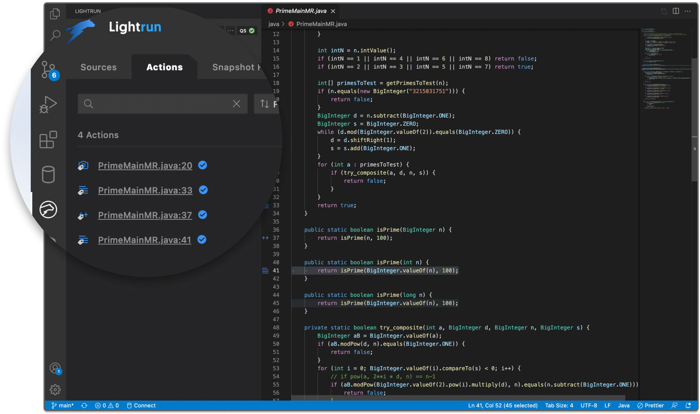
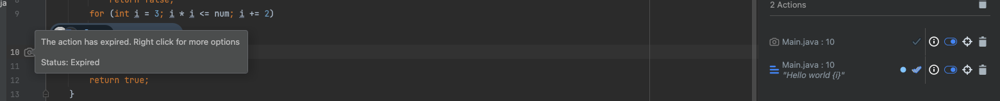
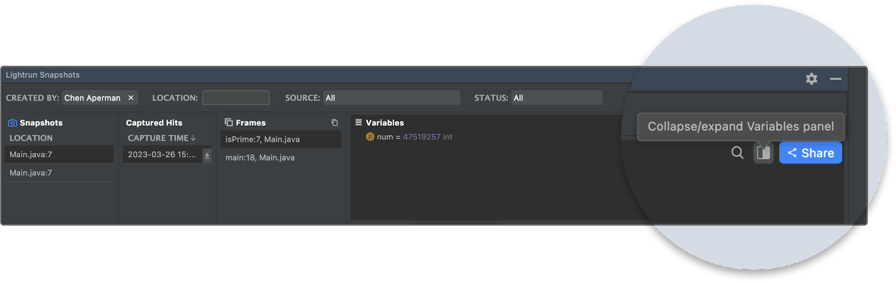
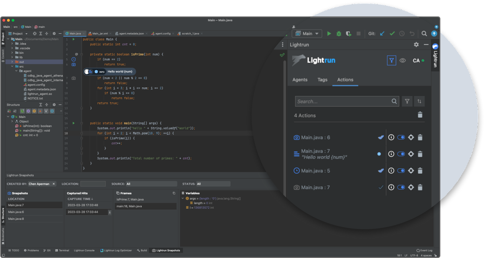

# Version 1.11

## Version 1.11.3

Release Date: April 4, 2023 (SaaS)

### Features & Changes

#### JVM Agent

- The Lightrun Java agent now supports **AutoBoxing** and **Auto-unboxing** of Java variables in Java expressions. Previously, when you try to evaluate an expression containing two different data types, i.e., when you add the following expression `myLongVal == 123` into the following code sample,

  ```java
  Long myLongVal = 123;
  System.out.println(myLongVal);
  ```
  You will get a `Type mismatch error` since the `myLongVal` variable(wrapper class) does not have the same data type as `123` (long primitive data type). The `myLongVal` must be unboxed to its primitive data type equivalent with an unboxing function before you can use it in the expression.

  ```java
  myLongVal.longValue() == 123
  ```
  With the new autoboxing and unboxing feature, the expression will be evaluated successfully since the unboxing process is done automatically by the Lightrun agent. This addition greatly simplifies writing Java expressions, removes the need for manually boxing and unboxing of variables, and helps developers avoid unnecessary errors. For more information on Java expressions, see [Java expressions](/jvm/java-expressions/). 


#### VSCode Plugin

* We have added an Actions view tab to the VSCode Plugin Lightrun sidebar.

  

  From the new Actions view tab, You can:

  - Search for actions with their filename and line number.
  - Filter actions with all, expired, and error statuses.
  - Delete actions.

  For more information, see the [VSCode plugin quick tour](/vscode/vscode-plugin-quick-tour/).

## Version 1.11

**Release Date:** March 28, 2023 (SaaS)

### Features & Changes

#### Lightrun LogOptimizer(™)

- The Lightrun LogOptimizer(™) now supports Windows OS!  The Lightrun LogOptimizer(™) is an automated log optimization solution that scans your current code, or entire codebase, for potential logging issues and returns clear instructions explaining the suspected cases with suggestions on how to fix the logging problem in your IDE.  To learn more about the Lightrun LogOptimizer(™), see [Lightrun LogOptimizer(™)](https://lightrun.com/lightrun-log-optimizer/).

	**Note that the Lightrun LogOptimizer(™) requires the Docker desktop or engine installed and running on your local machine to scan your code base.**

- We have refined the LogOptimizer tool to enable it to work better with Python and Javascript codebases.

#### General

- We have added a new service configuration property called **Expose action output to Lightrun**. Disabling this option will restrict your action output to your application’s standard output(stdout) and prevent your action’s data exposure to Lightrun plugins and installed integrations. This new configuration property helps ensure that Lightrun is not a sub-processor of private data or Personal Identifiable Information (PII), enabling your organization to comply with data privacy laws like GDPR or CCPA. For more information, see [Service configuration](/service-configuration/).

- We have added the Expired status to Lightrun actions. Previously, when an action reached its set time limit, it was assigned the error status. With the new expired status, the number of errors is significantly reduced, and you can now filter expired actions from other actions.

  

- You can now expand and collapse Snapshots data in the VSCode snapshots tab and the JetBrains Snapshot tool window.

    

#### JetBrains Plugin

* We have added an Actions tab to the JetBrains Plugin Lightrun tool window.

  

  From the new Actions tab, You can:

  - Search for actions with their filename and line number.
  - Filter actions with all, expired, and error statuses.
  - Delete actions.
  - View the total action hit count.

  For more information, see the [JetBrains plugin quick tour](/getting-around/).

* You can now bulk delete Lightrun actions in the JetBrains plugin.

#### VSCode Plugin

- You can now view Snapshots data created for over 72 hours in the VSCode snapshots tab. This extended length of snapshots provides longer troubleshooting cycles for developers and supports longer audit processes.

#### Management Portal

- Lightrun platform administrators can now re-invite members from their organizations to the Lightrun platform via email.

### Bug Fixes

#### General

- Fixed Custom Source wrong hit count indication.
- Fixed invokedynamic enabled returning unclear errors. 

#### .NET Agent

- Fixed unsupported metadata tables error.
- Fixed Boolean values showed as Integers in snapshots.
- Fixed null values showed as empty in snapshots.
- Fixed Logpoint has a wrong expression order.
- Fixed .NET agent stops after inserting two actions.
- Fixed invalid file name or line number errors when parsing large PDB files.
