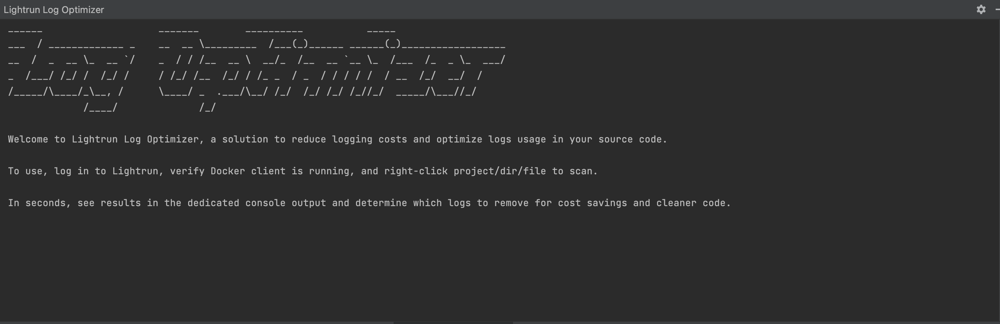

# Version 1.12

## Version 1.12

Release Date: May 16, 2023 (SaaS)

### Features & Changes

#### System for Cross-Domain Identity Management (SCIM)

!!! Update to Release
    As we navigate the pre-GA phase, our team is actively refining and enhancing SCIM for seamless automated user provisioning.   Stay tuned for updates on this exciting addition.

We are excited to announce that Lightrun now supports automated user provisioning using the System for Cross-Domain Identity Management (SCIM) protocol. SCIM allows you to automatically manage and communicate user data and permissions between identity providers (IdP) like Okta or Azure AD and a service provider like Lightrun. This feature helps improve your organization’s data security and streamline workflows. For more information, please reach out to our [support team](https://go.lightrun.com/contact-us). 

#### Agent Pool Key rotation 

  Lightrun now supports API Key rotation. The API Key rotation feature allows you to change compromised or exposed Agent Pool API keys without losing your Agent Pools or action data. This feature increases your control over your Lightrun agents and secures the servers your agents are running on. For more information, see [Agent Pools](/rbac/manage-pools/).

#### Dynatrace Integration

  We have added support for sending metrics data from Lightrun to Dynatrace with the new Lightrun Dynatrace Integration. Dynatrace is an application performance monitoring (APM) and software intelligence solution that gives you visibility and AI-backed answers across your entire digital infrastructure. With the new Lightrun Dynatrace integration, you can import live metrics data from your Lightrun account to your Dynatrace user interface to take advantage of Dynatrace's full-stack monitoring and analytics capabilities. For more information, see [Dynatrace integration](/integrations/dynatrace/).

#### Lightrun LogOptimizer(™)

  We have made improvements to the Lightrun LogOptimizer(™) onboarding process. The prerequisites for running the LogOptimizer have been added to the Lightrun LogOptimizer tool window, and error messages have been made clearer to help customers more quickly resolve any issues that may arise while using the LogOptimizer.

  

#### General

- Lightrun IDE plugins now display a notification when your current plugin version is incompatible with our servers and when a general plugin update is available. This helps you keep up with our new feature releases and improvements. It also makes it easier to take full advantage of Lightrun capabilities.

- Snapshot consoles now filter out hits from deleted snapshots by default.

### Bug Fixes

#### .NET Agent

- Fixed .NET agent evaluating struct properties as class properties.
- Fixed action file path changes from the full path to filename only, resulting in an Invalid Filename or line number error when editing an action on Windows.
- Fixed auto-properties not evaluated in .Net expressions.
- Fixed .NET agent becomes stuck after multiple refresh attempts.
- Fixed Snapshot base class members' evaluation.

#### Lightrun LogOptimizer(™)

- Fixed duplicate log statement flag emitting multiple results for the same method, one per log line.

#### General

- Fixed security vulnerabilities in the Lightrun server.

#### Node.js Agent

- Fixed typescript path resolving issues.