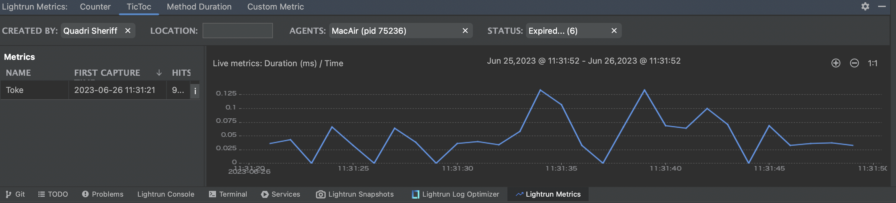

# Version 1.14

## Version 1.14.3

Release Date: September 18, 2023 (On Premise)

This On Premise release contains the contents of all the 1.14.x releases.

### Bug Fixes

- Fixed security vulnerabilities in the Lightrun server.

## Version 1.14.2

Release Date: September 4, 2023 (SaaS)

### Feature Enhancements

#### .Net Agents Support Apple Silicon Macs (M1, M2)

You can now run the .Net Agent on M1 and M2 silicon Macs. This means that you can now create Lightrun actions (dynamic logs, and snapshots) using the .Net Agent.
For more information, see [.Net Agent System Requirements](/dotnet/system-requirements/).

## Version 1.14.1

Release Date: August 28, 2023 (SaaS)

### Feature Enhancements

#### Extended PII redaction Support within Snapshot Actions

In this release, Lightrun extends its PII redaction support within snapshot actions to consist of additional data structures including arrays, lists, and objects for Variable Names. With PII redaction, customers can easily define within the Lightrun platform which data is being exposed throughout the debugging process and ensure maximum data security and privacy. For more information, see [PII Redaction](/data-security/#pii-redaction). 

### Bug Fixes
#### General
This release contains internal fixes to service behavior and performance.

## Version 1.14

Release Date: August 15, 2023 (SaaS)

### Highlights

#### Lightrun Metrics Visualization for Java

We are happy to announce the release of the JetBrains plugin Lightrun Metrics tool window. With the new Lightrun Metrics tool window, you can view and analyze Lightrun metrics data in its dedicated tool window for up to 24 hours, view your metrics data in the context of captured hits, and analyze Lightrun metrics with new helpful visualization graphs. For more information, see [JetBrains Metrics console](/metrics/#lightrun-metrics-toolwindow). Additionally, you can watch our short demo that focuses on utilizing the new tool to perform [Java performance troubleshooting](https://lightrun.com/lightrun-empowers-developers-with-next-generation-metric-tools-for-java-performance-troubleshooting/).

!!! note 
     To enable this feature, please reach out to Lightrun Support, as it is currently available on demand.
     The Lightrun metrics tool window is currently supported for JetBrains IDE and is available on demand. To try out the metrics tool window, please contact our support team.

### Features and Enhancments

#### PII Redaction on Agents: Case Insensitivity Supported on Patterns

When setting PII Redaction patterns, the **Make Case Insensitive** field has been added to the Patterns dialog box to support setting case insensitivity for variables. The default is set to case sensitive only. For more information, see [Data Security](/data-security/#to-configure-pii-redaction).

#### JetBrains Plugin: ‘Data Delay’ Status Mode

To enhance your observability experience, we have added the **Data Delay** status mode to the Lightrun plugin's top menu. When in **Data Delay** mode, you can continue debugging and retrieving Lightrun actions but may encounter a short delay of up to 10 seconds for new agents to be added or snapshot action data to be retrieved from the server.

In **Data Delay** mode, you can fetch the logs immediately by clicking **Refresh** on the menu bar or directly in the log console.

#### Server Log Optimization (On-Premise Only) 

To reduce the out-of-the-box log storage, we have changed the default log levels for Lightrun packages to **DEBUG** and 3rd party packages to **WARNING** in the Logs window in the Lightrun Management Portal.
!!! note 
    To make changes to these default settings, please reach out to Lightrun Support, as it is currently available on demand.

### Bug Fixes

#### General

- Fixed an issue related to PII filters where changing the `Value` to `Variable Name` for an existing pattern would fail.

#### JetBrains Plugin

- Fixed an issue where metrics action data was not being displayed in both the plugin log console and the web console.
- Fixed an issue where snapshot variables with long strings were not retrievable.
- Fixed a Java-related `ConcurrentModificationException` error that was generated when running on Windows.

#### VSCode Plugin

- Fixed an issue specific to the plugin version 1.13 in VSCode, where displaying a captured snapshot caused plugin flickering.
