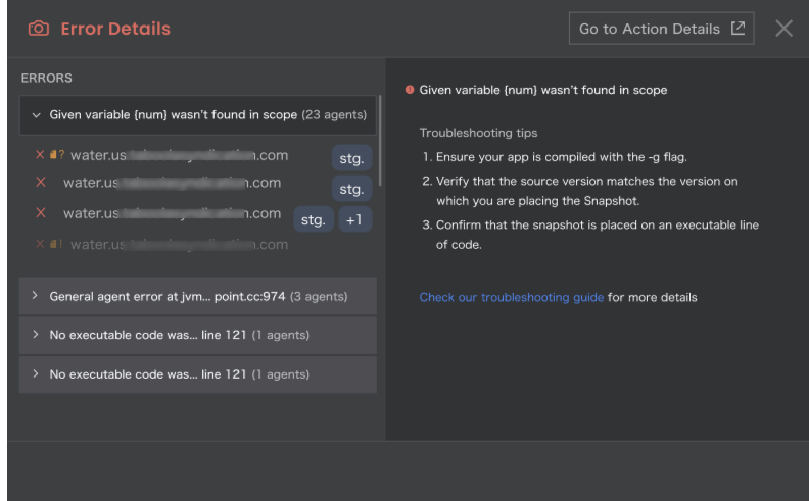

# Version 1.19

## Version 1.19.2

Release Date: November 19, 2023 (On-Premise)

!!! imp "Important"
    
    This On-Premise release incorporates features introduced in the preceding versions 1.17.x, 1.18.x as well as 1.19.0, 1.19.1, and 1.19.2 (SaaS).

### Feature Enhancements

#### Java Agent: Added Wildcard Support for Class Path Indexing Parameters
 
The latest update to the Java Agent introduces - Wildcard Support for Class Path Indexing Parameters. This enhancement empowers users to exercise finer control over the indexing of Java classes within Lightrun. With this new capability, you have the ability to specify an absolute path with a range of filenames using wildcard characters that adhere to glob patterns. As a result, determining which Java classes can be excluded from indexing is now an effortless task. For more information, see [Java Agent Configuration](https://docs.lightrun.com/jvm/agent-configuration/#additional-command-line-flags).

#### Jetbrains Plugin: Error Handling Enhancements

Customer feedback is invaluable to us, and in this release, we have introduced an intuitive **Error Details** module in the Jetbrains IDE. This is helpful in case you encounter an error while placing a Lightrun action, for example, when an action is placed on a non-executable line of code. It is now accessible by right-clicking on the action icon located in the editor gutter and selecting the **Info** option. This information is tagged by an exclamation mark and includes a clear error description, along with actionable guidance on how to resolve the issue. 

Another example of a type of error that is addressed in the **Error Details** module, pertains to source mismatches between a file and agent sources, or when a file cannot be found. 

We have also integrated a set of Troubleshooting How-Tos into the Error Details module. This enhancement empowers you to address issues with precision, guided by specific problem detection.

### Bug Fixes

Fixed security vulnerabilities in the Lightrun server.

## Version 1.19.1

Release Date: November 8, 2023 (SaaS)

### Bug Fix

Fixed an internal bug in the Lightrun server.

## Version 1.19

Release Date: November 5, 2023 (SaaS)

### Feature Enhancements

#### JetBrains Plugin: Troubleshooting How-Tos Now Available in Your Plugin

We're excited to introduce Troubleshooting How-Tos integrated into the Error Details module of your JetBrains Plugin. This enhancement empowers you to address issues with precision, guided by specific problem detection.

#### JetBrains Plugin: GoTo Code Line Enhancement

The Lightrun JetBrains plugin's Go-to-code line capabilities have been improved. You can now navigate to an action’s code line from the Lightrun Console, Actions tab, and Snapshot Hits tab; we’ve also added the ability to select a code line if an action returns multiple options. To learn more about the Lightrun JetBrains plugin, see the [JetBrains plugin quick tour guide](https://docs.lightrun.com/getting-around/).

### Bug Fixes

Fixed an issue related to SSO login, whereby logging into SSO for the first time with a registered account displayed the registration page.

