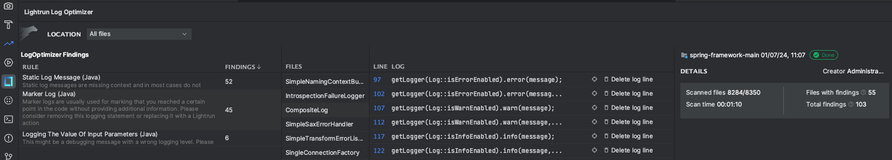

# Version 1.23

## Version 1.23.1

**Release Date**: 2 January, 2024 (SaaS)

### Feature Enhancements

#### LogOptimizer Major Enhancements

We have taken the Lightrun LogOptimizer solution to the next level by introducing the following enhancements:

- A shiny and intuitive new UI.
- Aggregated filtered results.
- Ability to filter results by path.
- Go to suspected logging statement directly from the scan results.
- Ability to delete a log directly from the LogOptimizer.

To learn more, see [LogOptimizer Overview](/logoptimizer/overview/).

### Bug Fixes

Fixed multiple internal bugs and security vulnerabilities in the Lightrun server.

## Version 1.23.0

**Release Date**: 31 December, 2023 (SaaS)

### Highlights

#### Private System API Keys Support

In Lightrun version 1.23.0, we have introduced private system API Keys with AES-128 encryption. This significant enhancement adds an extra layer of security to the application's communication. With this feature, users can now generate API keys through the Lightrun Management Server, creating a secure authentication mechanism for various application requests. This includes requests to SCIM endpoints and Lightrun Integrations, such as Prometheus integration endpoints. For more information, see [Lightrun System API Keys](/api-keys/).

### Bug Fixes

Fixed multiple internal bugs in the Lightrun server.