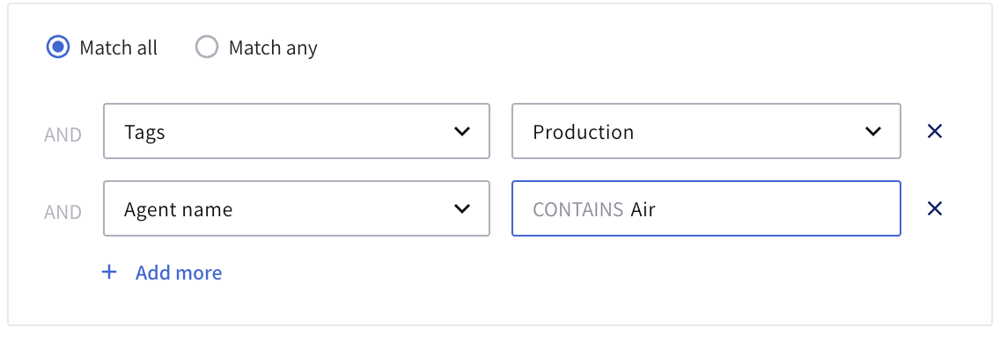
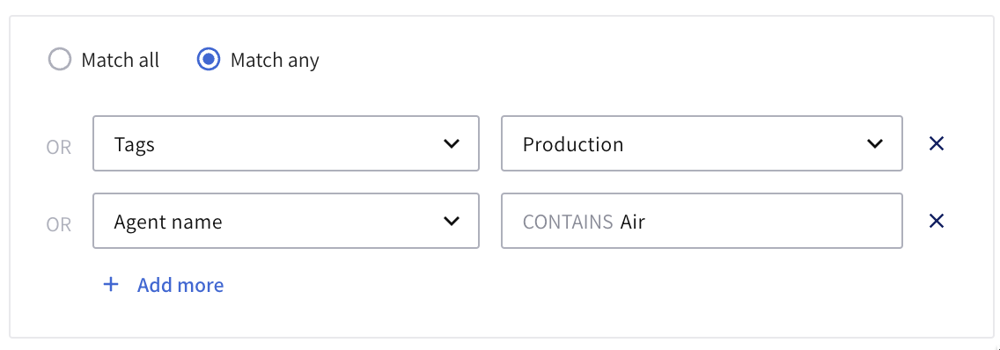

# Lightrun Custom Sources

A Custom Source is a dynamic group of agents and tags defined by a set of conditions, like a shared hostname or tag. Using Custom sources, you can simultaneously apply an action to multiple agents and tags without editing your agent configuration or restarting your server. 

## Differences between Agents, Tags, and Custom Sources.

|Agents|Tags|Custom Sources|
|------|---|---------------|
| Agents are the core of the Lightrun platform.  Lightrun agents run alongside your application and insert Lightrun actions(Logs, Metrics, and Snapshot) added through Lightrun IDE plugins into the application at runtime.| Tagging allows you to group agents using a meaningful name, typically based on a common functionality.|Custom Source is a dynamic group of agents and tags defined by a chosen set of conditions, like a shared property (tag or hostname). |
|When you insert a Lightrun action (dynamic log, snapshot, and metrics) into an agent, the action is tied to the agent's lifetime. Once the agent stops running, the action is deleted. | When you add an action to a tag, the action outlives any individual agent.  The action is tied to the tag, and as agents come and go, they pick up the actions assigned to the tag.|Depending on the custom source conditions, a dynamic list of agents and tags is created when you create a custom source. Lightrun actions added to a custom source are simultaneously applied to every agent and tag in the list. |

## Custom Source conditions

Custom Source conditions dynamically add the relevant agents and/or tags to a Custom Source.  You can create a set of conditions based on two properties.

-  Tag
- Agent Name

You can also set the conditions to **Match any** or **Match all**. 

|**Match any**|**Match all**|
|-------------|-------------|
|An agent or tag will be added to a Custom Source if it meets any of the conditions specified in the custom source.| An agent or tag will only be added to a Custom Source if it meets every condition specified in the custom source. |

For example, the following conditions will only add agents in the `Production` tag that have `Air` in their naming to the Custom Source.

And the following conditions will add every agent with the `Production` tag or `Air` in their naming to the Custom Source.

## Get Started with Custom Sources

-  [Learn how to create and manage Custom Sources in your Lightrun Management Portal.](/custom-sources/)