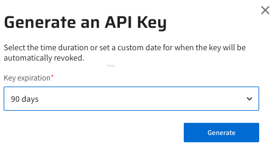

# Lightrun System API Keys

--8<-- "ux-reference/manager-role-only.md"

As of Lightrun version 1.23, you can actively generate and manage your private system API Keys using AES-128 encryption. API keys are assigned per organization and are crucial when configuring SCIM endpoints, and Lightrun Prometheus integration endpoints. As administrators, you need to generate keys in the Lightrun Management Server and then copy them to the target endpoint.

#### Rules and Limitations

- API Keys for Agents Pools use a dedicated mechanism and are managed independently for each Agent Pool. For more information, see [Manage Agent Pools](/rbac/manage-pools/).
- As of version 1.23.0, Lightrun system API Keys are not supported for On-Premise deployments using Docker Compose.
- API Keys expire automatically after the predefined period you set when initially generating the API Key and can also be deactivated at any time. Please note that it is your responsibility to track the validity of the tokens to ensure secure and uninterrupted access.

You have the flexibility to perform various tasks related to API Keys, including:

- [Generate an API Key](/api-keys/#generate)
- [Revoke and delete an API Key](/api-keys/#revoke)

## Generate an API Key {#generate}

1. Log in to your Lightrun account.
2. Click **Settings** on the top right-hand of the taskbar to navigate to the Settings dashboard.
3. Select **API Keys** under **Security** in the Settings dashboard sidebar.

       

4. Click **Generate an API Key**.
    
     

5. (Optional) From the **Key expiration** list, you can leave the default 90 days or select an alternate range.
6. Click **Generate**.
   The key is added to the API Keys list.
   Proceed to copy the API Key to the required application endpoint.

## Revoke and delete an API Key {#revoke}

Revoking and deleting API Keys is crucial for system security. Immediately revoke an API key if it's compromised, misused, hits its usage limit, belongs to an inactive user, is obsolete, or needs regular renewal. Once revoked, the API key denies access to the related service.

!!! Warning
    When an API Key is revoked, all associated integrations will immediately cease to function.
    It is crucial to create a new key before removing the existing one, as the removal will render all integrations using this key inoperable.

1. In the row of the required key, click **Revoke and Delete**.
   
   The **Revoke and Delete the API Key** dialog opens.

     

2. Click **Revoke and delete**. 

   The key is removed from the list.

   