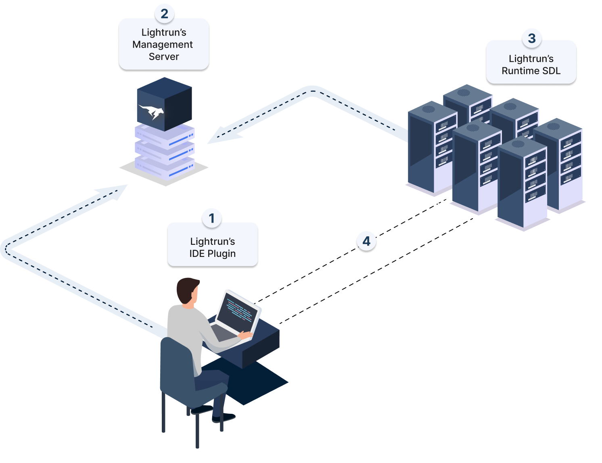

# Lightrun architecture

The Lightrun observability platform is a solution composed of a Lightrun plugin, installed on the developers' computers, Lightrun Agents, installed on live applications, and the Lightrun server.

## Lightrun solution components

The following diagram illustrates the interaction between the 3 main Lightrun components.

 <width="40%">

### Lightrun IDE plugin/ Lightrun CLI

Serving as the client, the majority of the work done with Lightrun, such as troubleshooting, debugging, and performance testing, is performed directly from your integrated development environment (IDE) or the Lightrun CLI.
Using the Lightrun plugin, you can insert Lightrun actions (Logs, Metrics, and Snapshots) anywhere within the source code of your running applications. Whenever you enter a command to insert an action, the agent receives your request.
The plugin is available for popular IDEs (such as VS Code, IntelliJ, and PyCharm).

### Lightrun Management Server

The Lightrun Management Server functions as the "backbone" of the Lightrun Observability Platform, maintaining the state of the system. It offers a Management Portal web UI for configuring administrative tasks and monitoring your agents and entities.
Acting as the intermediary between the Lightrun agent and the Lightrun clients, the Management Server plays a crucial role in coordinating Lightrun Actions as well as privacy and security controls. This includes managing users, data security, system authentication, and other administrative features.

### Lightrun agent

The stateless agent that runs alongside the application is at the heart of the Lightrun platform. The agent lets you dynamically insert Lightrun proprietary actions, including logs, metrics, and snapshots into your running code.

The Lightrun agent never processes, stores, or sends your source code to any third party but includes the Lightrun Sandbox that verifies and validates full integrity of your application’s behavior when running with Lightrun actions. The Lightrun Sandbox guarantees no exceptions, system I/O, system calls, or state/flow changes, and ensures that only read-only code is ever added to your application.

## How Lightrun works

Lightrun operates through a seamless process that enhances code observability and debugging capabilities. This architecture diagram shows how the different Lightrun platform components communicate with one another.

The process illustrated in the diagram is described as follows:

1. Developer adds Lightrun actions

    You begin by adding Lightrun actions directly to your application from the IDE. This allows you to incorporate logs, snapshots, and metrics directly into the running source code of your application, on the fly and in any environment.

2. Management Server processes request

    When a user action is initiated from the Lightrun IDE plugin or CLI, the Lightrun Management Server processes the request. It then sends the request to the Lightrun agent deployed within your application environment. The Agent, residing within your application, verifies the stability, integrity, and security of each requested action through the Lightrun Sandbox before dynamically adding the instrumentation to your application at runtime.

3. Action inserted by agent 

    The verified action is then inserted into your application at a specific location by the Agent during runtime.

4. Data transmission

    The data generated by these actions is transferred back to the developer’s IDE through the Management Server. Once Lightrun actions are added, you can immediately view the output directly from your IDE or from the Management Portal in any web browser.

## What's next

Give Lightrun a try or embark on your journey to experience its debugging capabilities firsthand.

- [Try Lightrun](/get-started/).

- Start using Lightrun in three easy steps:

  1. Install the Lightrun plugin for your IDE:

      - [IntelliJ, PyCharm, and WebStorm](plugin.md)

      - [Visual Studio Code](vscode/vscode-install-plugin.md)

  2. Install the Lightrun agent for your runtime environment:

      - [Java agent](jvm/agent.md){:target="_blank"}

      - [Python agent](python/agent.md){:target="_blank"}

      - [Node.js agent](node/agent.md){:target="_blank"}

      - [.NET agent](dotnet/agent.md){:target="_blank"}

  3. Add your [first action](logs.md){:target="_blank"}.
