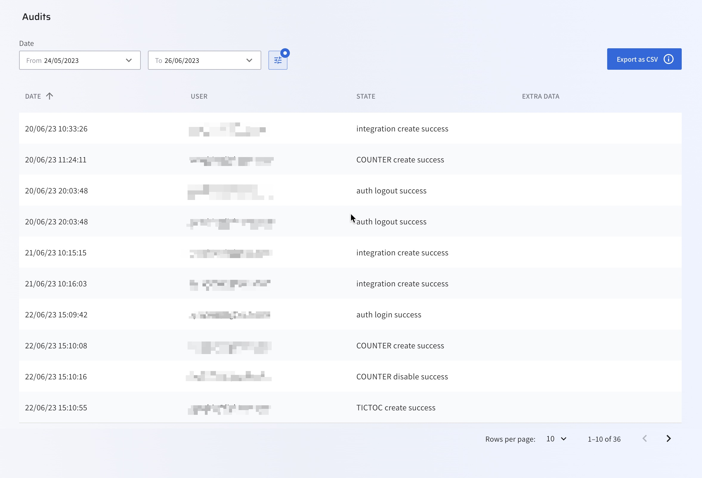
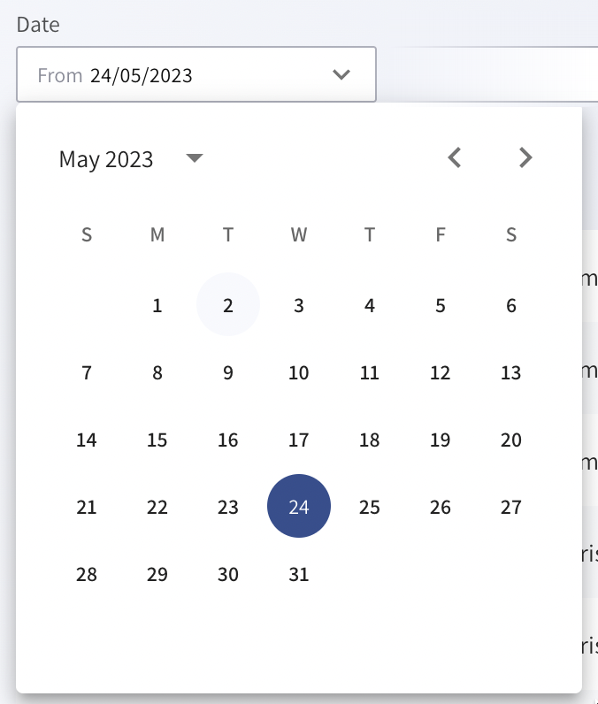
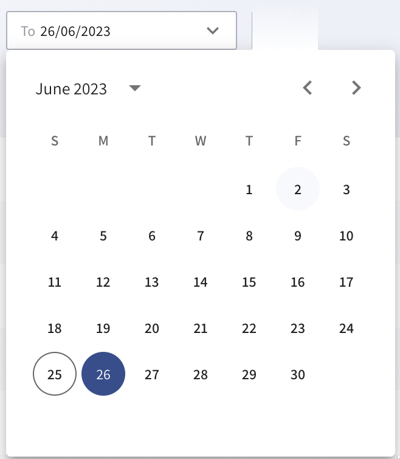
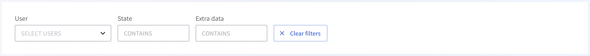

# Audit system usage

Lightrun maintains a record of your organization's Lightrun system usage, which is crucial for observing continuous compliance, performing system audits, and maintaining security.

The stored events include data about activities related to the Management Portal, Lightrun plugins, and agents. With the Lightrun audit events, you can answer questions such as:

- How is a specific user in your organization using Lightrun?
- What changes have been made to your organization’s account, and when?
- Who made a particular change, and when?
- Who created an agent or action, and when?


## View captured events in the Management Portal

You can view a brief overview of all captured events in your Management portal.

###### To view audited events

1. Log in to your Lightrun account.
2. Click **Settings** on the top right-hand side of your screen to navigate to the Settings dashboard.
3. Select **Audit events** under **Security** in the Settings dashboard sidebar.

The **Audits** page should appear similar to the following image:



The following table describes the data available in the **Audit** table:

| Data    | Description                                                  |
| --------- | ------------------------------------------------------------ |
|Date | Date of activity. |
|USER | Username of who performed the activity, including automated system actions. |
|STATE | State of the Activity. |
|EXTRA DATA | More data from the activity. See [Events Type](#events) below for a list of all events audited by Lightrun and their metadata. |

### Filter Audit table {#filter-audits}

You can filter the **Audit** table in two ways:

- [Filter based on a specific date range](#filter-by-date-range).
- [Filter by specifying custom conditions](#filter-by-custom-conditions).

###### To filter the Audit table based on a specific date range {#filter-by-date-range}

1. Enter the start date by clicking on the **From** input.
  
  
2. Enter the end date by clicking on the **To** input.
  

The data filter will be automatically applied after selecting any of the two options.

###### To filter the Audit table by specifying custom conditions {#filter-by-custom-conditions}

1. Click the filter icon   next to the date fields. A menu appears that allows you to filter on various conditions.
    

2. Populate the present fields with your preferred conditions. The Audit table will be updated automatically.

### Audit events retention

The default retention period for captured events is 30 days. For advanced capabilities, such and extended timeframe and the use of an external event storage, please reach out to [our support team](https://go.lightrun.com/contact-us).

## Events and events metadata {#events}

### Stored events

The following table describes a list of events stored by Lightrun and their corresponding metadata.

|Event|Actor|Description|Metadata|
|--|--|--|--|
| `create action success` | Agent/User |New action creation was successful. |- [Action Metadata](#action-metadata) <br> - [Agent Metadata](#agent-metadata) <br> - [User Metadata](#user-metadata) |
| `create action failure` | Agent/User |Action creation failed due to an `error_message`. |- [Action Metadata](#action-metadata) <br> - [Agent Metadata](#agent-metadata) <br> - [User Metadata](#user-metadata) |
| `create new user` | User, System| New user was created successfully or failed due to an `error_message`.| [User Metadata](#user-metadata), [System Metadata](#system-metadata)|
| `delete user` | User | User was deleted successfully or failed due to an `error_message`. | [User Metadata](#user-metadata)|
| `create agent success` |Agent| Action was created successfully. | - [Action Metadata](#action-metadata) <br> - [Agent Metadata](#agent-metadata) <br> - [User Metadata](#user-metadata)|
| `create agent failed` |Agent| Action creation failed due to an `error_message`. | - [Action Metadata](#action-metadata) <br> - [Agent Metadata](#agent-metadata) <br> - [User Metadata](#user-metadata)|
| `remove agent success` |Agent| Action was removed successfully. | - [Action Metadata](#action-metadata) <br> - [Agent Metadata](#agent-metadata) <br> - [User Metadata](#user-metadata)|
| `integration added` |User| New integration was added successfully.  |[User Metadata](#user-metadata)|
| `daily exception limit reached` | System | Daily exception limit reached.| [System Metadata](#system-metadata)|
| `change company name` | User | Organization was renamed successfully or failed due to an `error_message`. | [User Metadata](#user-metadata)|
| `tag created` | System | New METADATA TAG added to organization’s account.| [User Metadata](#user-metadata) |
| `authentication Success` |User|User was authenticated successfully.| [User Metadata](#user-metadata)|

### Events metadata

#### User metadata {#user-metadata}

The following table describes the data available in the User metadata.

|Data|Description|
|--|--|
| `user_id` | User ID value. |
| `user_name` | User name. |
| `user_types` | User type. |
| `user_group` | User group. |

#### Action metadata {#action-metadata}

The following table describes the data available in the Action metadata.

|Data|Description|
|--|--|
| `action_type`| Action type: <br>- Log <br>- Metrics <br>- Snapshot |
| `action_id` | Action ID. |
| `condition` | Action conditions. |
| `expression` | Action expression. |
| `file_name, line` | Action filename and line. |
| `ignore_qouta` | Action `ignore_qouta` configuration. |
| `max_hit_count` | Action `max_hit_count` value. |

#### System metadata {#system-metadata}

The following table describes the data available in the System metadata.

|Data|Description|
|--|--|
|`operation_type`| System operation type. |
|`executor_ip`| System IP address. |
|`message`| System operation message. |
|`operation_result`| System operation result.  |
|`actor`| Event actor.|
|`target`| Event target.|

#### Agent metadata {#agent-metadata}

The following table describes the data available in the Agent metadata.

|Data|Description|
|--|--|
| `agent_api_version` | Agent API version.|
| `agent_ip` | Agent IP address. |
| `agent_id` | Agent ID value. |
| `agent_name` | Agent name. |
| `agent_os` | Agent OS. |
| `agent_pid` | Agent PID value. |
| `agent_version` | Agent version. |
| `runtime environment` | Runtime environment. |
| `log_piping` | Agent configured routing value. |
| `source` | Agent source. |

## Export captured events

Lightrun provides two options for exporting captured system events.

- [Export to a CSV file.](#csv)
- [Export to AWS S3.](#s3-buckets)

### Export to a CSV file {#csv}

###### To export your captured system events to a CSV file

1. Log in to your Lightrun account.
2. Click **Settings** on the top right-hand side of your screen to navigate to the **Settings** dashboard.
3. Select **Audit events** under **Security** in the **Settings** dashboard sidebar.
4. Apply the necessary filters to the **Audit** table. See [Filter Audit table](#filter-audits) for more information.
5. Click the **Export as CSV** button to download the `.csv` file.

The exported `.csv` file will have the following naming format `lightrun-audit-events-<timestamp>.csv`.

!!! important
    The CSV export feature is limited to a maximum of 1,000 records. If you require more, please contact our [support team](https://go.lightrun.com/contact-us) for alternative solutions.

#### CSV file fields

The following fields will be present in the exported CSV file.

|Fields|Description|
|--|--|
|Date | Date of activity. |
|Actor type | Event actor, can be: <br>- `Agent pool`<br>- `Agent`<br>- `System`<br>- `User`. |
|Actor | Event actor, can be: <br>-Agent pool name <br>-User email <br>- Agent ID. |
|ID|Event ID.|
|Agent Pool |Name of agent pool whose agent were used to register the action.|
|Event Type|Event type.|
|Result | Outcome of the event (`success` or `failure`). |
|EXTRA DATA | More data from the activity. See [Events Type](#events) below for a list of all events audited by Lightrun and their metadata. |

### Export to SysLog {#s3-buckets}

Lightrun captures all events made by every user associated with your organization and stores the event in Amazon S3 buckets in a Syslog file format.

!!! Important
	The option to access audit events in Amazon S3 buckets is not available to every Lightrun account. Please [reach out to our support team](https://go.lightrun.com/contact-us) for more information.

#### Audit events retention (AWS S3 buckets)

The audit events S3 buckets are updated daily and have a default retention period of 24 months. Please [contact our support team](https://go.lightrun.com/contact-us) for more information on configuring your organization’s audit event retention period.

#### SysLog file format

Lightrun Audit events data are stored in Amazon S3 in a Syslog file format. The following code sample describes an example audit event for an agent-removed event.

```bash linenums="1"
1 2022-08-29T12:19:51Z 10.50.29.9 Lightrun 72850 
[actorId=d885cc7b-344f-44aa-a853-0a261a844d8d eventType=delete event=REMOVED_AGENT_SUCCESS outcome=success]
[runtime_environment=Java agent_id=d885cc7b-344f-44aa-a853-0a261a844d8d agent_name=shiran-Latitude-7410 (pid 72850) api_version=1.7 log_piping=BOTH agent_os=linux agent_pid=72850 agent_version=1.7.0-rc4.de87b07b3]
```
The Syslog message has the following format:

- [Header (Line 1)](#header)
- [Structured Data (Line 2)](#data)
- [Message (Line 3)](#message)


##### Header {#header}
The following table describes the data in the Header part of the audit event data.

|Data|Description|
|--|--|
|Version|Syslog protocol version|
|TimeStamp|The time when the audit log was created in an [ISO 8601](https://www.iso.org/iso-8601-date-and-time-format.html) format.|
|HostName|The machine that sent the events data|
|PROCID|The log Process ID  which can be used to further identify the sender of the audit log.|
|MSGID| Audit log message ID.<br>- `authn`<br>- `creation`<br>- `access`<br>- `change`<br>- `deletion`|

##### Structured data {#data}

The following table describes the data in the Structured Data part of the audit event.

|Data|Description|
|--|--|
|Actor type|Event actor, can be: <br>- `Agent`<br>- `System`<br>- `User`|
|Actor ID|Event actor ID. For example, User ID, Agent ID, or System ID.|
|Event| The event that created the audit log. See [Events Type](#events) below for a list of all events audited by Lightrun.|
|Event Type|Event type, can be: <br>- `authentication` <br>- `creation` <br>- `access` <br>- `change` <br>- `deletion`|
|Outcome|Event outcome, can be: <br>- `success` <br>- `failure` <br>- `unknown` |
|Target|Event target.|
|Details| Event details.|

##### Message {#message}

Event metadata. See [Events Type](#events) above for a list of all events audited by Lightrun and their metadata.
