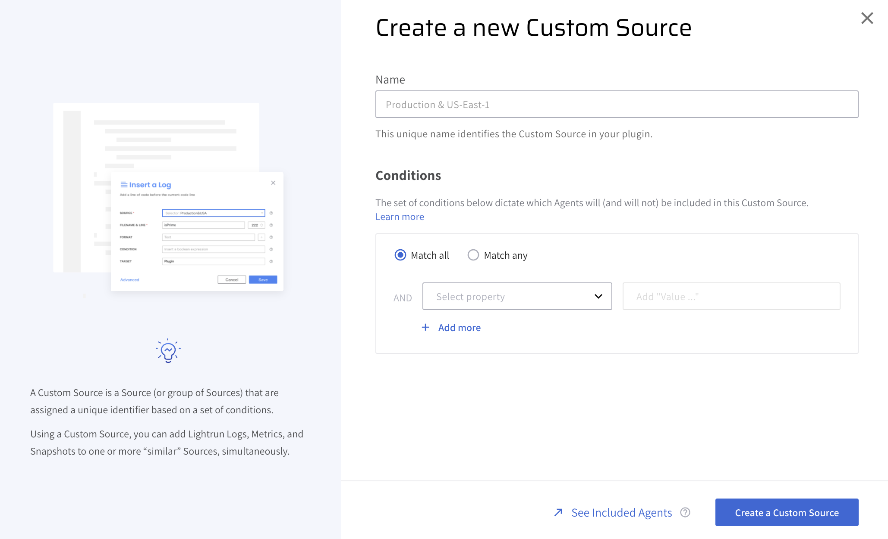
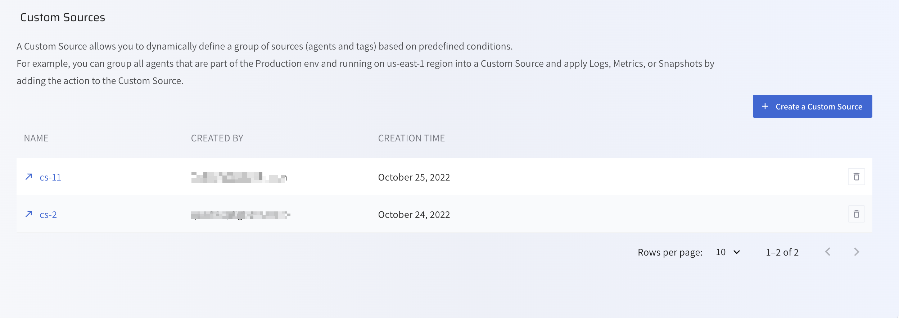
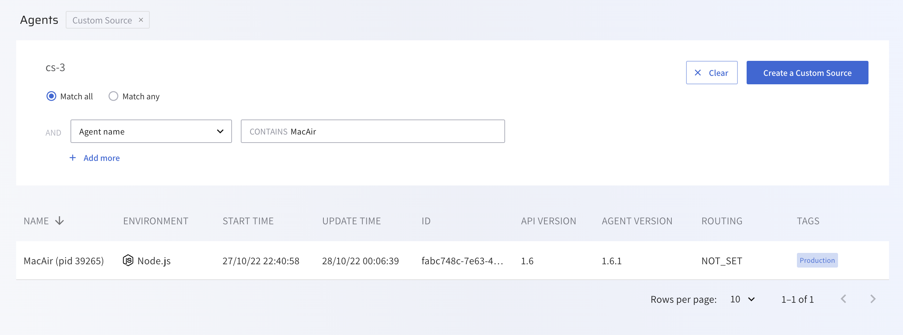

# Managing Custom Sources in the Lightrun Management Portal

A Custom Source is a dynamic group of agents and tags defined by a set of conditions, like a shared hostname or tag. Using Custom Sources, you can simultaneously apply an action to multiple agents without editing your agent configuration or restarting your server. To learn more about Lightrun Custom Sources, Custom Source conditions, the differences between Agents, Tags, and Custom Sources, see [Introduction to Lightrun Custom Sources](/actions/custom-sources/).

## Create a Custom Source

1. Log in to your Lightrun account
2. Navigate to **Entities**
3. Select **Custom Sources** to open the Custom Sources page.
4. Click **+ Create a Custom Source**.

	The following modal should appear.
	

5. Enter the Custom Source name, specify the relevant conditions, and click **Create a Custom Source** to create the Custom Source. After creating a Custom Source, the Custom Sources page should appear similar to the following image.

	

	The table describes the following parameters in the Custom Source table.

	| Field     | Description                                               |
	| ---------- | --------------------------------------------------------- |
	| NAME       | Custom Source name. |
	| CREATED BY    | Email of user who created the Custom Source.                               |
	| CREATION TIME | Custom Source creation time. |

## View agents attached to a Custom Source

- Click on a Custom Source to view every agent attached to the Custom Source.

	

	The table describes the following parameters: 

	| Field     | Description                                               |
	| ---------- | --------------------------------------------------------- |
	| NAME       | The name of the server on which the agent is running. |
	| ENVIRONMENT | The application environment. |
	| START TIME  | The time at which the agent was started.                   |
	| UPDATE TIME | The last time the agent fetched actions from the server.   |
	| ID         | The unique agent ID.                                       |
	| API VERSION | The Lightrun API version currently implemented.            |
	| AGENT VERSION | The Lightrun Agent version currently implemented.            |
	| ROUTING  | The current configuration for log piping.                  |
	| TAGS     | Tags attached to this agent.                               |

## Delete a Custom Source

!!! imp "Important" 
	You must remove every Lightrun action associated with a Custom Source before you can delete the Custom Source.

- Click the  icon next to a Custom Source to delete the Custom Source.
