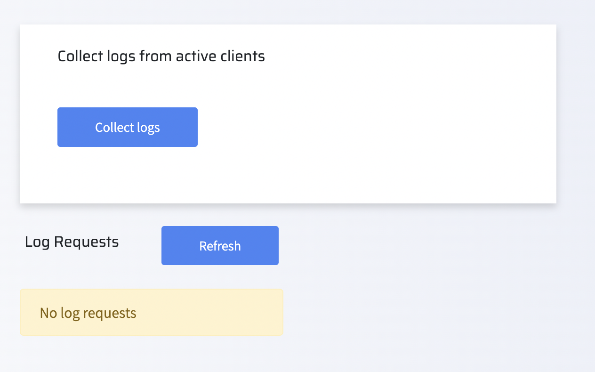
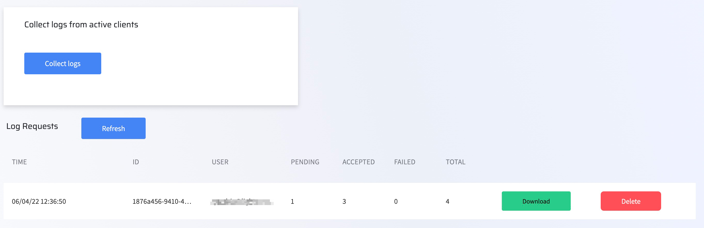

# Collect all log output

Lightrun agent logs are collected and made available for troubleshooting if any issues arise while using Lightrun.

Managers can work with agent logs as follows:

- Collect logs from all active agents and plugins
- Download any of the collected output
- Delete log output - this only deletes the output you've collected

!!! note
    This is not related to the dynamic Lightrun log action, but rather the logs collected from the running agents and active plugins and other associated Lightrun services. 
    
###### To view agent logs

1. Log in to your Lightrun account.
2. Click **Settings** on the top right hand side of your screen to navigate to the Settings dashboard.
3. Select **Lightrun's logs collector** under **Compliance** in the Settings dashboard sidebar.

    The **Lightrun's logs collector** screen loads and appears similar to the following:
    

4. To collect new active logs, click **Collect Logs**.

    The collected logs will appear on the page.
    

5. To download a log, click **Download** from the relevant log row in **Log Requests** table. 
6. To delete output, click **Delete** from the relevant log row in **Log Requests** table.
7. Click **Refresh** to refresh the collected logs.
