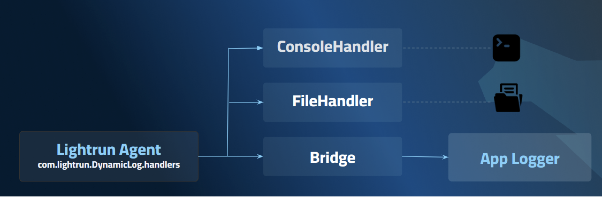

# Customize Java dynamic logs for logger integration
   
!!! note

    This feature is available for the Lightrun Java Agent.

This guide describes how to customize Lightrun logs to align with your application's logger format.
Lightrun supports the integration of dynamic logs into your application's existing logs, maintaining the application’s log format and structure. If your application is configured to send logs to log management tools such as Kibana or New Relic, you can also include dynamic logs in real-time during runtime. These dynamic logs will be piped to those tools along with your application's static logs. For more information, see [Dyanmic Logs Overview](https://docs.lightrun.com/actions/dynamic-logs/).

The Lightrun agent uses `java.util.logging` as its logging framework, and integration with the application's logger is achieved by adding a `java.util.logging.Handler` implementation to the agent. Certain logging frameworks offer built-in handler implementations, for example, SLF4J provides the `SLF4JBridgeHandler`, which serves as a bridge between the `java.util.logging` logger and the SLF4J APIs.

Before integrating Lightrun logs to your application logger, it is important to understand your application logger configuration, map its hierarchy, and determine the specific level of `LoggerConfig` within the hierarchy that you wish to be inherited by the Lightrun logger. Notably, `Log4J2` implements a hierarchy mechanism between `LoggerConfig` objects.

The following diagram illustrates the integration between the Lightrun agent logger and the Application logger through `JUL` handlers.

{: style="width:60%"}

## Before you begin

- Prior knowledge of your application's logging configuration is essential for executing the described steps effectively. Familiarize yourself with relevant logging settings before proceeding.
  
- In your logger configuration file (typically named `<framework>.xml` or `<framework>-spring.xml` in a Spring application), configure the Lightrun logger with the relevant appender(s) for your application by adding the appender(s) to Lightrun logger.
Note that this step is unnecessary if the appenders you want are already configured on the root logger.

    ```bash
    <Loggers> 
        <Logger name="com.lightrun" level="info">
                <AppenderRef ref="AppAppender" />
        </Logger>
    </Loggers>
    ```

- Keep in mind that later, when creating Lightrun logging actions, you will need to ensure that the [Target](https://docs.lightrun.com/actions/output-routing/) for the Lightrun action(s) includes Stdout.

    

The following sections describe common use cases with examples on logging frameworks.

## Configure Dynamic Logger with SLF4J
!!! note

    If you are using the Spring Boot framework, refer to spring boot & SLF4J.

This section describes how to set up the dynamic logger with SLF4J, without Spring Boot, using one of the following options:

- [Configure Dynamic Logger with SLF4J with code change](#configure-dynamic-logger-with-slf4j-with-code-change)
- [Configure Dynamic Logger with SLF4J without changing your code](#configure-dynamic-logger-with-slf4j-without-changing-your-code)

##### Configure Dynamic Logger with SLF4J with Code Change 

1. In your code, configure the `SLF4JBridgeHandler` of `org.slf4j:jul-to-slf4j` on the root logger at the beginning of the execution. For more details, see [Class SLF4JBridgeHandler](https://www.slf4j.org/api/org/slf4j/bridge/SLF4JBridgeHandler.html).
2. Configure the [agent](https://docs.lightrun.com/jvm/agent-configuration/) with `com.lightrun.DynamicLog.useParentHandlers=true` which can be set in the `agent.config` file,  as a Java property, or as an environment variable.
   
##### Configure Dynamic Logger with SLF4J without changing your code
!!! note
   
    This option is not supported for a JAR containing nested JARs (Uber JAR) because it is not possible to specify a classpath for nested JARs.

Prerequisites

`slf4j-jul` libraries must be available at runtime.
Typically, the required packages are `slf4j-jul-{version}.jar`, `slf4j-api-{version}.jar`, `slf4j-core-{version}.jar`. In case of containerized applications, ensure that the packages are packaged inside the container. 


 1. Search for the `jul-to-slf4j` library.

   - For Maven:

     ```bash
    mvn dependency: tree -Dincludes=org.slf4j:jul-to-slf4j
    ```

   - For Gradle:

     ```bash
    gradle dependencyInsight --dependency jul-to-slf4j (or ./gradlew)
    ```

1. Find and copy the JARs to where the Lightrun agent is located.
   In the `agent.config` file, add the following configuration:

    ```bash
    com.lightrun.DynamicLog.handlers=org.slf4j.bridge.SLF4JBridgeHandler

    com.lightrun.DynamicLog.SLF4JBridgeHandler.classpath=<PATH_TO_jul-to-slf4j.jar>
    ```

## Configure Dynamic Logger with Log4J2

!!!note

    If you are using the Spring Boot framework, refer to spring boot & SLF4J.

This procedure describes how to set up the dynamic logger with `Log4j2` without Spring Boot using one of the following options:

- [Configure Dynamic Logger with Log4J2 with code change](#configure-dynamic-logger-with-log4j2-with-code-change)
- [Configure Dynamic Logger with Log4J2 without code change](#configure-dynamic-logger-with-log4j2-with-code-change)
  
##### Configure Dynamic Logger with Log4J2 with Code Change
1. In your code, configure the `Log4JBridgeHandler` available in the `org.apache.logging.log4j:log4j-jul` package on the root logger of your application as part of the application utilization:
`Log4JBridgeHandler.install(false, "", true);`
2. Configure the agent with `com.lightrun.DynamicLog.useParentHandlers=true`, which can be set in the `agent.config` file, as a Java property or as an environment variable.

##### Configure Dynamic Logger with Log4J2 without Code Change

!!! note
   
    This option is not supported for a JAR containing nested JARs (uber JAR) because it it not possible to specfiy a classpath insided a JAR.

Prerequisites

`Log4j-jul` libraries must be available at runtime.
Typically, the required packages are `log4j-jul-{version}.jar`, `log4j-api-{version}.jar`, and `log4j-core{version}.jar`. In case of containerized applications, ensure that the packages are copied inside the container. 


1. Search for the `log4j-jul` library.
   
   - For Maven:

    ```bash
    mvn dependency:tree -Dincludes=org.apache.logging.log4j:log4j-jul
    ```

   - For Gradle:
    
    ```bash
    gradle dependencyInsight --dependency log4j-jul (or ./gradlew).
    ```

2. Find and copy the JARs to the location where the Lightrun agent is located.
3. Add the following to the `agent.config` file:
 
    ```bash
    com.lightrun.DynamicLog.handlers=org.apache.logging.log4j.jul.Log4jBridgeHandler
    com.lightrun.DynamicLog.Log4jBridgeHandler.classpath=<PATH_TO_log4j-jul.jar>
    ```

## Configure Dynamic Logger with Log4J (1.x)

`Log4J 1.x` does not have a built-in bridge, unlike some logging frameworks, requiring the implementation of a custom handler.

1. Implement this simple handler:

    ```bash
    import java.util.logging.Handler;
    import java.util.logging.LogRecord;
    import org.apache.log4j.Level;
    import org.apache.log4j.Logger;

    public class Log4J1BridgeHandler extends Handler {

        @Override
        public void publish(LogRecord record) {
            ClassLoader originalClassLoader = Thread.currentThread().getContextClassLoader();
            Thread.currentThread().setContextClassLoader(ClassLoader.getSystemClassLoader());
            try {
                Logger log4j = getLog4jLogger(record.getLoggerName());
                Level log4jLevel = getLog4jLevel(record.getLevel());
                log4j.log(log4jLevel, record.getMessage(), record.getThrown());
            } finally {
                Thread.currentThread().setContextClassLoader(originalClassLoader);
            }
        }

        @Override
        public void flush() {
        }

        @Override
        public void close() throws SecurityException {
        }

        private Logger getLog4jLogger(String name) {
            return Logger.getLogger(name);
        }

        private Level getLog4jLevel(java.util.logging.Level level) {
        if (java.util.logging.Level.SEVERE.equals(level)) {
                return Level.ERROR;
            } else if (java.util.logging.Level.WARNING.equals(level)) {
                return Level.WARN;
            } else if (java.util.logging.Level.INFO.equals(level)) {
                return Level.INFO;
            } else if (java.util.logging.Level.CONFIG.equals(level) ||
                    java.util.logging.Level.FINE.equals(level)) {
                return Level.DEBUG;
            } else if (java.util.logging.Level.FINER.equals(level) ||
                    java.util.logging.Level.FINEST.equals(level)) {
                return Level.TRACE;
            } else {
                return Level.ALL;
            }
        }
    }
    ```

2. Compile the handler.
   
3. Add the handler and its classpath to the `agent.config` file:

   ```bash
   com.lightrun.DynamicLog.handlers = <FULLY_QUALIFIED_NAME>.Log4J1BridgeHandler
   com.lightrun.DynamicLog.Log4JBridgeHandler.classpath=<PATH_TO_FILE>/Log4J1BridgeHandler.class
   ```

## Configure Dynamic Logger with Spring Boot & SLF4J

By definition, Spring adds the `SLF4JBridgeHandler` handler to the root logger, bridging `java.util.logging` logs to SLF4J. The Lightrun logger (`com.lightrun`) parents are `com` and the root logger. Therefore, setting the following property to `true` will cause the Lightrun logger to publish logs to its parent's handlers, including the `SLF4JBridgeHandler` handler of the root logger.

- Congfigure the [agent](https://docs.lightrun.com/jvm/agent-configuration/) with `com.lightrun.DynamicLog.useParentHandlers=true`. which can be set in the `agent.config` file, or alternatively as a Java property or as an environment variable.

## Configure Dynamic Logger with a custom handler

You can implement a custom handler of your own and add it to the agent `jul` logger.

1. Compile your handler.
2. Add your handler and its classpath to the `agent.config` file:

    ```bas
    com.lightrun.DynamicLog.handlers = <FULLY_QUALIFIED_NAME>.YourCustomHandler
    com.lightrun.DynamicLog.YourCustomHandler.classpath=<PATH_TO_FILE>/YourCustomHandler.class
    ``` 