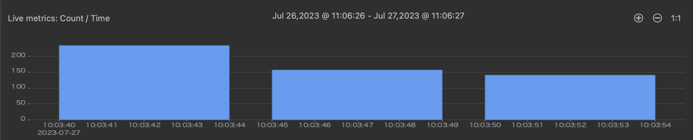
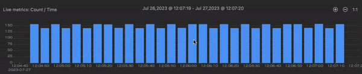
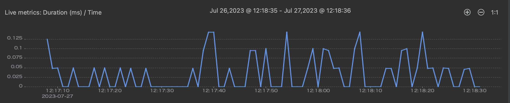

# JetBrains Plugin Quick Tour

<iframe width="560" height="315" src="https://www.youtube.com/embed/iesDKHbijZ8" title="YouTube video player" frameborder="0" allow="accelerometer; autoplay; clipboard-write; encrypted-media; gyroscope; picture-in-picture" allowfullscreen></iframe>

The majority of the work you do with Lightrun, such as troubleshooting, debugging, and performance testing, is performed directly from your integrated development environment (IDE) or the Lightrun CLI.

Using the Lightrun plugin, provided for a variety of popular IDEs (such as VSCode, IntelliJ, and PyCharm), you can insert Lightrun actions (Logs, Metrics, and Snapshots) anywhere within the source code of your running applications. Also, from within the Lightrun plugin for your IDE, you can view, in real time, the output of Lightrun actions.

And, thanks to Lightrun's comprehensive range of integrations with third-party logging tools, from the plugin, you also can route output from Lightrun Logs and Metrics to your usual logging framework (such as [New Reic](/integrations/new-relic/) and [DataDog](/integrations/datadog-events/)).

## Scope of the quick tour

This quick tour guide provides an overview of the main features and functionalities of the Lightrun Plugin for JetBrains (Intellij IDEA, Webstorm, Pycharm).

For more detailed information on the procedures involved in running and managing Lightrun actions in your JetBrains IDE(Intellij IDEA, Webstorm, Pycharm), see:

- [Lightrun Dynamic Logs in JetBrains](/logs/)
- [Lightrun Snapshots in JetBrains](/snapshots-plugin/)
- [Lightrun Metrics in JetBrains](/metrics/)

!!! reqs "Prerequisites"
    These instructions assume that you have:

    1. A Lightrun Account.

    2. [Installed the Lightrun JetBrains plugin](/authenticate-plugin/) in your IDE.

	3. [Authenticated your Lightrun JetBrains Plugin](/authenticate-plugin/).

	4. Attached at least one agent to your app.

    5. Opened the source code file for the running application from the IDE.

## The JetBrains Plugin

Once you have authenticated the Lightrun plugin in your JetBrains IDE, your JetBrains IDE user interface should appear similar to the following image.

The following table describes the sections of the interface as numbered above:

| Sections | Description                                                  |
| ---- | ------------------------------------------------------------ |
| 1    | **Lightrun tool window** - Authenticate your plugin, manage Lightrun actions and tags.|
| 2    | **Lightrun Console tool window** - Manage dynamic logs and metrics. |
| 3    | **Lightrun Snapshot tool window** - Manage snapshots. |
| 4    | **JetBrains Code Editor** - JetBrains code editor.      |
| 5    | **Lightrun LogOptimizer(™)** - Lightrun LogOptimizer(™) |
| 6    | **Lightrun Metrics tool window** - Manage metrics. |

The following sections describes the different parts in detail:

- [Lightrun tool window](#layout)
- [Lightrun Console tool window](#console)
- [Lightrun Snapshot tool window](#snapshot)
- [Lightrun Metrics tool window](#metrics)

## The Lightrun tool window {#layout}

The Lightrun tool window is part of the IntelliJ right-hand sidebar, and appears similarly to the following image.

!!! note
    The Lightrun tool window displays the **Data Delay** mode when connectivity issues arise. **Data Delay** mode allows you to continue debugging and retrieving Lightrun actions, with a short delay of up to 10 seconds, allowing new agents to be added or snapshot action data to be retrieved from the server.

The Lightrun tool window has three tabs: 

- [Agents](#agents)
- [Tags](#tags)
- [Actions](#actions)

!!! note
     Please note that the **Agent** and **Tag** tabs display only actively running agents and tags in your IDE. If both tabs are empty or only the agent tab is empty, please contact your manager for assistance.

### Agents tab {#agents}

The Agents tab displays a list of all active agents currently attached to your JetBrains IDE and all the actions associated with each agent. You can search for agents, view and configure agent details, view action details or delete actions, and configure agent output piping in the Agents tab. 

###### To search for an agent
1. Enter the agent's name or PID value into the search bar.
2. Click the Search button. 
	
	The agent lists should appear similar to the following image 
	

3. Click the drop-left icon  on the left-hand side of an agent to display a list of all actions associated with that agent.
	

The following table describes the icons present in the agents and action lists and the functions of each icon.

|      | Icon                                                         | Function                                                  |
| ---- | ------------------------------------------------------------ | ------------------------------------------------------------ |
| 1    |            | Opens the information dialog box for the agent, tag, or action.  |
| 2    |              | Toggle this button to hide/show dynamic logs in the editor. This applies to the hierarchy and can be toggled globally on the login button. |
| 3    |                  | Use this icon to configure an agent output piping. See [Viewing action output](#piping) for more details.  |
| 4    |                   | Delete agent or tag actions. Only agent-activated actions can be deleted from the Agents list and tag-activated actions from the Tags list. |
| 5    |                 | Jump to the source file and line number in the code that is associated with the action. |
| 6    |                   | Toggle to disable or enable an action. Only agent-activated actions can be toggled from the Agents list and tag-activated actions from the Tags list. |
| 7    |  | Displays the current state of the action.  - One checks indicates the action was submitted to the server.  - Two checks indicate that it was received by the agent.  - Highlighted checks indicate that the agent accepted the action. From the Agents list, the tag icon indicates the action was activated with tags and not agents, and its status can be viewed from the Tags list. |
| 8    |          | Indicates the the level that was configured for the log (on log rows only): Info, Debug, Warn, Error. |

###### To view more information about an agent or Lightrun action {#details}

- Click the information icon  on the right side of the agent or action. A dialog box will appear on your screen, showing more details about the agent/action.

    The agent details dialog box should appear similar to the following image.

    

    The following table describes the information present in the dialog box.

    | Field         | Description                                                  |
    | ------------- | ------------------------------------------------------------ |
    | Host          | The name of the machine where the agent is running.         |
    | ID            | The unique identification number automatically generated for the action. |
    | PID           | The process ID (for the machine where the agent is running). |
    | Start Time    | The time at which the agent started running.                 |
    | API Version   | The version of the API used by the agent.                    |
    | Agent Version | The version of the agent.                                    |
    | Piping Mode   | The configured [piping](#piping) method.    |
    | Tags          | All tags that have been applied to this agent.               |

    The action details dialog box should appear similar to the following image.

    

    The following table describes the information present in the dialog box.

    | Field           | Description                                                  |
    | --------------- | ------------------------------------------------------------ |
    | ID              | The system-generated ID associated with this action item.    |
    | Type            | The type of action.                                          |
    | Location  | The file and code line where the action starts following behavior. |
    | Create Time     | The time and day on which the action was created.            |
    | Owner           | The user who created the action.                             |
    | Quota in effect | The quota controls use of CPU, Networking, Memory, excessively long strings, too many instructions printing out, protection from infinite loops and the like.       Quota settings can be tuned in the agent.config file. |
    | Log Message     | The message resulting from the action appears here, if relevant. |
    | Error Message   | If any agent reports any errors for this action, they are documented here. |

### Tags tab {#tags}

The Tags tab displays a list of all active tags currently attached to Lightrun actions running in your JetBrains IDE.

###### TO SEARCH FOR A TAG

1. Enter the tag’s name into the search bar.
2. Click the Search button.

	The tag list should appear similar to the following image.
	

3. Click the drop-left icon  on the left-hand side of the tag listing to display a listing of all actions associated with that tag.
	

The following table describes the icons present in the tags and action listing and the functions of each icon.

--8<-- "ux-reference/actions-details.md"

### Actions tab {#actions}

The Actions tab lists all Lightrun actions (Logs, Metrics, and Snapshots) currently in your system. This includes active actions, disabled actions, expired actions, and actions with errors.

#### Managing actions with the actions tab

The actions tab appears similar to the following image.

From the actions tab, you can:

- Search for actions with their filename and line number.
- Disable actions.
- Filter actions with the active, expired, and error statuses.
- Filter actions with their filename and creation time.

The following table describes the icons present in front of each action.

--8<-- "ux-reference/actions-details.md"

## Lightrun Console {#console}

Lightrun dynamic logs and metrics appear in real-time in the Lightrun Console when you enable **Both** or **Plugin** piping configurations in the Lightrun toolwindow ([See action output routing](#piping)). To open the console, click **Lightrun Console** on the bottom part of your JetBrains IDE.

The Lightrun Console should appear similar to the following image.

The Lightrun Console is divided into two parts:

- [Header section](#console-header)
- [Data section](#console-data)

### Header section {#console-header}

The Header section is used to search and filter the Data section.

- Enter an expression or name into the search bar to display only logs and metrics with that expression/name in the Lightrun Console.
- Select an agent in the **Agents** dropdown to display logs and metrics associated with that agent in the Console.
- Select **Only my logs** to display only logs and metrics associated with your Lightrun account in the Console.
- Select **Error**, **Warning**, **Info**, and **Debug** to filter logs and metrics in the Console based on their Level.
- Click the  icon to clear the console. 

### Data section {#console-data}

Once you've configured your action target to Plugin and added at least one dynamic log or metric to your code, data from the inserted dynamic log and metric will appear in your Lightrun Console Data section in real-time. 

1. Hover on a dynamic log or metric to view more information about the action.

    

2. Right-click a dynamic log or metric and click **Clear** to clear the Console, click **Copy** to copy the action data, and click **Go to Line** to navigate to the action's source file and line number.

   

## Lightrun Snapshot {#snapshot}

The Lightrun Snapshot tool window allows you to view and configure your snapshot data directly in your JetBrains IDE. To open the tool window, click **Lightrun Snapshots** on the bottom part of your JetBrains IDE.

The Lightrun snapshot section should appear similar to the following image.

The following table describes the sections of the Lightrun snapshot interface as numbered above:

| Sections | Description                                                  |
| ---- | ------------------------------------------------------------ |
| 1    | **Header section** |
| 2    |**Snapshot data** |
| 3    | **Stacktrace** |

The following sections describes the different sections in detail:

- [Header section](#snapshot-header)
- [Snapshot data](#snapshot-data)
- [Snapshot stacktrace](#snapshot-stacktrace)

### Header section {#snapshot-header}

The Header section is used to search and filter the Snapshot data section.

There are four search and filtering options in the Header section:

| Option | Description |
|--------|-------------|
| CREATED BY | Use the **CREATED BY** filter to display only snapshots created by specific users or all users in your organization. |
| LOCATION | Use the **LOCATION** search to search for a snapshot using its location in your code. |
| SOURCE | Use the **SOURCE** filter to display only snapshot belonging to specific agents or tags in your system. |
| STATUS | Use the **STATUS** filter to filter snapshots based on their current status.   The **STATUS** filter has the following options:  - Deleted  - Expired  - Done  - Disabled  - Active  - Imported  - Error  - All  - None |

### Snapshot data {#snapshot-data}

The snapshot data section provides access to a list of all available snapshots and their creation details. The snapshot data section should appear similar to the following image.

 
The following table describes the data available in the Snapshot data section.

| Column    | Description                                                  |
| --------- | ------------------------------------------------------------ |
| CREATION TIME | The time at which the snapshot was created.                        |
| LOCATION      | The line of code at which the snapshot was inserted. |
| TARGET       | The agent or tag to which the snapshot was attached. |
| HIT      | Number of recorded captured hits.  |
| STATUS       | The snapshot status. Can be **Active**, **Done**, or **Deleted**. |

- Click the  icon to view more information about a Snapshot.

### Snapshot stacktrace {#snapshot-stacktrace}

The Snapshot stacktrace section displays a snapshot stacktrace. The section should appear similar to the following image.

- Click on a snapshot in the Snapshot data section to view its stacktrace in the Stacktrace section. 

    The following table describes the data available in the Snapshot stacktrace section.

    | Column    | Description                                                  |
    | --------- | ------------------------------------------------------------ |
    | CAPTURE TIME   | The time at which the snapshot hit was captured.    |
    | FRAMES   | The snapshot frames.    |
    | VARIABLES | The snapshot frame variables.     |

- Click on a **CAPTURE TIME** to display the frames recorded during that captured time, click the  icon to save the snapshot data to a file.
- Click on a **FRAME** to navigate to the source code and line, click the  icon to copy the snapshot's stack trace.
- Click the **Share** button to share the snapshot's data.
  

## Lightrun Metrics {#metrics}

!!! info "Support"
    Lightrun metric actions are available only to Java/JVM applications in [JetBrains Intellij IDEA](https://www.jetbrains.com/idea/).

The Lightrun Metrics tool window allows you to view and analyze captured hits from Lightrun metrics (Counter, Custom metrics, Tic Toc, and Method duration) directly in your JetBrains IDE.

- To open the tool window, click **Lightrun Metrics** on the bottom part of your JetBrains IDE. The Lightrun Metrics tool window should appear similar to the following image.

    

    The Lightrun Metrics tool window has four metrics tabs:

    | Tabs | Description |
    |------|-------------|
    | Counter | View and analyze captured Counter metrics hits.    |
    | TicToc |  View and analyze captured TicToc metrics hits.          |
    | Method Duration | View and analyze captured Method Duration metrics hits.      |
    | Custom Metric | View and analyze captured Custom Metric hits.   |

Each metric tab is divided into three sections:

- [Header section](#headers-section)
- [Metrics section](#metrics-section)
- [Graphs section](#graphs-section)

### Header section {#headers-section}

The Header section is used to search and filter the Metrics section.

There are four search and filtering options in the Header section:

| Option | Description |
|--------|-------------|
| CREATED BY | Use the **CREATED BY** filter to display only metrics created by specific users or all users in your organization. |
| LOCATION | Use the **LOCATION** search to search for a metric using its location in your code. |
| AGENTS | Use the **AGENTS** filter to display only metrics belonging to specific agents in your system. |
| STATUS | Use the **STATUS** filter to filter metrics based on the metric current status.   The **STATUS** filter has the following options.  - Deleted  - Expired  - Done  - Disabled  - Active  - Imported  - Error  - All  - None |

### Metrics section {#metrics-section}

The Metrics section displays the metrics currently attached to your agents.

Use the [Header section](#headers-section) to search and filter the Metrics section to display the only metric hits relevant to your current investigation. The following table describes the data available in the Metrics section.

| Column    | Description                                                  |
| --------- | ------------------------------------------------------------ |
| NAME | The metric name.                     |
| FIRST CAPTURED TIME      | The time at which the first metric hit was captured. |
| HITS      | Number of captured hits recorded in a 24-hour interval.  |

- Click the  icon to view more information about a metric action.

### Graphs section {#graphs-section}

The Graphs section allows you to visualize your captured metrics hit in a graphical form.

- Click on a metric in the Metrics section to view its graph in the Graphs section. The [Counter metrics](/getting-around/#counter-metrics) and [Time measurements](/getting-around/#time-measurements) sections below describe each metric graph in detail.

!!!important
    Captured metric hits are collected and available for visualization and analysis in the Lightrun Metrics tool window in 24-hour intervals. If you want to collect and analyze metrics for a longer time interval, you can take advantage of our integrations with Application Performance Monitoring tools like [Dynatrace](/integrations/dynatrace/), [Grafana](/integrations/grafana/), [New Relic](/integrations/new-relic/), and [Elastic Stack](/integrations/elastic-stack/). For more information, log in to the [Lightrun Management Portal](https://app.lightrun.com/) and inspect the Integrations page.
#### Counter metrics

The Counter metrics graph is a vertical bar chart showing the number of hits recorded every five seconds.

- Hover on a bar to view more information on the bar, use the  and the  buttons to zoom in and out of the graph.

#### Time measurements

The Lightrun Time measurement (Tic Toc and Method duration) graph is a line chart that shows the duration of recorded hits in milliseconds and the date and time when the hits were recorded.

- Use the  and the  buttons to zoom in and out of the graph.