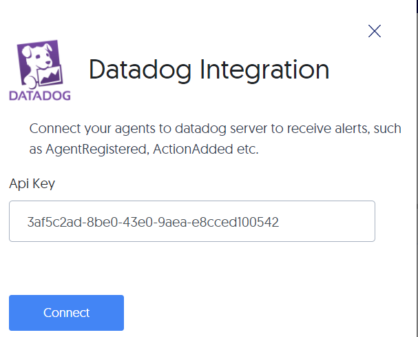

# Integrate Lightrun with Datadog

--8<-- "ux-reference/manager-role-only.md"

Datadog aggregates metrics and events (from integrations such as Lightrun), provides a quick search, filter, and analysis tool to support open-ended exploration of your dynamic logs and data, and provides customizable dashboards for data visualization.

	 
!!! reqs "Prerequisites"
    Install and configure [Datadog](https://docs.datadoghq.com/agent/) and copy the API key from your Datadog account. For additional assistance, refer to their [troubleshooting guide](https://docs.datadoghq.com/logs/guide/log-collection-troubleshooting-guide/) as well.

    --8<-- "ux-reference/config-pipe.md"

## Connect to and disconnect from Datadog

--8<-- "ux-reference/navigate-integrations.md"

2. From the **Integrations** page, click **Connect** from the Datadog card.

    The **Datadog Integration** window pops up:

    
	
3. Paste the API key you copied from your Datadog account.

6.  Click **Connect** and wait for the toast message approving the connection.

7. To disable the configuration, click **Disconnect**.