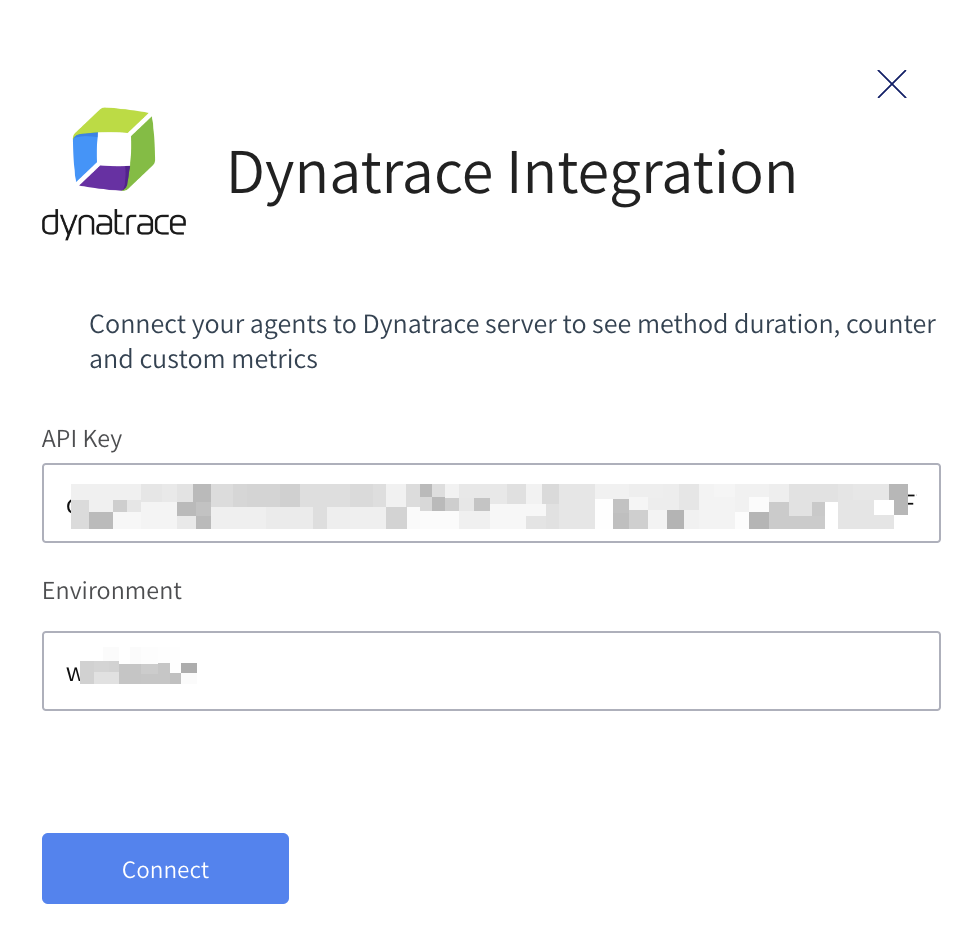
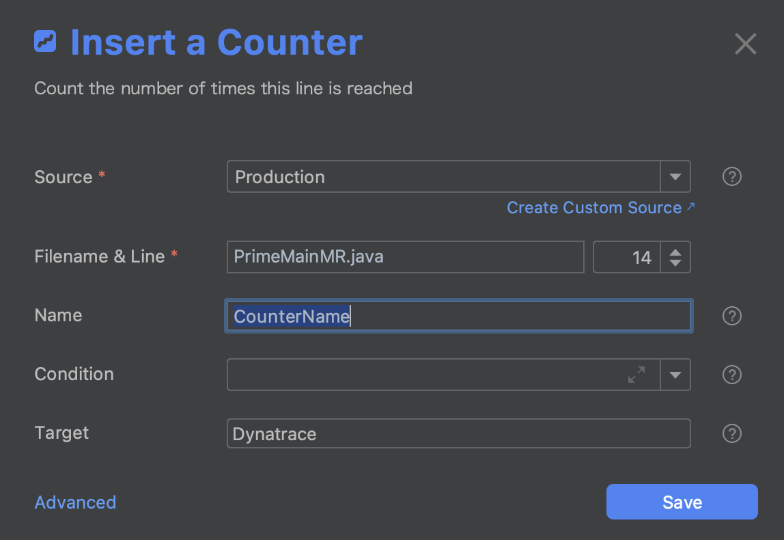

# Integrate Lightrun with Dynatrace
## Introduction

--8<-- "ux-reference/manager-role-only.md"

Lightrun allows Developers and DevOps Engineers to add real-time logs, metrics, and traces to live applications on demand. This means, in practice, that information that was once only accessible by pushing new code with more instrumentation or by profiling your application can now be added on demand - right from your IDE.

In this guide, we will learn how to integrate Lightrun with Dynatrace. Dynatrace is an application performance monitoring (APM) and software intelligence solution that gives you visibility and AI-backed answers across your entire digital infrastructure. With the Lightrun Dynatrace integration, you can receive metrics data (counter, tic toc, custom metrics) from Lightrun and visualize the data using your dashboard.

!!! reqs "Prerequisites"
    This tutorial assumes that you have:

    1. A Dynatrace account. Follow the instructions [here](https://www.dynatrace.com/trial/) to create your Dynatrace account.
    2. Created a Dynatrace access token with the `metrics.ingest` scope. Follow the instructions [here](https://www.dynatrace.com/support/help/manage/access-control/access-tokens#create-api-token) to generate an access token in Dynatrace.

    For Lightrun to send observability data to your integrations, ensure:

    - The application has a running agent attached to it.
    - Your plugin version has been upgraded to v1.12.

## Integrate Lightrun with Dynatrace 

1. Open a browser and log in to your Lightrun account.
2. In the menu on the left, click **Integrations** to open the Integrations page.
3. From the **Integrations page**, click **Connect** from the Dynatrace card.
    The Dynatrace Integration window pops up:
    

4. Enter your Dynatrace personal access token and environment name into the available fields.

  !!!note
      In Dynatrace SaaS, your environment is the first part of your Dynatrace dashboard's URL.
      ```
      https://{your-environment}.live.dynatrace.com/
      ```

5. Click **Connect** and wait for the approval toast message. You can now select Dynatrace as a target when creating metrics in your IDE.
    

6. To disable the configuration, click **Disconnect**.