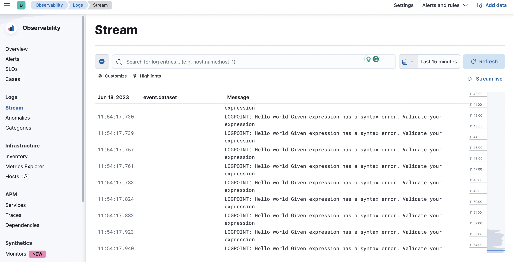

# Integrate Lightrun logs to Elasticsearch and Kibana with Logstash

## Overview
In this guide, you will learn how to send Lightrun logs to Elasticsearch and Kibana with Logstash. Logstash is a free and open server‑side data processing pipeline that collects, transforms, and sends Lightrun dynamic logs to Elasticsearch for search and visualization with Kibana.


## Prerequisites

This tutorial assumes that you have:

- A Lightrun account.
- An Elastic cloud account. Register for an Elastic cloud free account [here](https://cloud.elastic.co/registration?storm=global-header-en).
- Logstash installed and running. Refer to the Logstash [installation page](https://www.elastic.co/downloads/logstash) for Logstash installation instructions.
- Basic understanding of Logstash concepts and terminologies.

## Configure Elastic Stack

The first step in the tutorial is to set up a deployment on Elastic Cloud. An Elastic Cloud deployment includes Elastic Stack components such as Elasticsearch, Kibana, and other features that we need to store, search, and analyze dynamic logs data from Lightrun.

To create a deployment on Elastic Cloud:

1. Log in to your Elastic Cloud account, and select **Create deployment** from the Elasticsearch Service main page.
2. Enter the required details and click **Create deployment** to create the Elastic Stack deployment. 
3. Copy the deployment credentials (username and password) and save them. Later, they will be required for our Logstash configuration.


## Configure Logstash

After creating a deployment on Elastic Cloud, the next step is to set up our Logstash configuration.

Logstash has three main configuration options.

- **Input**  - Define where data should be collected from.
- **Filter** -  Define how collected data should be processed.
- **Output** - Define where collected data should be sent.

### Input Configuration

Add the following to your `logstash.conf` file as your input configuration.

```conf
input {
	file {
		type => "log"
		path => "/tmp/lightrun_file_handler_logs1.log"
		start_position => beginning
		codec => json
		sincedb_path => "/dev/null"
		}
	}
```

!!! important
	Change `tmp` to `%TEMP%` on Windows OS.

This configuration tells Logstash to read logs from the `/tmp/lightrun_file_handler_logs1.log` file as the input.

### Output Configuration

Add the following to your `logstash.conf` file as your output configuration.

```conf
output {
  elasticsearch {
	cloud_id => "<elastic-deployment-cloud-id>"
	cloud_auth => "<elastic-cloud-username>:<elastic-cloud-password>"
	}
}
```

!!! important

    - Change `<elastic-cloud-username>:<elastic-cloud-password>` to your authentication credentials in the following format `<elastic-cloud-username>:<elastic-cloud-password>`.
    - Change `<elastic-deployment-cloud-id>` to your elastic deployment cloud id.


The output configuration tells Logstash to send the collected logs to the specified elastic cloud deployment. 

!!! note
	You final `logstash.conf` file  should appear similar to the following:

	```conf
	input {  file { type => "log" path => "/tmp/lightrun_file_handler_logs1.log" start_position => beginning codec => json sincedb_path => "/dev/null" } }
	output {
	elasticsearch { cloud_id => "<elastic-deployment-cloud-id>" cloud_auth => "<elastic-cloud-username>:<elastic-cloud-password>" }
	}
	```


!!! note
	We are not using any `filter` for this tutorial.


## Confirm your integration

To confirm your integration.

- Restart your Logstash server.
- Insert a Lightrun dynamic log into your application and select `stdout` as the target.
- Log in to your Elastic cloud account and navigate to **Observability** > **Logs** > **Stream**.
- Your dynamic logs data should appear in the **Stream** page.


