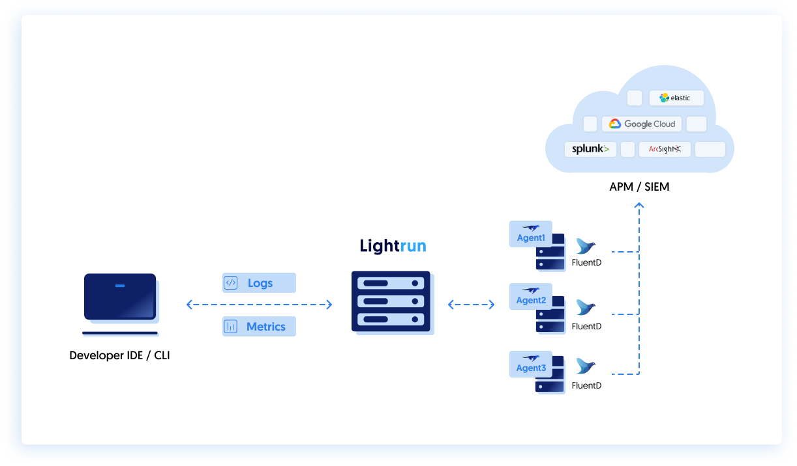

# Integrate Lightrun with FluentD

--8<-- "ux-reference/manager-role-only.md"

[FluentD](https://www.fluentd.org/) unified logging layer is an open source [CNFC](https://www.cncf.io/) project, that may be used as a Lightrun logs collector.
It can also be used as a parser, for logs enrichment, for data anonymization and also as a forwarder to variety of APMs and SIEMs (such as Splunk, Elastic, Datadog, ArcSight, etc...).

## Topology and overview

Let's take a look at the topology of running Lightrun with FluentD with the intent of forwarding Lightrun logs to a sink (i.e. an APM, SIEM, etc...).

  <figure>
  
  <figcaption>FluentD Topology</figcaption>
  </figure>


Before you begin, make sure you have installed the [FluentD service](https://docs.fluentd.org/installation) and it is running on the relevant machine (i.e. where your application is running).

## Configuration

The FluentD configuration is stored in a simple YAML file , structured as a chain of directives: 

```
input source > parsing > filtering (optional) > output destination
```

In the example below, we demonstrate a common scenario where Lightrun logs are written into `/tmp/lightrun_file_handler_logs1.log`.
In order to collect the logs we'll `tail` the file in our FluentD Configuration file:
```
<source>
  @type tail
  path /tmp/lightrun_file_handler_logs1.log
  pos_file /var/tmp/posfile_lightrun.pos
```

We'll also make sure to add a tag called `lightrun_log` for easier identification:
``` 
tag lightrun_log
    <parse>
        @type none
    </parse>
</source>
```

We'll then write the output of that parsing directive to `/example/lightrun` directory:
```
<store>
    @type file
    path /example/lightrun
```

Which simulated the piping to a remote location (but in practice writes to a local file).

In a real word scenario you might consider forwarding the logs to an APM or archive the data in an external datastore such as AWS S3 bucket.
This is out of scope for this article, but can be easilty done using [FluentD's various output plugins](https://docs.fluentd.org/output).

The full configuration example:
```
<source>
  @type tail
  path /tmp/lightrun_file_handler_logs1.log
  pos_file /var/tmp/posfile_lightrun.pos
  tag lightrun_log
    <parse>
        @type none
    </parse>
</source>

<match lightrun_log>
  @type copy
  <store>
    @type file
    path /example/lightrun
  <buffer>
    chunk_limit_size 512K
    flush_interval 15s
    flush_thread_count 8
  </buffer>
  </store>
</match>
```
## Output Example

Applying the above configuration will create a log file in the `/example/lightrun` directory with the following structure:
```
2021-10-28T15:34:10+00:00	lightrun_log	{"message":"<record>"}
2021-10-28T15:34:10+00:00	lightrun_log	{"message":"  <date>2021-10-28T15:34:00.663749Z</date>"}
2021-10-28T15:34:10+00:00	lightrun_log	{"message":"  <millis>1635435240663</millis>"}
2021-10-28T15:34:10+00:00	lightrun_log	{"message":"  <nanos>749000</nanos>"}
2021-10-28T15:34:10+00:00	lightrun_log	{"message":"  <sequence>11962</sequence>"}
2021-10-28T15:34:10+00:00	lightrun_log	{"message":"  <level>INFO</level>"}
2021-10-28T15:34:10+00:00	lightrun_log	{"message":"  <class>PrimeMainMR</class>"}
2021-10-28T15:34:10+00:00	lightrun_log	{"message":"  <method>isPrime</method>"}
2021-10-28T15:34:10+00:00	lightrun_log	{"message":"  <thread>1</thread>"}
2021-10-28T15:34:10+00:00	lightrun_log	{"message":"  <message>LOGPOINT: lightrun TEST log</message>"}
2021-10-28T15:34:10+00:00	lightrun_log	{"message":"</record>"}
2021-10-28T15:34:10+00:00	lightrun_log	{"message":"<record>"}
```
