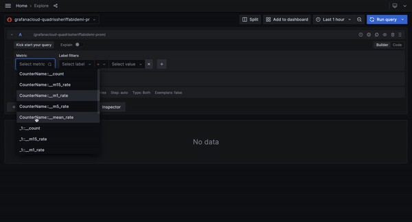

# Integrate Lightrun metrics into Grafana using the Grafana agent

In this guide, you will learn how to scrap metrics data from Lightrun and push the metrics data to a [Grafana cloud-hosted Prometheus instance](https://grafana.com/go/grafana-cloud-prometheus-1/) for visualization with [Grafana](https://grafana.com/).

[Grafana](https://grafana.com/) is an open-source analytics and monitoring solution for databases. By integrating Grafana with Lightrun, we can collect real-time metrics data (counter, tic toc, custom metrics)  from our live applications with Lightrun and send them directly to Grafana for monitoring and visualization from our preferred IDE without pushing new code.


## Prerequisites

This tutorial assumes that you have:

- A Lightrun account.
- A Grafana Labs account. Register for a Grafana free account [here](https://grafana.com/).


## Enable Lightrun Prometheus integration

The first step in the tutorial will be to activate the Lightrun Prometheus integration. 

To do that:

--8<-- "ux-reference/navigate-integrations.md"

3. From the **Integrations** page, click **Connect** from the Prometheus card.

    The **Prometheus Integration** window pops up:

    

4. From the **Round Up** dropdown list, select the rounding rule to be applied by Prometheus for your Lightrun data.
5. Click **Copy** from under the scrape configuration.
6. Click **Connect** and wait for the approval toast message.

## Configure the Grafana agent

The next step in this tutorial is to configure the [Grafana agent](https://grafana.com/docs/agent/latest/). The Grafana agent is a batteries-included telemetry collector that can be used to collect logs, metrics, and traces for Grafana.

!!! note
	The Grafana agent works with the same metrics format as Prometheus, hence can connect easily to Lightrun using the same scrape config file as Prometheus.

To install and run the Grafana agent,

1. Log in to your Grafana account and click **Create a dashboard**.
2. Click **Create your own** and select Prometheus on the **Choose a data connection** page. 
3. Select **Send Prometheus Metrics to Grafana Cloud**.
4. In the Configuration Details page, select **Via Grafana Agent** as your method for forwarding metrics. Choose your relevant OS architecture, then download and configure the required agent binaries. 
5. Enter your API token name and click **Create API** to create your API token. 
6. Copy and run the displayed code to generate your Grafana `agent-config.yaml` file.
7. Enter your copied Lightrun scrape configuration into the `agent-config.yaml` file.
8. Run your Grafana agent as specified in the instructions.

!!! important
    Your `agent-config.yaml` file should appear similar to the following.

	```yml
	metrics:
		global:
			scrape_interval: 5s
			remote_write:
				- url: https://prometheus-prod-13-prod-us-east-0.grafana.net/api/prom/push
			basic_auth:
				username: <grafana-cloud-username>
				password: <grafana-cloud-password>
		configs:
			- name: hosted-prometheus
			  scrape_configs:
				- job_name: "lightrun"
					scrape_interval: 5s
					scheme: https
					metrics_path: /athena/company/<lightrun-company-key>/integrations/prometheus/metrics
					static_configs:
						- targets: [app.lightrun.com]
					tls_config:
						insecure_skip_verify: false
				remote_write:
					- url: https://prometheus-prod-13-prod-us-east-0.grafana.net/api/prom/push
						basic_auth:
						username: <grafana-cloud-username>
						password: <grafana-cloud-password>
	```

## Confirm your integration

To confirm your integration, insert a Lightrun metric into your application and select Prometheus as your target. Then log in to your Grafana dashboard and navigate to **Explore** to visualize the collected data.



## Troubleshooting

- ` msg="Scrape failed" err="Get \"https://app.lightrun.com:443/athena/company/<company_id>/integrations/prometheus/metrics\": context deadline exceeded"` - This error occurs when your Grafana agent timed out before sending the collected metrics data to Grafana cloud. To resolve.

  1. Increase the `scrape_timeout` period in your `agent-config.yaml` file.
  2. Ensure that your firewall rules are not blocking Grafana agent queries to the Lightrun server.
  3. Ensure that there are no communication issues with your Grafana agent server.