# Integrate Lightrun with Instana using StatsD

--8<-- "ux-reference/manager-role-only.md"

When preparing to tackle challenging production bugs, it’s crucial to remember that building great infrastructure is not enough. Equally vital is the ability to gain insights into its performance. By leveraging the observability features of Lightrun and IBM Instana you will be able to observe the full stack of your production service, encompassing infrastructure, applications, and code-level information, all seamlessly integrated within Instana. 
Lightrun allows you to acquire, in real-time, a broad range of performance metrics for timing, synchronization, and business logic. These metrics provide immediate answers for identifying bottlenecks, with minimal impact on performance. 

Lightrun supports the following metric types:

- [Counter](https://docs.lightrun.com/actions/metrics/#counter): Checks how many times a specific line of code was reached.
- [Method Duration](https://docs.lightrun.com/actions/metrics/#method): Checks how much time a specific method took to execute.
- [Tic & Toc (Block Duration)](https://docs.lightrun.com/actions/metrics/#tic-toc): Checks how much time any arbitrarily-selected block of code took to execute.
- [Custom Metric](https://docs.lightrun.com/actions/metrics/#custom-metric): Checks what is the value of any code-level variable over time.

This guide will take you through the step-by-step process of integrating Lightrun and Instana using StatsD. This integration allows you to seamlessly transmit Lightrun metrics generated during runtime to Instana. You can then visualize these metrics in the Instana dashboard, allowing you to collect, emit, and visualize these Lightrun code-level metrics on an Instana dashboard from a running application within the [Instana Custom Dashboard](https://www.ibm.com/docs/en/obi/current?topic=instana-building-custom-dashboards).

Before we proceed with the integration setup, let’s review the process of ingesting Lightrun metrics into Instana.

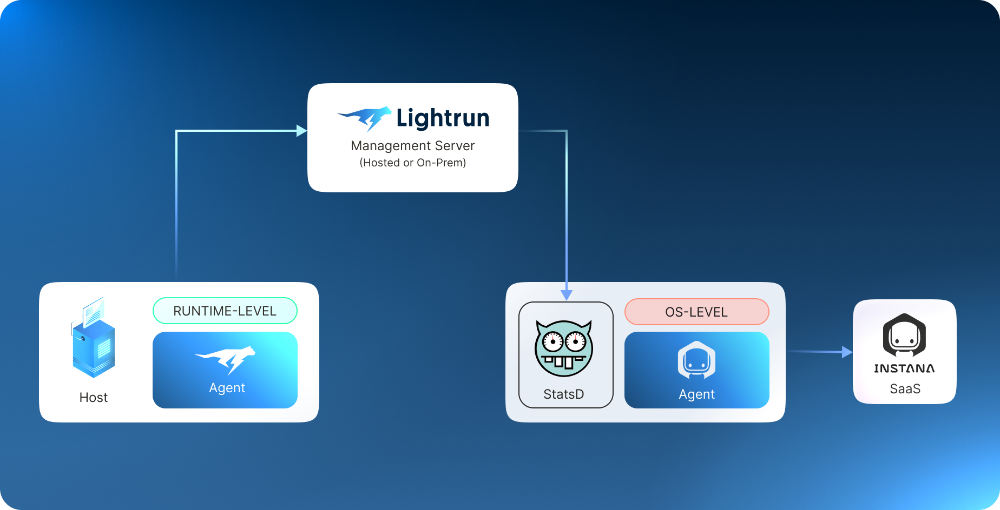{ width="750" }
 
This ingestion process involves the following steps:

1. Lightrun metrics are initially transmitted from the IDE Plugin to the Lightrun Management Server.
2. From the Lightrun Management Server, they can be exported to a remote StatsD daemon.
3. Subsequently, the metrics are then forwarded from the StatsD Sensor to Instana. 
It's important to highlight that Instana supports StatsD, enabling you to forward these metrics from StatsD to Instana. To activate this functionality, you must enable the StatsD Sensor in Instana's agent configuration settings.

The workflow of setting up the Instana-Lightrun integration is described in the following sections.
  
## Set up Instana with the StatsD Sensor

Prerequisites

- Sign up for an Instana SaaS trial [here](https://www.instana.com/trial/).
- Install the [Instana Host Agent](https://www.ibm.com/docs/en/obi/current?topic=agent-installation-requirements).

### Install Instana Agent with StatsD Sensor

1. [Install Instana’s Host Agent](https://www.ibm.com/docs/en/instana-observability/current?topic=agents-installing-host) on any machine that has at least one incoming open port. It is recommended to use the port already utilized for communication with the Lightrun Management Server.
2. [Enable the StatsD Sensor in Instana](https://www.ibm.com/docs/en/obi/current?topic=technologies-monitoring-statsd#configuration) by editing the following configuration file: `<agent_install_dir>/etc/instana/configuration.yaml`.
3.  Edit the `com.instana.plugin.statsd block` similar to the following code example:

  ```conf
  com.instana.plugin.statsd:
    enabled: true
    ports:
      udp: 8125
      mgmt: 8126
    bind-ip: "0.0.0.0" # all IPs by default
    flush-interval: 10 # in seconds
  ```
  !!! note "StatsD Ports"
      Although 8125 and 8126 are commonly used in this scenario, you can choose any port you’d like.

## Set up Lightrun with StatsD

The Lightrun agent is at the core of the Lightrun platform. It runs alongside your application and inserts Lightrun actions added through Lightrun IDE plugins into the application at runtime. It enables real-time instrumentation and exporting of Lightrun Actions.
Lightrun's agent can coexist with Instana's agents without any issues because both types of agents rely on different capabilities of the underlying system. Instana's agent runs at the operating system level, typically as a separate binary or container, while Lightrun's agent runs at the runtime level (JVM, V8, etc.) and is usually delivered as a runtime agent or language-level package. To install the Lightrun agent, see [Lightrun Agents](https://docs.lightrun.com/introduction/agents/).

### Enable Lightrun StatsD integration
To pipe the Lightrun metrics to Instana, you need Lightrun to work with the StatsD daemon.

To do so, we’ll enable the StatsD integration from the Lightrun Management Console:

1. Log in to the Lightrun Management Portal.
2. In the navigation pane, click **Integrations**.
3. In the **System Integrations** page, click **StatsD** and click **Connect**.
   
   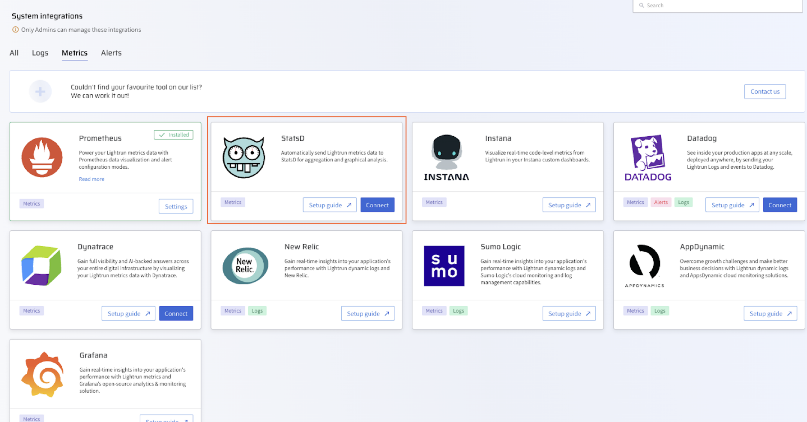{ width="800" }

4. In the **StatsD integration** dialog, enter the URL of the application host, where the Instana Host Agent is running, along with the port (typically 8125 or the port you selected in the previous step). 
   
   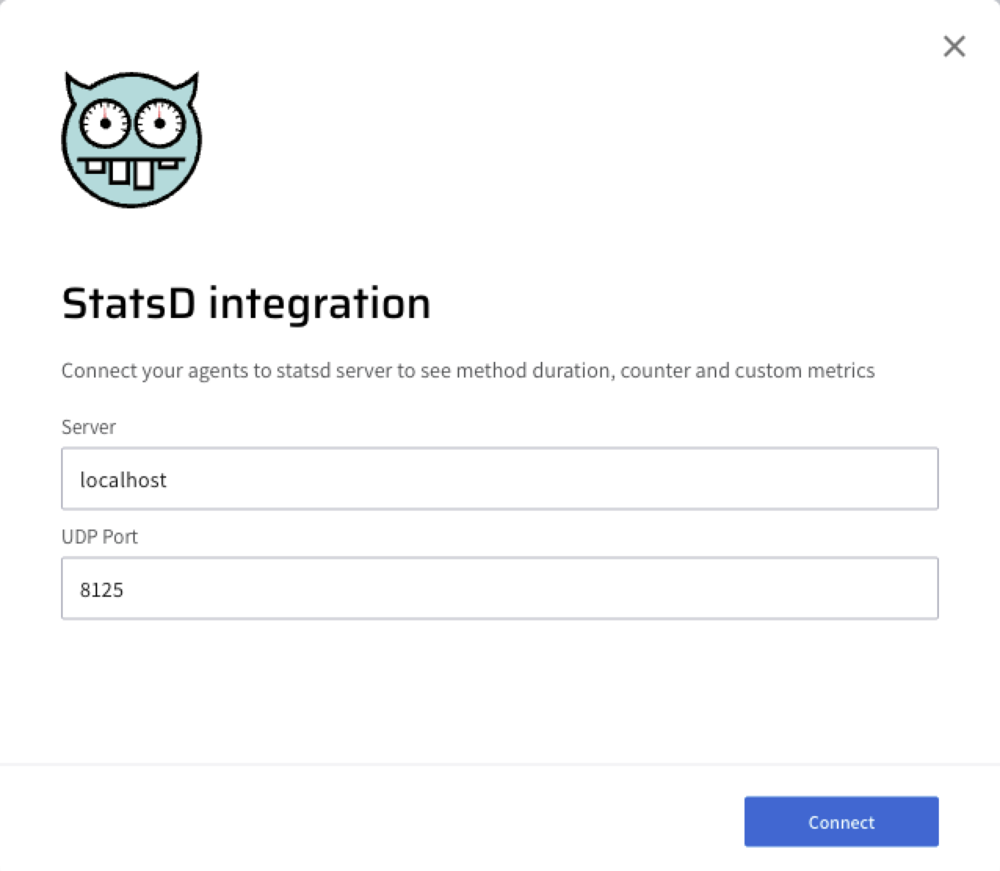{ width="600" }

5. Click **Connect**.
   Lightrun’s StatsD integration is now active. 
   
Proceed to create and pipe the Lightrun metrics to Instana.

## Insert Lightrun metrics into your code

Access your Lightrun IDE plugin and proceed to set up the metrics to be piped to Instana by setting the Target to StatsD.
The following example displays how to add a counter metric to the aws source that is added to a single line of code. A counter metric counts the number of code lines the code line has reached. 

##### INSERT A COUNTER METRIC INTO YOUR CODE

1. Place your cursor at the line in your source code where you want to insert the Counter, and right-click to open the context menu.
2. Hover over **Lightrun** and, from the Metrics menu, select **Counter**.

  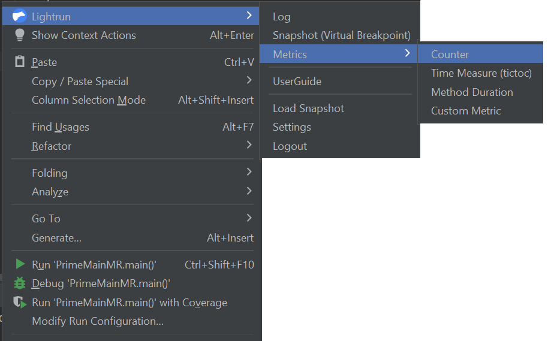

  The **Insert a Counter** page opens.

3. In the **Target** field, select **StatsD** as your preferred action output target.

  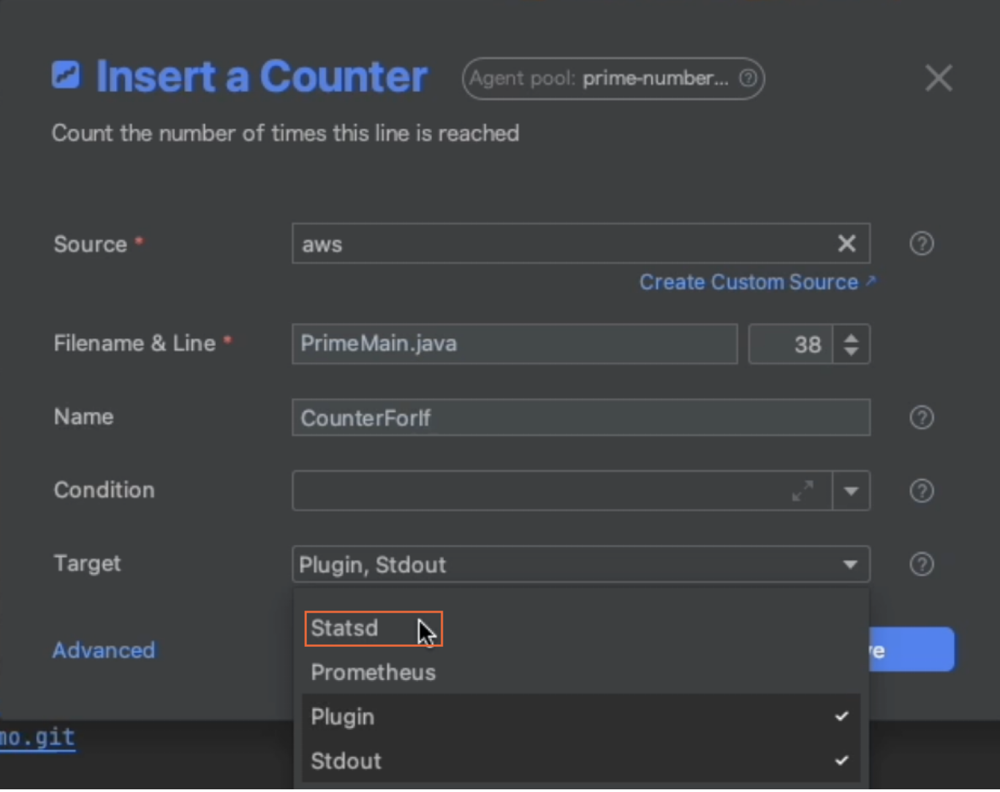

4. Click **OK** to add the Counter metric to your code. 
   The  icon should appear in the left gutter of the editor next to the code line where the action was added.

## Configure visualization in Instana

1. Navigate to the Instana landing home page, click the Instana logo and then click **Create Dashboard**.
   
  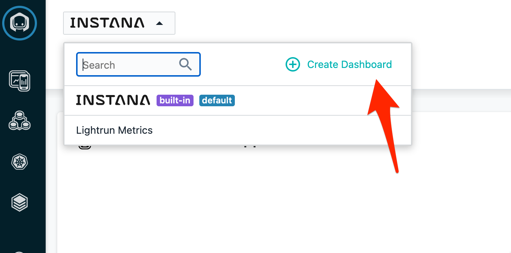{ width="600" }

2. Give the dashboard an intuitive name. For example, 'Instana Lightrun metrics' and click **Create**.

   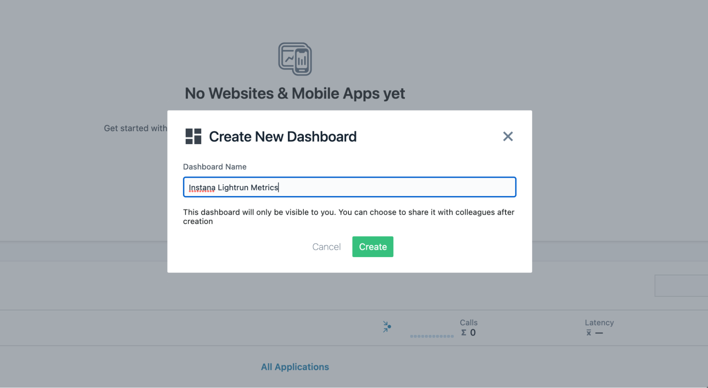{ width="600" }
 
 3. Once the dashboard is created, make sure the timing of the dashboard is set to **Live** and click **Add Widget**.

  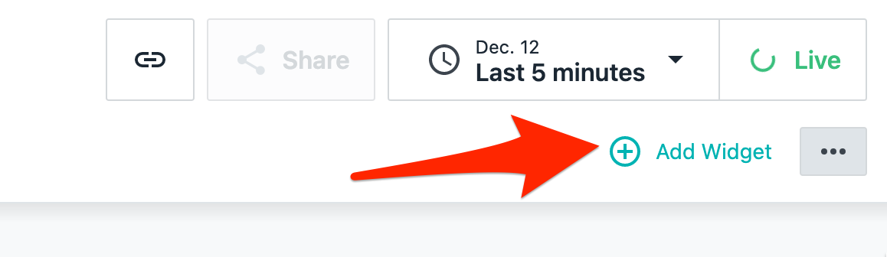{ width="600" }

  In this procedure, we will show you how to create the 'Chart: Time Series' widget as an example.

4. Select **Chart: Time Series** and click **Next**.

  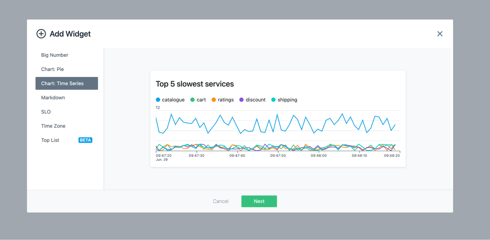{ width="600" }

5. In the Datasets dialog, select **Infrastructure and Platforms** from the **Data Source** list.

6. Select **StatsD** from the **Select metric** list.

   
  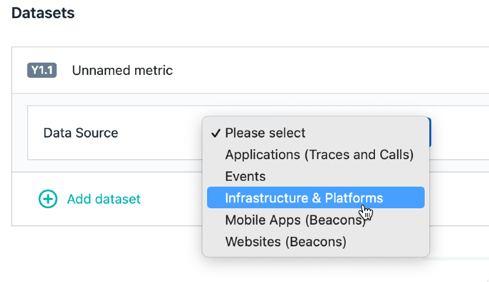{ width="600" }

1. Click the **Aggregation** list. In the search bar that opens, enter `InstanaLightrunMethodDuration` to search for the metric. Make sure to choose `.mean` as the suffix.

  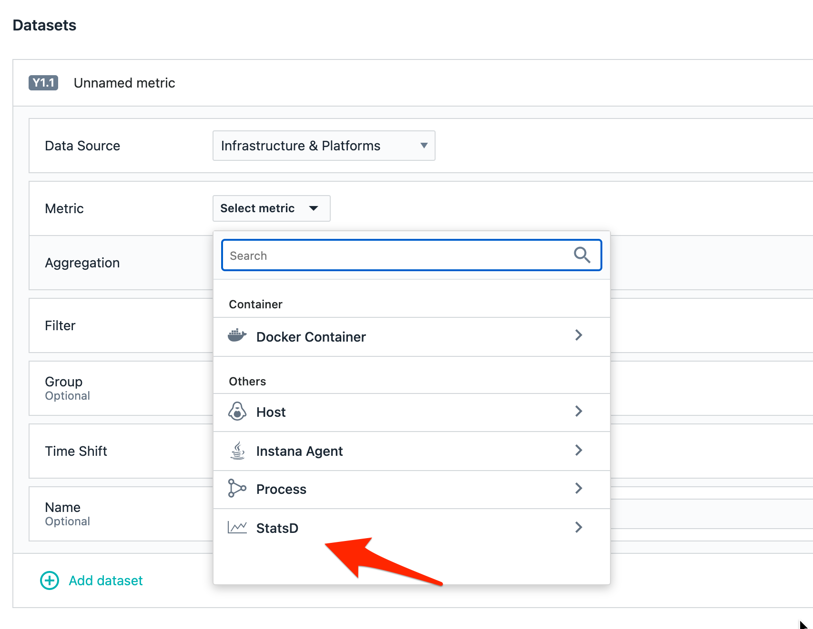{ width="600" }

  Lightrun exposes various aggregated metrics about the method invocations, and we’d like to view the mean.

  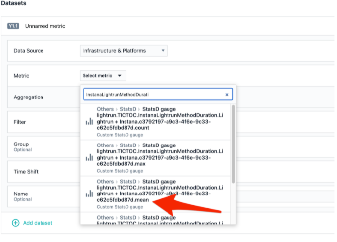{ width="600" }
  
8. In the **Name** field, enter **Time To isPrime** and click **Create**.
   
  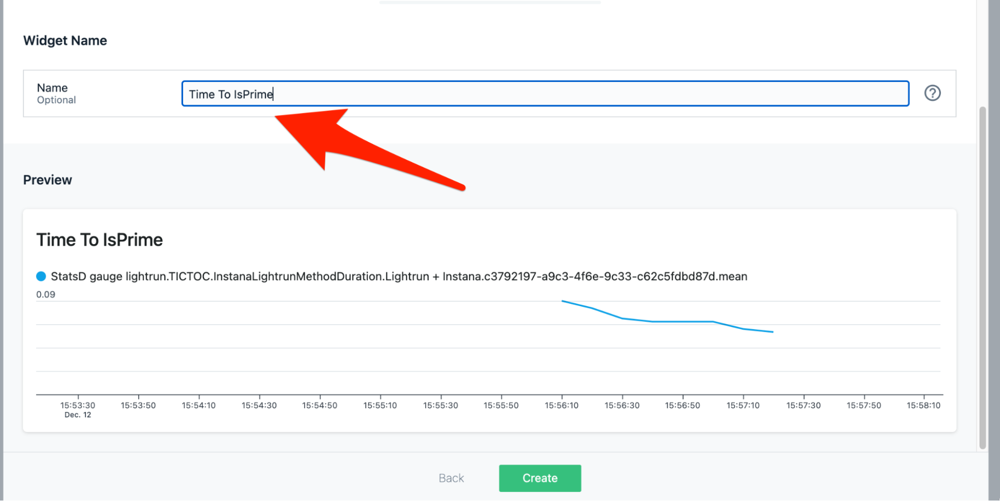{ width="600" }
 
  An indication is displayed with the Mean time it took to check for primality in the application.

  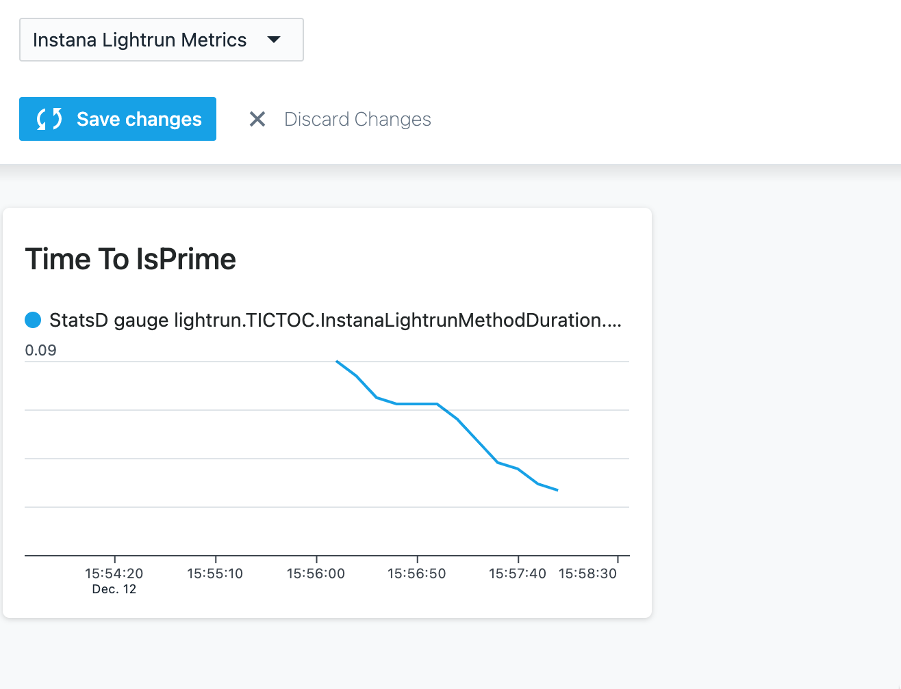{ width="600" }

## Demo: Pipe and view Lightrun metrics in Instana

This demo shows how to add the counter metric to a simple Java application, but it's important to note that Instana supports a wide variety of technologies. You can see the list of all supported technologies [here](https://www.instana.com/supported-technologies/).

We'll start by opening IntelliJ and adding a Counter metric into the application, selecting **aws** as the source, and providing an intuitive name. The process described throughout the guide and is demonstrated in the following video.

<iframe width="560" height="315" src="https://www.youtube.com/embed/_02iNL-gB5M" title="YouTube video player" frameborder="0" allow="accelerometer; autoplay; clipboard-write; encrypted-media; gyroscope; picture-in-picture" allowfullscreen></iframe>

## Further reading

To learn more about the IBM Instana and Lightrun Dynamic Observability Platform, see [IBM Instana and Lightrun Observability Platform Solution Brief](https://lightrun.com/resources/instana-lightrun-white-paper/).
