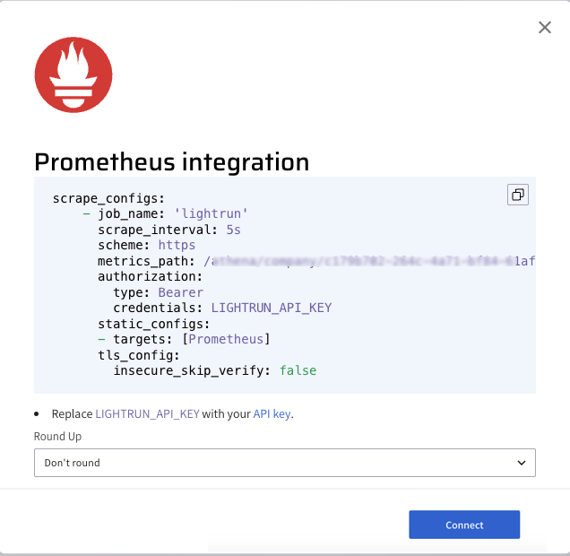

# Integrate Lightrun metric data into New Relic using Prometheus `remote_write`

In this guide, you will learn how to ingest Lightrun metrics data into [New Relic](https://newrelic.com/) from a Prometheus time series database with the [Prometheus `remote_write` capabilities](https://docs.newrelic.com/docs/infrastructure/prometheus-integrations/install-configure-remote-write/set-your-prometheus-remote-write-integration/).

New Relic is a cloud-based all-in-one observability platform that monitors performance and availability. By storing Lightrun metrics with Prometheus and ingesting the stored data into New Relic with Prometheus `remote_write`, you can analyze real-time metrics (counter, tic toc, custom metrics) collected from your live code using Lightrun with New Relic's advanced monitoring capabilities.


## Prerequisites

This tutorial assumes that you have:

1. A Lightrun account.
2. A New Relic account. Register for a free New Relic account [here](https://newrelic.com/).
3. [Prometheus](https://prometheus.io/) installed and running. Refer to the [Prometheus FAQ](https://prometheus.io/docs/introduction/faq/) as well for additional help.
4. Basic understanding of Prometheus concepts and terminologies.


## Configure the Lightrun Prometheus integration

The first step in the tutorial will be to activate the Lightrun Prometheus integration. 

To do that:

--8<-- "ux-reference/navigate-integrations.md"

3. From the **Integrations** page, click **Connect** from the Prometheus card.

    The **Prometheus Integration** window pops up:

    

4. From the **Round Up** dropdown list, select the rounding rule to be applied by Prometheus for your Lightrun data.
5. Click **Copy** from under the scrape configuration.
6. Paste the <code>scrape_configs</code> data to the existing <code>scrape_configs</code> section in your Prometheus YAML configuration file.
    

8. Start your Prometheus server.
9. Click **Connect** and wait for the approval toast message.


## Configure New Relic and Prometheus

After configuring the Lightrun Prometheus integration,  the next step is to configure our Prometheus server to send the collected metrics data to New Relic using the Prometheus `remote_write` capabilities.

To configure Prometheus New Relic `remote_write` connection, 

1. Log in to your New Relic account.
2. Click **Add Data** in the New Relic sidebar.
3. Search for Prometheus and select the **Prometheus Remote Write Integration**.

  

4. Enter a name to identify the data source and click **Generate URL** to generate the Prometheus `remote_write` configuration.
5. Add the configuration to your `prometheus.yml` file.
6. Restart your Prometheus server.

!!! note
	After adding the New Relic configuration to your `prometheus.yml` file, your `prometheus.yml` file should appear similar to the following.

	```yml
	# my global config
	global:
		scrape_interval: 15s # Set the scrape interval to every 15 seconds. Default is every 1 minute.
		evaluation_interval: 15s # Evaluate rules every 15 seconds. The default is every 1 minute.
		# scrape_timeout is set to the global default (10s).

		# Alertmanager configuration
		alerting:
		alertmanagers:
			- static_configs:
			- targets:
				# - alertmanager:9093

		# Load rules once and periodically evaluate them according to the global 'evaluation_interval'.
		rule_files:
		# - "first_rules.yml"
		# - "second_rules.yml"

		# A scrape configuration containing exactly one endpoint to scrape:
		# Here it's Prometheus itself.
		scrape_configs:
			# The job name is added as a label `job=<job_name>` to any timeseries scraped from this config.
			- job_name: "prometheus"

				# metrics_path defaults to '/metrics'
				# scheme defaults to 'http'.

				static_configs:
				- targets: ["localhost:9090"]
			- job_name: "lightrun"
				scrape_interval: 5s
				scheme: https
				metrics_path: /athena/company/<lightrun_company_id>/integrations/prometheus/metrics
				static_configs:
				- targets: [app.lightrun.com]
			tls_config:
			insecure_skip_verify: false
		remote_write:
		- url: https://metric-api.newrelic.com/prometheus/v1/write?prometheus_server=prometheus-lightrun
		bearer_token:<new_relic_api_token>`
	```

## Confirm your integration

To confirm your integration, insert a Lightrun metric into your application and select Prometheus as your target. The metrics data will appear in your metrics dashboard.

Query the collected data to gain more insights on your Lightrun metrics.


## Troubleshooting

- If the connection state is down, confirm that:
 
  1. Your firewall rules are not blocking Prometheus queries to the Lightrun server.
  2. There are no communication issues with your Prometheus server.

- If the connection state is down and there is a `server returned HTTP status 403 forbidden` error message. This error indicates that Prometheus integration is not currently enabled in your Management Portal.

    