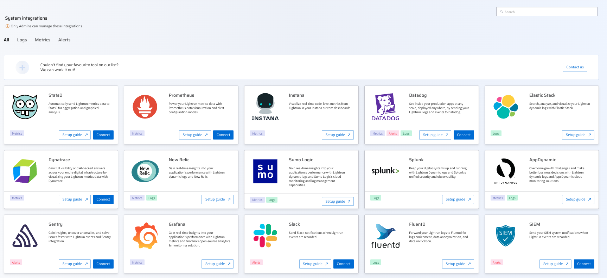

# Integrate with Lightrun

--8<-- "ux-reference/manager-role-only.md"

Lightrun seamlessly integrates with key third-party vendors to harness valuable and actionable telemetry data generated at runtime, providing a full-cycle observability platform. These integrations facilitate the troubleshooting of complex issues, contributing to the reduction of Mean Time To Resolution (MTTR).
The Lightrun integrations are set up in the Lightrun Management Portal, categorized under All, logs, metrics, and alerts, which can be triggered by events generated by Lightrun.
he currently supported integrations through the **Integrations** page in your Management Portal.

## Real-time integration with Lightrun data
The following real-time data generated and piped to your integrated third-party platforms provides the observability necessary for troubleshooting applications in production:

- Lightrun Metrics: Send Lightrun metrics generated in real-time to the designated partner. This functionality enables developers to collect, emit, visualize, and analyze code-level metrics from a running application. 
  
- Lightrun Logs: Easily Insert real-time dynamic logs into your live application with Lightrun and transmit the collected logs to the designated target for visualization and rapid analysis.

- Lightrun Events: Collect events related to activities in the Lightrun Management Portal, Lightrun plugins, and agents. Send these events to the target partner for valuable insights and continuous  monitoring. Events include user actions, agent registration, Lightrun action creation or deletion, and agent deletion.

## Supported Lightrun integrations

The following table lists the Lightrun integrations categorized by action type.
This list of integrations officially supported by Lightrun is constantly expanding. If you don’t find your favorite tool listed, please reach out to us.

| 
Vendor
             | 
Metrics
                    | 
Logs
                        | 
Alerts
                      |
|--------------------|----------------------------|-----------------------------|-----------------------------|
| [AppDynamics](app-dynamic.md)        | 
Prometheus external integration
 | 
N/A
                           | 
✅
                          |                           | 
External integration
       |
| [Datadog (events)](datadog-events.md)| 
StatsD external integration
 | 
[Datadog (logs)](datadog-logs.md)
             | [Datadog (events)](datadog-events.md)           |
| [Dynatrace](dynatrace.md)          | 
✅
 |
✅
                           |   
N/A
                          |
|[Elastic Stack](elastic-stack.md)      | 
✅
                          | 
✅

                           |  
N/A
                           |
| [FluentD](fluentd.md)            | 
✅
                          | 
N/A
                            | 
N/A
                         |
| [Grafana](/integrations/grafana/)            | 
✅
                          | 
External integration
       |
N/A
   |
| [HashiCorp Nomad](nomad.md)   |
N/A
  |
External intregration
  |
N/A
  |
| [Instana](instana.md)            | 
StatsD external integration
 | 
✅
                           | 
N/A
                            |                           |                             |
| [New Relic](/integrations/new-relic/)         | 
N/A
                           | 
StatsD external integration
| 
✅
                           |
| [Prometheus](prometheus.md)         | 
✅
                          | 
N/A
                            | 
N/A
                            |
| [Sentry](/integrations/sentry/)          | 
N/A
                           |
N/A
                             | 
✅
                           |
| [SIEM](/integrations/siem/)          | 
N/A
                           |
N/A
                             | 
✅
                           |
| [Slack](https://docs.lightrun.com/slack-alerts-overview-configuration/)              |
N/A
                            | 
N/A
                            | 
✅
                           |
| [StatsD](statsd.md)| 
✅
                          | 
N/A
 | 
N/A
                            |
| [Splunk](/integrations/splunk/) | 
StatsD external integration
|
N/A
                             | 
✅
                          |
| [Sumo Logic](/integrations/sumo-logic/)| 
StatsD external integration
|
N/A
                             | 
External integration<c/enter>       |
