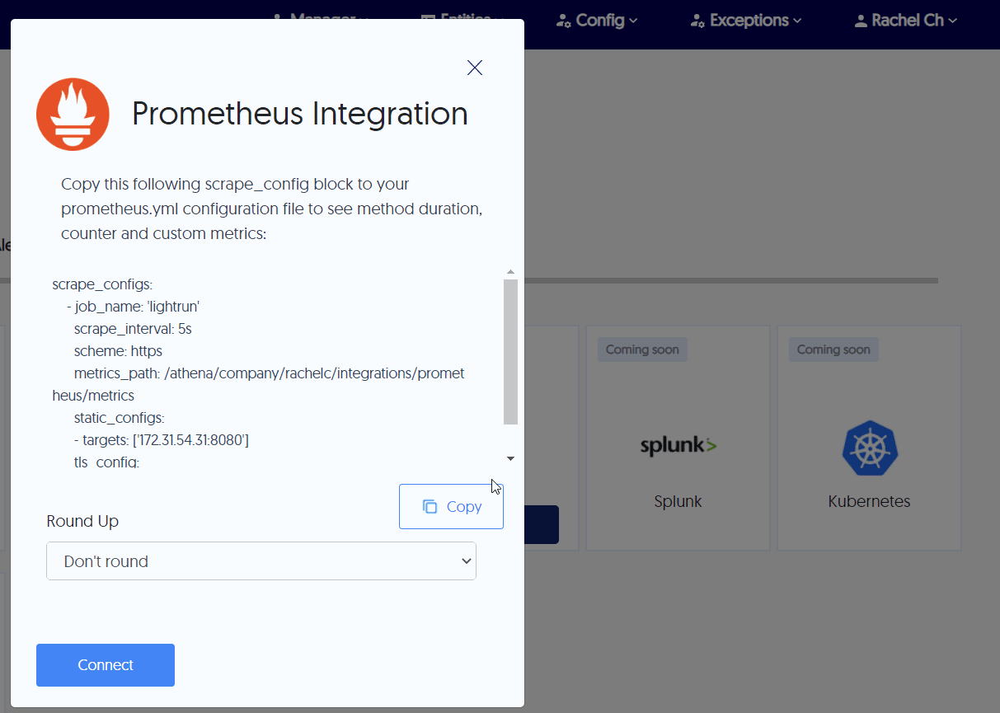

# Integrate Lightrun with Prometheus 

--8<-- "ux-reference/manager-role-only.md"

Prometheus is an open-source monitoring and alerting toolkit that scrapes and stores time series data locally from its configured targets (such as Lightrun) and then runs rules over the data for aggregation, recording, and alerting.

Prometheus offers multiple data visualization and alert configurations modes, including via additional tools such as Grafana, which can be very useful for visualizing Lightrun output data.

	 
## Prerequisites

- Install and configure [Prometheus](https://prometheus.io/). Refer to the [Prometheus FAQ](https://prometheus.io/docs/introduction/faq/) as well for additional help.
- From Lightrun version 1.23, you can generate a dedicated API Key to be added to the Prometheus JSON. For more information, see [Lightrun API Keys](/api-keys/).
- For Lightrun to send observability data to your integrations, ensure:
      
  - The application has a running agent attached to it.
  - Your action **Target** is set to **Promethues**.

## Enable and disable Prometheus integration

--8<-- "ux-reference/navigate-integrations.md"

2. From the **Integrations** page, click **Connect** from the Prometheus card.

    The **Prometheus Integration** window pops up:

    
	
3. Click **Copy** from under the scrape configuration. 

4. Paste the <code>scrape_configs</code> data to the existing <code>scrape_configs</code> section in your Prometheus YAML configuration file.

    

5. From the **Round Up** dropdown list, select the rounding rule to be applied by Prometheus for your Lightrun data.

6.  Click **Connect** and wait for the approval toast message.

7. To disable the configuration, click **Disconnect**.

## Confirm your Prometheus integration

If your Prometheus integration was successful:

1. The Prometheus card **Connect** button should change to **Settings** on your Management Portal Integrations page, and **Installed** should appear on the top left part of the card.
    
    

2. Lightrun should appear in your Prometheus interface **Targets** page, and the connection state should be **Up**.

    

## Troubleshooting Prometheus integration

- If the connection state is down, confirm that:
 
  1. Your firewall rules are not blocking Prometheus queries to the Lightrun server.
  2. There are no communication issues with your Prometheus server.

- If the connection state is down and there is a `server returned HTTP status 403 forbidden` error message. This error indicates that Prometheus integration is not currently enabled in your Management Portal.
    

