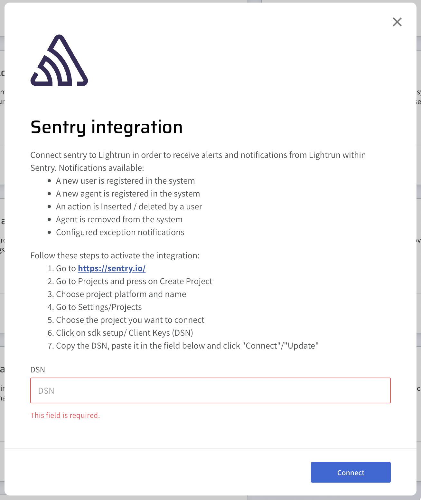
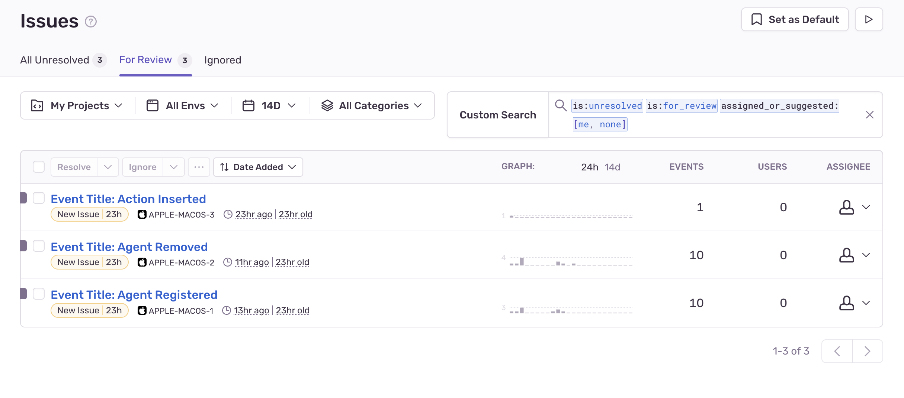

# Integrate Lightrun with Sentry

In this guide, you will learn how to pipe Lightrun events to [Sentry](https://sentry.io/) with the Lightrun Sentry integration.

[Sentry](https://sentry.io/) is a developer-first application performance monitoring and error tracking platform that can help you gain insights, uncover anomalies, solve issues, and learn continuously about your code. With the Lightrun Sentry integration, you can collect events on activities related to the Management Portal, Lightrun plugins, and agents and send the events to Sentry for insights and monitoring.

The following events will be collected from your Lightrun server and sent to your Sentry account when you configure the Lightrun Sentry integration.

- User registration events.
- Agents registration events.
- Lightrun action created or deleted events.
- Agents deleted events.

## Prerequisites

This tutorial assumes that you have:

- A Lightrun account.
- A Sentry account. Register for a Sentry free account [here](https://sentry.io/signup/).

## Create a Sentry project.

To create a Sentry project,

1. Log in to your Sentry account. 
2. Navigate to **Projects** > **Create Project**.
3. Select any platform, configure your alert frequency, and assign a name and team to your Sentry project. 
4. Click **Create Project** to create the new Sentry project.
5. Navigate to **Settings** > **Projects**.
6. Select the created project. 
7. Go to **Client Keys (DSN)** under **SDK SETUP**.
8. Copy the project’s DSN and store it in a safe place.

## Configure the Lightrun Sentry integration.

--8<-- "ux-reference/navigate-integrations.md"

3. From the **Integrations** page, click **Connect** from the Sentry card.

	The **Sentry integration** window pops up.
	

4. Enter the copied DSN into the **DSN** field
5. Click **Connect** and wait for the approval toast message.

After completing your integration, events captured from your Lightrun server should start appearing in your Sentry dashboard.

