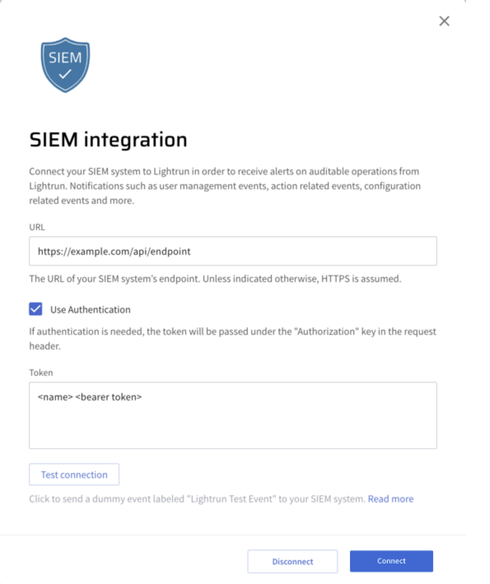
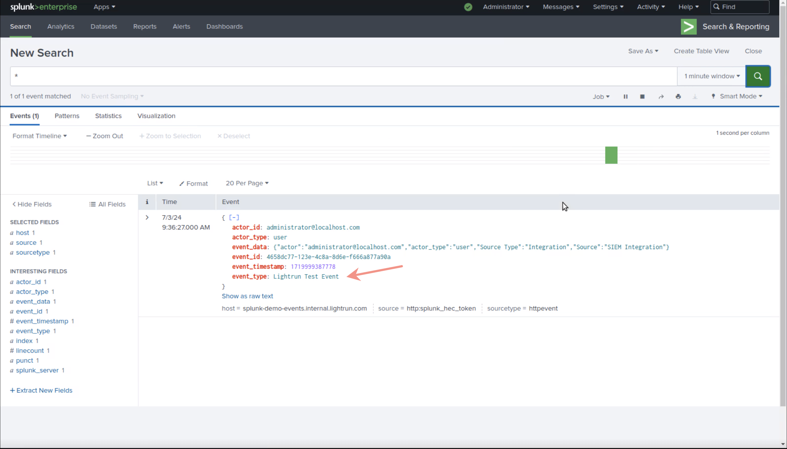
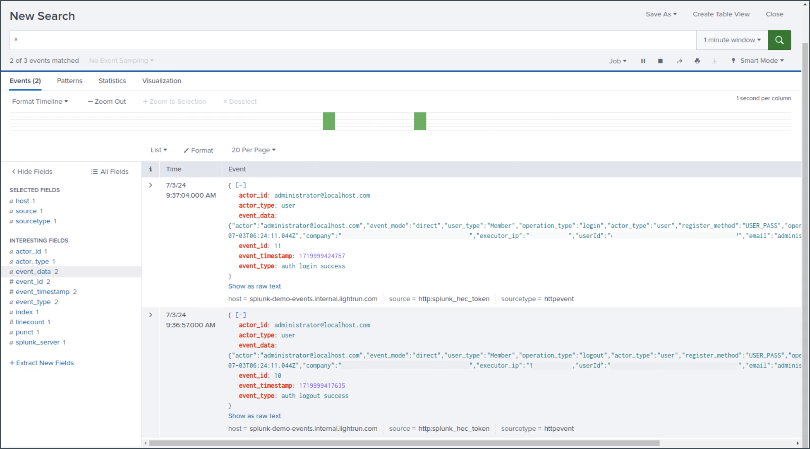

# Integrate Lightrun audit events to SIEM systems

--8<-- "ux-reference/manager-role-only.md"

Security Information and Event Management (SIEM) is a security methodology that helps detect, analyze, and respond to security threats before they harm business operations. It combines security information management (SIM) and security event management (SEM) into one security management system. 

The SIEM integration in Lightrun allows you to stream Lightrun audit events to your SIEM systems in real time, such as Splunk. You can receive any auditable event recorded by Lightrun in your SIEM system in real time, such as user management events, configuration changes, and runtime accessibility management events. Investigate these events at the convenience of your SIEM system, and set policies and alerts regarding user activities in Lightrun.
The Lightrun-SIEM integration supports setting up SIEM with or without authentication.

## Before you begin

- The URL of your SIEM system’s endpoint.
- (Optional) API Token: If Authentication is required, provide your API token to be included in the request header. 

## Set up SIEM with authentication

For this integration, we demonstrate how audit events are ingested into Splunk through the SIEM integration.

1. Log in to the Lightrun Management Portal.
2. In the navigation pane, click **Integrations**.
3. On the **System Integrations** page, click **SIEM** and click **Connect**.
    The **SIEM integration** page opens.
4. Enter the **URL** of the SIEM system.
5. (Optional) Enable authentication.

    a. Select the **Use Authentication** check box if required.
    
    

    b. Enter your predefined token in the following format: `<type> <credential>`. The token will be sent as part of the "Authorization" HTTP header.

6. Click **Test connection**. 

    Lightrun will send a test event, which will appear as performed by the user who clicked the button. To verify the configuration, look up this event in Splunk, which is the SIEM system used in this demo.

    

7. Click **Connect**.
   The integration is now set up. 
   Proceed to view how Lightrun audit events are displayed in Splunk.

### View Lightrun audit events in Splunk

1. Log out and log in to Lightrun.
2. Go to Splunk and view the relevant audit events related to the logout and log in actions.

   

