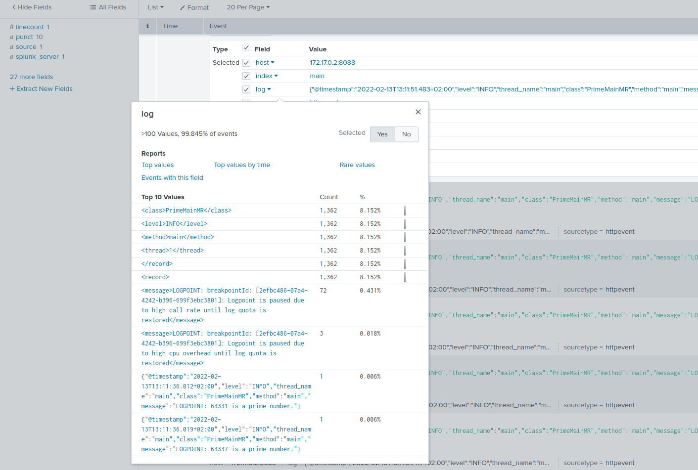

# Integrate Lightrun Logs to Splunk’s HTTP Event Collector (HEC) using the FluentBit Log Processor

In this guide, you will learn how to use the [Fluent Bit Log processor](https://fluentbit.io/) to collect log data from Lightrun and send the data to [Splunk’s HTTP Event Collector (HEC)](https://docs.splunk.com/Documentation/Splunk/7.0.3/Data/UsetheHTTPEventCollector). 

Splunk allows you to search, analyze, and visualize all of your data, providing valuable insights on your infrastructure that you can act on. By integrating Lightrun with Splunk using Fluent Bit as a Log collector, you will be able to add real-time logs to your live application on demand and gain actionable insights on the data with Splunk. 


## Prerequisites

This tutorial assumes that you have:

- A Lightrun account.
- Access to a Splunk Enterprise/Cloud service account. Register for a Splunk free trial account [here](https://www.splunk.com/en_us/download/splunk-cloud.html).
- Fluent Bit is installed and running. See [Getting started with Fluent Bit](https://docs.fluentbit.io/manual/installation/getting-started-with-fluent-bit) for Fluent Bit installation instructions.
- Basic understanding of Fluent Bit concepts and terminologies.


## Configure Splunk HEC

The first step in this tutorial is to set up Splunk to receive data through HTTPS.

To do that:

1. Log in to your Splunk’s cloud dashboard. 
2. Go to **Settings** > **Data Inputs** > **HTTP Event Collector** > **Global Settings**.
3. Ensure that your HTTP port number is 8080 and click **Enable SSL**.
4. Go back to the **HTTP Event Collector** page and click **New Token**.
5. Follow the steps to create an authentication token. 
6. Copy and save the token in a safe place.

## Configure Fluent Bit

Fluent Bit has two main configuration components:

- `INPUT` - Define where data should be collected from.
- `OUTPUT` -  Define where the collected data is sent to.

### INPUT Configuration

Add the following to your Fluent Bit configuration file as your INPUT. 

```conf
[INPUT]
    name tail
    path /tmp/lightrun_file_handler_logs1.log
```

!!! important
	  Change `tmp` to `%TEMP%` on Windows OS.

This configuration tells Fluent Bit to read from the `/tmp/lightrun_file_handler_logs1.log` file as the input with the Tail input plugin.

### OUTPUT Configuration

Add the following to your Fluent Bit configuration file as your OUTPUT. 

```conf
[OUTPUT]
    Name splunk
    Match *
    Host <SPLUNK_HOSTNAME/IP>
    Port 8088
    Splunk_token <AUTH_TOKEN>
    TLS ON
    tls_verify off
    splunk_send_raw_data on
```

!!! important
    - Change `<SPLUNK_HOSTNAME/IP>` to the hostname of the target Splunk service
    - Change `<AUTH_TOKEN>` to your Splunk authentication token. 

This configuration tells Fluent Bit to send the collected data to Splunk Events Collector with the  Fluent Bit Splunk plugin.

!!! important
    Fluent Bit configuration files are based on a strict Indented Mode, which means that each configuration file must follow the same pattern of alignment. By default, an indentation level is four spaces from left to right.

## Confirm your integration

To confirm your integration, restart Fluent Bit and add a Lightrun log to your application. Your Lightrun Logs data should appear in your Splunk event console.

