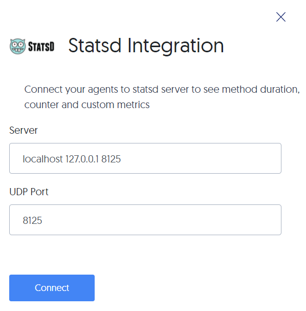

# Integrate Lightrun with StatsD


--8<-- "ux-reference/manager-role-only.md"

	 
Statsd is a network daemon that runs on the Node.js platform and listens for statistics, such as counters and timers, that are sent over UDP or TCP protocols. It then sends aggregates of the statistics to a backend services such as Graphite.

There's a short script that performs online metric scraping from the agent log file (usually `/tmp/lightrun_java_agent.INFO`).

``` {.bash}
cd <install-dir>/agent/stats/
./statsd_reporter.py --host <statsd-hostname> --port <statsd-port> --logfile <agent-log-file.txt>
```

!!! reqs "Prerequisites"
    Install and configure [StatsD](https://github.com/statsd/statsd).


    --8<-- "ux-reference/config-pipe.md"


## Connect to and disconnect from StatsD


--8<-- "ux-reference/navigate-integrations.md"

2. From the **Integrations** page, click **Connect** from the StatsD card.

    The **Statsd Integration** window pops up:
	
    

2. Complete the **Server** and **UDP Port** details, or if correct, leave the default values. 

3. Click **Connect** and make sure you see the approval toast message.

4. To disable the configuration, click **Disconnect**.