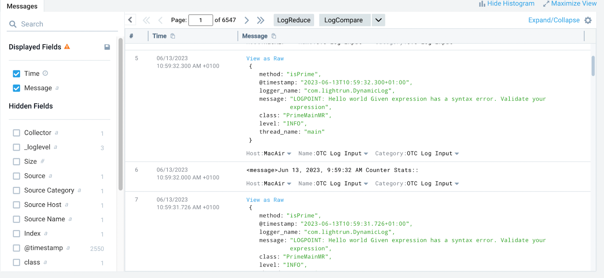

# Integrate Lightrun Logs to Sumo Logic using Sumo Logic OpenTelemetry (OTEl) collector

In this guide, you will learn how to pipe Lightrun logs to [Sumo Logic](https://www.sumologic.com/) with the [Sumo Logic OpenTelemetry(OTel) collector](https://help.sumologic.com/docs/send-data/opentelemetry-collector/). 

Sumo Logic is a popular cloud-native logging tool that makes gaining valuable insights from your log data easy. By integrating Lightrun with Sumo Logic, you can insert real-time dynamic logs into your live application with Lightrun and send the collected logs to the Sumo Logic platform for visualization and fast analysis. 

## Prerequisites

This tutorial assumes that you have:

- A Lightrun account.
- A Sumo Logic account. Register for a free Sumo Logic account [here](https://www.sumologic.com/sign-up/).

## Install Sumo Logic OpenTelemetry(OTel) collector

This tutorial's first step is installing the Sumo Logic OpenTelemetry(OTel) collector on your local machine. When you create a new account with Sumo Logic, you will be directed to their onboarding page with the installation instructions. Run the Sumo Logic OpenTelemetry collector and dashboards installer code to complete the installation step.

## Configure Sumo Logic OTel collector

After completing the installation step, the next step in this tutorial is to configure the Sumo Logic OTel collector to collect Lightrun logs and send the collected logs to Sumo Logic for analysis.

To do that,

1. Create a `lightrun.yaml` file.
2. Add the following YAML to the file.

	```yml
	receivers:
		filelog/custom_files:
			include:
				- /tmp/lightrun_file_handler_logs1.log
			include_file_name: false
			include_file_path_resolved: true
			storage: file_storage
			operators:
				- type: json_parser
				parse_to: body
				if: 'attributes["log.file.path_resolved"] matches "/tmp/.*"'
		start_at: beginning
	processors:
		groupbyattrs/file path resolved:
			keys:
			- log.file.path_resolved
	service:
		pipelines:
			logs/custom_files:
				receivers:
					- filelog/custom_files
				processors:
					- memory_limiter
					- groupbyattrs/file path resolved
					- resourcedetection/system
					- batch
				exporters:
					- sumologic
	```

  !!! important
      Change `tmp` to `%TEMP%` on Windows OS.

3. Move the `lightrun.yaml` file to the `/etc/otelcol-sumo/conf.d` directory or appropriate location for your operating system; see the [Sumo Logic documentation for more information](https://help.sumologic.com/docs/get-started/sign-up/#set-up-collector).

  ```bash
  $ sudo mv lightrun.yaml /etc/otelcol-sumo/conf.d
  ```

4. Run the OpenTelemetry installer.

  ```bash
  $ sudo otelcol-sumo --config=/etc/otelcol-sumo/sumologic.yaml --config "glob:/etc/otelcol-sumo/conf.d/*.yaml"
  ```

## Confirm your integration

To confirm your integration:

1. Change your log file handler format to JSON in your agent configuration and restart your Lightrun agent.
	```conf
	com.lightrun.DynamicLog.FileHandler.formatter=json
	```

  !!! note
      For instructions on how to edit your agent configuration, see:

	  - [Java Agent configuration](/jvm/agent-configuration/)
	  - [Node.js Agent configuration](/node/agent-configuration/)
	  - [Python Agent configuration](/python/agent-configuration/)

	     

2. Insert a Lightrun dynamic log into your code base.
3. Log in to Sumo Logic and navigate to **Manage Data** > **Collection** > **Open Telemetry Collection**.
4. Select your collector and click the **Open in Log Search** button.
5. You should be able to view and analyze your Lightrun logs. 

