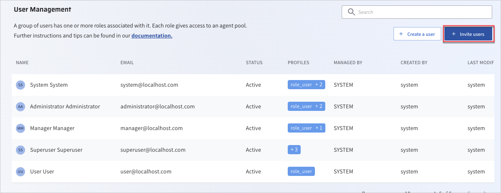
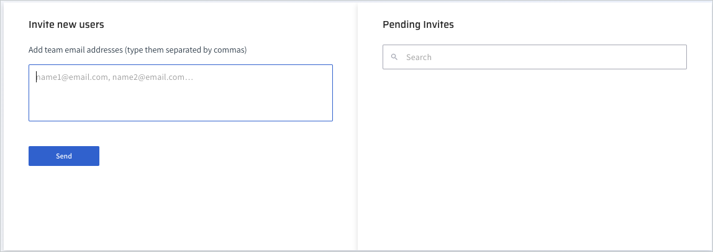
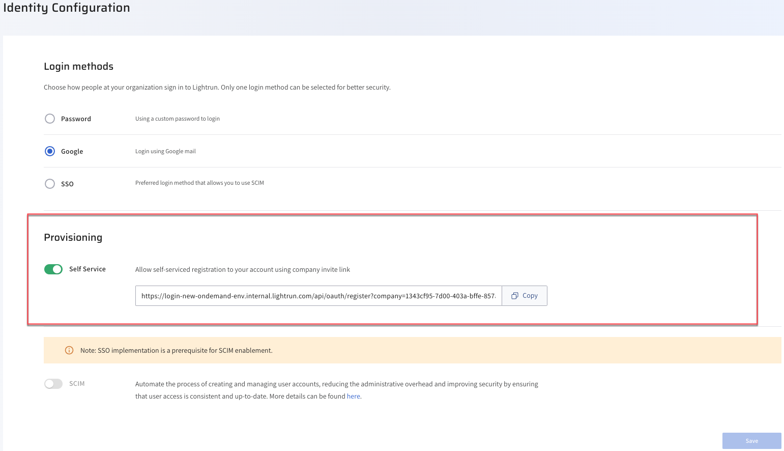

# Invite a user

Lightrun offers an efficient option to invite new users to register, in addition to manually adding users in the Lightrun Management Portal. This feature eases the burden on administrators, especially in medium to large-sized companies. 

Lightrun supports two methods for inviting new users:

- Email Invite: Send an email invitation directly to the new user.
- Preset URL: Provide a preset URL that users can use to register themselves.
  
For those who still prefer adding users manually, one by one, please see [Manager users with basic access](manage-users.md).

## Invite new users with an email invite

This method allows you to invite new users to join your Lightrun organization with a personal email. It is particularly useful for medium-sized organizations that would like to control the users added to the organization and give a personalized touch to the invite as opposed to the generalized URL. 

## Invite a user to an organization with an email

!!!Tip
    Get quick access to  on the main bottom left pane. In the Settings page.

1. Log in to your Lightrun account.
2. Click **Settings** located at the bottom left corner of your Management Portal.
3. Select **Users** under **Identity and Access Management**. The Users Management page opens.
4. Click **+ Invite users**.

    

    The **Invite new users** page opens.

    

5. Fill in the user emails and click **Send**.
    
## Invite new users with a predefined URL link

This method allows you to invite new users to join your Lightrun organization by providing them with a predefined link. It is particularly useful for larger organizations where you may need to onboard multiple users, and you want those users to enter their own credentials and complete the registration process.

With this method, you generate a unique link or token within Lightrun, and then you share this link with the individuals you want to invite. When they click on the link, they will be directed to a registration page where they can fill out their details, set up their accounts, and join your organization.

1. Log in to your Lightrun account.
2. Click **Settings** located at the bottom left corner of your Management Portal.
3. Select **Identity Configuration** under **Identity and Access Management**. 

    The **Identity Configuration** page opens.

4. Under the **Provisioning** section, copy the URL under the **Self Service** field.
    
5. Send the URL to your selected users in the organization.

## What’s Next

You can then proceed to assign user roles based on your access control method:

- To manage users and basic roles, see [Manage users and basic roles](manage-users.md).
- To manage users with RBAC, see [Manage users with RBAC](rbac/manage-users.md). 

