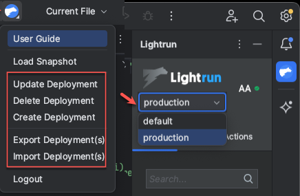
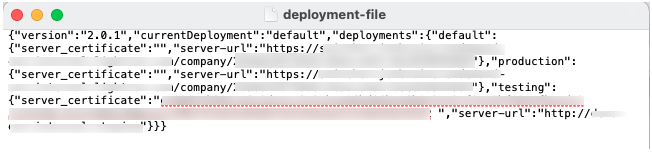
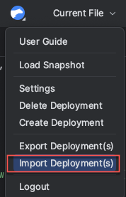
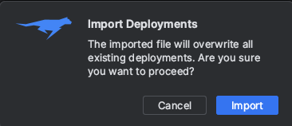
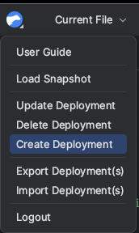
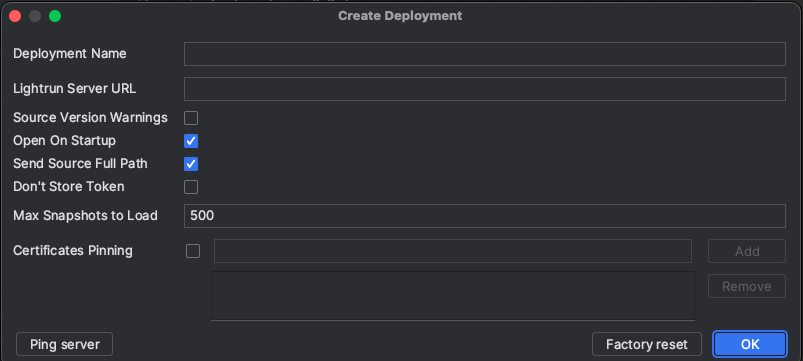
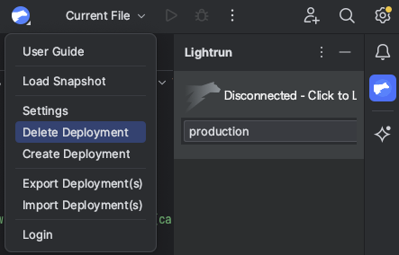
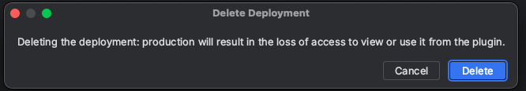

# Switch between deployments in the Lightrun plugin in JetBrains

!!! Note
    
    You need a Lightrun Enterprise plan to use the Deployment Switcher functionality. For more information, see [Pricing](https://lightrun.com/pricing/).

    The Deployment Switcher feature applies only to Single-tenant and On-premise environments and is activated upon demand. To enable this feature, please [reach out](mailto:lightrun-ticket@lightrun.com).

From version 1.38, Lightrun provides a Deployment Switcher directly within the Lightrun plugin in your IDE, designed for developers within large enterprise organizations who use Lightrun to debug applications across multiple deployment instances. Developers with the appropriate access permissions can seamlessly switch between deployments, such as from `TESTING` to `PRODUCTION` deployment or between `TESTING-EU` and `TESTING-US`. 

For example, you might have two deployments set up as follows: `default` and `Production`.

## Rules and guidelines

- The Lightrun server that you first authenticate the plugin is set as the default deployment upon login.

- Deployment settings apply only to your local IDE and do not affect other users. Any changes or modifications you make are local and specific to your setup. 

- The selected deployment remains active every time you enter your IDE. 

- At least one deployment instance must be set in the IDE and cannot be deleted. 

## Before you begin

For each deployment instance, you will need the full URL of the remote deployment you wish to access. To obtain this information, please contact your organization's administrator.

## Set up the Deployment Switcher in your organization

The Deployment Switcher is designed for large enterprise organizations that manage multiple deployments. We recommend that an administrator or a designated team member generate and distribute the deployment settings to the users in your organization.

The recommended stages for deploying the Deployment Switcher in the Lightrun plugin for all the users in the organization are:

1. Administrator Tasks:

    a. Create a list of deployments: From within the plugin: create a list of deployments.

    b. Export the list of deployments: From within the plugin, export the list of deployments to an external file.

    c. Distribute the file: Share the exported file with all the relevant developers in the organization.

2. Developer Tasks:

   - Import the file:  Use the Import Deployment option available in the Deployment Switcher list to import the file.

### Stage 1: [Admins]: Create and export a list of deployments

1. Create a list of deployments. Follow the Add a new deployment to the deployment switcher procedure.

2. From the  drop-down list on the menu bar in the JetBrains IDE, select **Export Deployment(s)**.

3. The **File Explorer** window opens, allowing you to set the location for saving the file on your local drive.
    
    The file is saved with a user-defined file name in the following format. 

    

4. Distribute the file to your developers with instructions on how to import the file within the plugin.

### Stage 2: [Developers] Import deployment file

1. From the  drop-down list on the menu bar in the JetBrains IDE, select **Import deployment (s)**.
   
    

    The Explorer window opens. 

2. Select the deployment settings file you exported in the previous step.
   
   The following message is displayed.

    

3. Click **Import**.
4. Log out and log in to apply the changes.

## Manage Deployments

### Add a new deployment to the Deployment Switcher

1. Click the  in the menu bar in your JetBrains IDE to access the drop-down list.

2. Select **Create Deployment**.

    

    The **Create Deployment** window opens.
   
   

3. Enter the deployment details:

   - **Lightrun Deployment Name**: Provide an intuitive name to recognize your deployment, such as Production, Staging, or a geographical location.

   - **Lightrun Server URL**: Provide the full path to your Lightrun server.

   - **Certificate Pinning List**: Add your 64-character SHA-256 certificate public key hash for pinning.

   - **Send source full path check box**: Select the checkbox to send the source full path.

4. Click **Create**.	
    The new deployment is added to the lists of deployments. You can view its settings by selecting the deployment name and then choosing **Settings** from the Lightrun drop-down list.

### Edit deployment settings

You may want to edit deployment settings, such as updating the certificates for the Lightrun Server URL.

1. In the Lightrun plugin, open the deployment list and select the deployment you want to modify.
2. From the  drop-down list on the menu bar in the JetBrains IDE, select **Settings**.

    The Update Deployment window opens.
3. Make the necessary changes and click **OK**.
4. Log out and log in to the Lightrun server to apply the changes.

### Delete a deployment 

You can remove any deployment from the deployment list in the Lightrun plugin, except for the last one. This action will only delete the deployment from your local deployment list and will not affect other users.

1. From the deployment list in the Lightrun plugin, select the deployment to delete.
   
   As displayed in the following example, select **production**.

2. From the  drop-down list on the menu bar in the JetBrains IDE, select **Delete Deployment**.
   
    

    The **Delete Deployment** message opens.

    

3. Click **Delete**.

    The deployment is removed from the list.