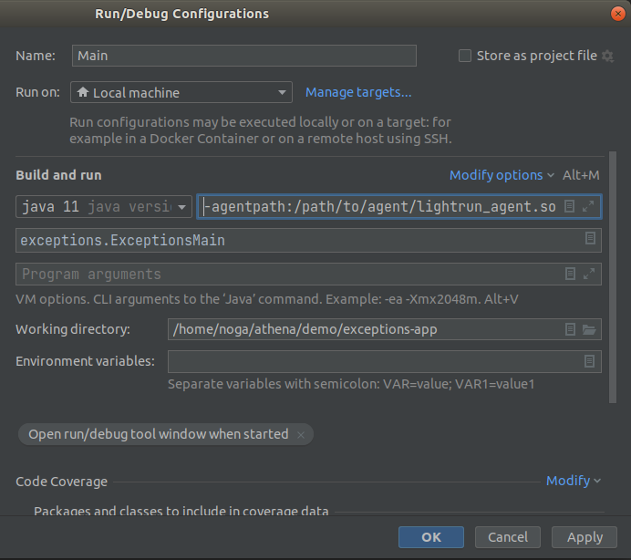
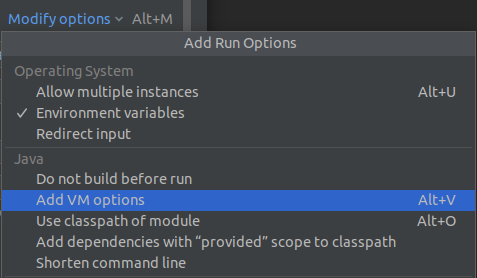

# Install the Lightrun Java agent

The Lightrun agent is at the core of the Lightrun platform. It's the component that communicates requests for runtime observability to your running code, and gathers and relays the requested data back to the Lightrun Server, and eventually the developer's IDE.

Before running the agent, it must be installed on the system where your code to be monitored is running, and its credentials must be declared either inside an `agent.config` file, or as environment variables entered from the command line.

## Before you begin

- This document is intended for Java developers working with JDK 8+. 
  - To set up Lightrun with Kotlin, click [here](kotlin.md).
  - To set up Lightrun wiht Scala, click [here](scala.md).
- Before you proceed with the installation, review the JVM agent system requirements [here](system-requirements.md).
- Alpine Support:
  - When downloading the Lightrun agent, make sure you select the correct OS based on the OS **of your base image**. If, for example, you're using [`openjdk:17-alpine`](https://hub.docker.com/layers/openjdk/library/openjdk/17-alpine/images/sha256-a996cdcc040704ec6badaf5fecf1e144c096e00231a29188596c784bcf858d05?context=explore) in the `FROM` line of your image, you should use the Lightrun `alpine` agent.

  - To run the Lightrun Java agent on an Alpine operating system, ensure `libstdc++` is installed on the system.

    ```bash
    apk add libstdc++
    ```

You can install the Lightrun Agent using one of following methods:

- [A direct installation](#direct-installation) 
- [Within a Docker container](#docker-installation) 
- Using the [IntelliJ IDE](#runintellij) 
  

To get started, download the Lightrun agent.

## Downloading the Lightrun Java Agent

If you haven't yet done so, please [sign up for a Lightrun account](https://app.lightrun.com/api/oauth/register).

Our onboarding flow will direct you to download the agent. You can also download the Lightrun JVM Agent from the Management Portal.

##### Download the agent

1. Log in to the [Management Portal](https://app.lightrun.com){:target="_blank"}.
2. Copy the download script from the **Install the Agent** section.

    
    
1. Open a terminal and navigate to the directory where your project folder is located.
2. Paste the copied script into your terminal and click the **enter** or **return** key to download.

Now that you have downloaded the agent, you can proceed to use it.

## Run directly {#direct-installation}

On completion of the agent download, from your terminal, enter the following command:  
`java -agentpath:<path-to-agent>\lightrun_agent.so -jar <your-jar-file> RestofArgumentsHere`  

Replace the placeholders in the command as follows:

- `<path-to-agent>`: The full path to the agent's folder (`~/` will not work)  
- `<your-jar-file>`:The full path to the application to be run with the agent  
- `RestofArgumentsHere`: Any [relevant configuration options](agent-configuration.md){:target="_blank"}.  
  
See the example in this video:
  
<iframe src="https://player.vimeo.com/video/542152672?title=0&amp;byline=0&amp;portrait=0&amp;speed=0&amp;badge=0&amp;autopause=0&amp;player_id=0&amp;app_id=56727" width="640" height="360" frameborder="0" class="vimeo_edit" allow="autoplay; fullscreen" allowfullscreen></iframe></p>


!!! tip "Optional"
    To cause all launched Java processes automatically to be attached to an agent, you can add the `JAVA_OPTS` environment variable.  
    From the terminal, enter the following command (replace the `agentpath` value with the path to the Lightrun agent):

    ```shell
    export JAVA_OPTS=-agentpath:/path/to/agent/lightrun_agent.so
    ```

## Run with Docker {#docker-installation}

Docker containers are [ephemeral](https://docs.docker.com/develop/develop-images/dockerfile_best-practices/#general-guidelines-and-recommendations).

If you were to create a shell into a Docker container (by `docker exec -it <container-id>`, for example) and add the Lightrun files there, they would disappear the next time the container would spin up due to the ephemeral nature of that container.

Instead, we suggest you install Lightrun by adding it to the underlying Docker image directly, i.e. by "baking" the agent into the image.

The following example displays how to add the Lightrun Agent to the `Dockerfile`:

```dockerfile
FROM openjdk:11

WORKDIR /opt/lightrun
ENV LIGHTRUN_KEY=<LIGHTRUN_KEY>
RUN bash -c "$(curl -L "https://app.lightrun.com/public/download/company/<ORG-ID>/install-agent.sh?platform=<your-base-image-os>")"

COPY prime.jar /app/prime.jar

CMD ["java", "-agentpath:/opt/lightrun/agent/lightrun_agent.so", "-jar", "/app/prime.jar"]

```
!!! important

     Post Installation instructions: 

    - Ensure that the `agent` folder is located in the Docker image build path, i.e. it is present in the current working directory when you're running `docker build . -t <image-name>`.
    - `<LIGHTRUN_KEY>` environment variables: Available from the Lightrun Management Console under the **Install an Agent** section. Do note that for production use, it's a good idea to persist that secret in an external secret managment solution, like [HashiCorp Vault](https://www.vaultproject.io/).


!!! tip "Optional"
    To cause all launched Java processes automatically to be attached to an agent, you can add the `JAVA_OPTS` environment variable.  
    From the terminal, enter the following command (replace the `agentpath` value with the path to the Lightrun agent, after it has been downloaded).

    ```shell
    export JAVA_OPTS=-agentpath:/path/to/agent/lightrun_agent.so
    ```

## Run with IntelliJ {#runintellij}

You can attach the agent also when running your application from IntelliJ:

1. Go to the **Run/Debug Configuration** of your application.

1. Add the following agent argument to the **VM options** field.

    ```bash
    -agentpath:/path/to/agent/lightrun_agent.so
    ```

3. Replace the `agentpath` value with the path to the Lightrun agent.

    
     
    
4. If the **VM options** field is not available, choose **Modify options** and add the field.
     
    

## Java Agent post-installation
- If you cannot see the agent in your plugin or the management portal, please use the [troubleshooting guide](/troubleshooting/java-troubleshooting/) or contact us. 
- You can customize the agent configuration at any time. To apply the changes, the application must be restarted. For more information, click [here](agent-configuration.md){:target="_blank"}.

### Adding support for Java debugging symbols  

--8<-- "ux-reference/add-debug-symbols.md"