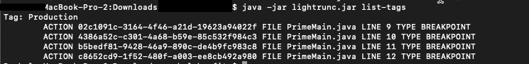

# Manage Lightrun Java agent tags

Tagging enables you to group agents together by using a meaningful name, typically based on common functionality. For example, you can use tags to identify the location and purpose of each agent: Database servers, Staging, and so forth. Additionally, you can apply to each agent multiple tags in any combination.

By applying multiple tags, you can bind actions to an agent before the agent has been launched, and you can apply actions to applications across different sectors. Once an action is bound to a tag, it is implicitly added to all of the agents that possess that tag.

!!! example

    -    Define a tag in the metadata file named "Integration".
    -    Add that tag to relevant agents where you're running your application for integration testing.
    -    Set integration tests to execute with the Integration tag, in order to debug an integration test failure.
    -    List actions by the Integration tag from the [CLI](/cli/cli_reference/) with `java -jar lightrunc.jar list-actions tag:Integration`.  
    The output lists all of your agents that inserted actions for integration testing.

Out-of-the-box, agents have a single **Production** tag. You can:

- [Create and manage tags](#managing-tags)

- [View all tags](#view)

- View tags and their details directly [from the CLI](#view-tags)

#### To create and add a tag to an agent

1. From the relevant server where the agent is installed, go to the `agent.metadata.json` file and open it.

2. Insert tag names within the **tags** object (which should be nested in the **registration** object).

    ``` {.json}
    {
      "registration": {
        "tags": [
          {
            "name": "Tag1"
          },
          {
            "name": "Tag2"
          },
          {
            "name": "Tag3"
          }
        ]
      }
    }
    ```

    For example, the following JSON applies the tags Production, Main, and East US to the relevant agent.
  
    ``` {.json}
    {
      "registration": {
        "displayName": "<DISPLAY_NAME>",
        "tags": [
          {
            "name": "Production"
          },
          {
            "name": "Main"
          },
          {
            "name": "East US"
          }
        ]
      }
    }
    ```

    Alternatively, tags can be applied using a command line argument as part of the command you use to run the agent with your application.

    Multiple tags can be specified by separating them with commas. For example, you can set them like this:


    ``` {.bash}
    java -Dlightrun.registration.tags=myTag1,myTag2,myOtherTag
  
    ```

3. Save the changes and close the file.

4. Restart the application.

  !!! imp "Important"

      Changes to this file aren't detected until the application is restarted.

#### To view all tag details from the Management Portal {#view}

Log in to your Lightrun account and navigate to **Entities->Tags**.

The **Tags** screen loads, appearing similar to the example below.


The details displayed in the **Tags** screen are as follows:

| Column  | Description                                               |
| ------- | --------------------------------------------------------- |
| Name    | The tag name                                      |
| Actions | A list of actions currently attached to this tag.       |
| Agents  | A list of agents with which this tag has been associated. |

#### To view tags from the CLI {#view-tags}

1. Install the [Lightrun CLI tool](/cli/installation/)

1. Run the command `java -jar lightrunc.jar list-tags`:

     

!!! info
     See the [CLI reference](/cli/cli_reference/) for more information.
