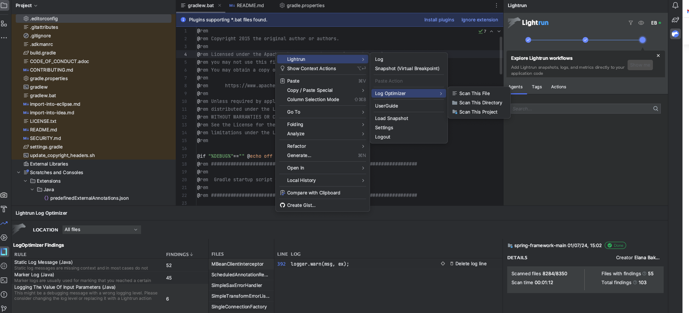

# Lightrun LogOptimizer

Lightrun LogOptimizer is an automated log-optimization and logging cost-reduction solution that enables developers to scan their source code for logging quality issues directly within the IDE. It seamlessly integrates into your IDE as part of the Lightrun JetBrains plugin, and is compatible with the JetBrains suite of IDEs, supporting Java, Python, Node.js, and C# projects. You can find it in the left navigation bar and is accessible from the LogOptimizer icon.

As a developer, LogOptimizer offers on-demand visibility into non-essential logs within your source code, reducing noise and overall logging costs. This approach steers FinOps practices towards engineers, aiding the transition from static to dynamic logging. Establish a continuous, optimized process for log integration into your DevOps practice, minimizing noise from over-logging practices like marker logs, or methods with duplicate instruction logs. This ensures cleaner code and eases the identification of valuable information within logs.



As a best practice, we recommend:

- Run LogOptimizer as part of your development process.
- Identify static, costly, and redundant logs, and remove them from the code.
- Eliminate legacy unused code lines added historically and left in the code.
- Stay constantly aware of your logging utilization and associated costs.
  
To learn more about how Lightrun boosts developer productivity, see [Lightrun logoptimizer gets a developer productivity and logging cost reduction boost](https://lightrun.com/lightrun-logoptimizer-gets-a-developer-productivity-and-logging-cost-reduction-boost/) blog.

## How does LogOptimizer work?

In your IDE, once lightrun Plugin is logged in and Docker Desktop is running, activate the LogOptimizer solution, and select a file, directory, or project to be scanned. LogOptimizer scans specific source files or the entire codebase for potential logging issues, flags the suspected logs and displays them in an organized list. Multiple logging quality rules are applied during the scan. The results are grouped by Language (Java, Python, Node.js) and then according to predefined rules. This allows you to prioritize reviewing the results by rule type and focusing first on rules which are more of importance to you. For example, focusing on logs which only contain a static log message. 
You can then review the scan, investigate the relevant source code, and decide what to do next. 

Recommended next actions: 

- Remove the logging statement in case it does not provide any value.
- Remove the logging statement and replace it with a dynamic Lightrun log.
- Update the log message to contain more valuable information.
- Change the log level to a more appropriate one.

## LogOptimizer rules applied during scanning

During the scan process, LogOptimizer examines the logs associated with your selected files according to the following built-in rule categories and provides results based on these main categories.

### Static log messages
Static log messages are missing context and in most cases do not provide enough value. 

!!! tip
    Add more context to the logging statement or replace it with a Lightrun action.

### Marker logs
Marker logs are typically used to indicate that a specific point in the code has been reached without providing additional information. While Marker logs are sometimes necessary; they can clutter your logs, hiding the more important information. Marker logs should be removed and replaced with a Lightrun dynamic log that is only logged whenever there is important data, like a specific user identifier.

An example of a marker log:

```java
public String foo(int bar) {
	logger.info("Starting method foo");
	...
	
	logger.info("Querying user {} profile details", user.getId());

	...
	logger.info("Exiting method foo");
	return value;
}
```
!!! tip
    Remove this logging statement or replace it with a dynamic Lightrun log.

### State reflecting logs
State reflecting logs are used to expose variables' values that might be interesting under certain circumstances. For example, state reflecting logs can be used to expose method input parameters, return values of method calls, data queried from a database, etc.

State reflecting logs are only relevant when the values returned are not what you expect. Most of the time, the values returned by state reflecting logs are expected; hence not useful. These expected log statements can be very wasteful as data returned from variables or databases can contain lots of information.

An example of a State reflecting log:

```py
def countries(language);
	logging.info(f"Processing countries for language {language}")

	with open('countries.json', encoding='utf-8') as data_file:
    	countries = json.load(data_file)

	logging.info(f"Read {len(countries)} countries from the JSON file.")

```

!!! tip
    Replace State reflecting logs with a Lightrun snapshot which is only activated when the variable value is different from what you expect. Using a snapshot has additional value as it allows you to easily view more complex variable types such as objects, arrays, and hashes.

### Repeated logging of the same variable

Multiple instructions logging the value of the same variable. 

An example of logging the value of the same variable multiple times:

```java
private boolean authorize(User user, Action action) {
	logger.info("User {} is trying to perform action {}", user.getId(), action.getName());

	if (isAdmin(user)) {
		logger.info("User {} has super powers - can perform action {}", user.getId(), action.getName());
		return true;
	}

	...

	logger.info("User {} not allowed to perform action {}", user.getId(), action.getName());
}
```

!!! tip
    Merge them into a single logging statement or replacing with a Lightrun action.

### Logging the value of input parameters

This might be a debugging message with a wrong logging level. 

!!! tip
    Consider changing the log level to a more appropriate one.

### Logging method return value

This might be a debugging message with a wrong logging level. 

!!! tip
    Change the log level to a more appropriate one.

## Get Started

- [Scan your code using Lightrun LogOptimizer](/logoptimizer/scan-code-using-logoptimizer/)
