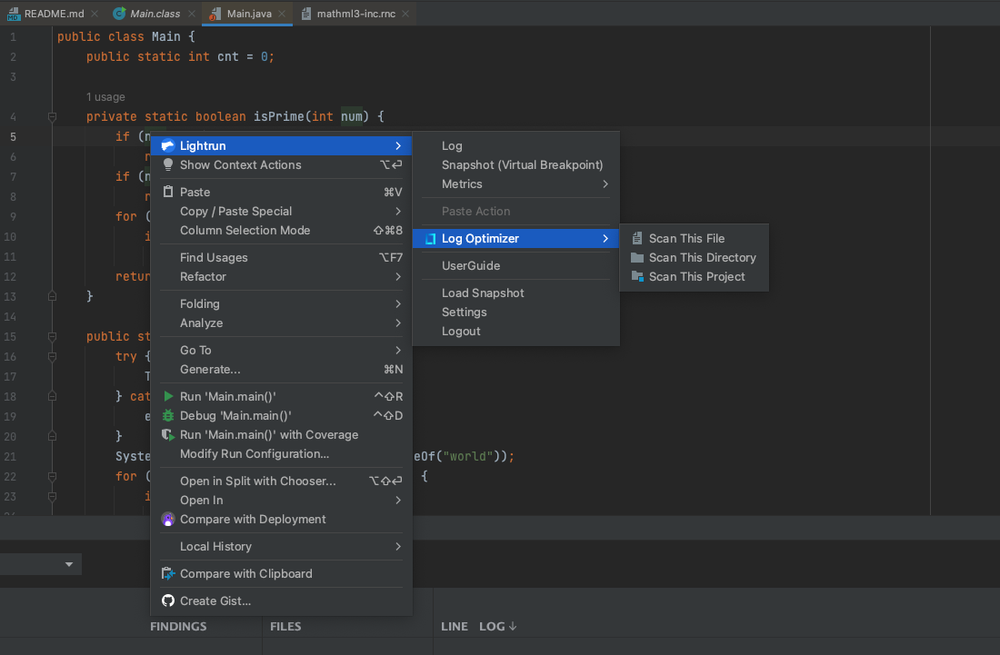
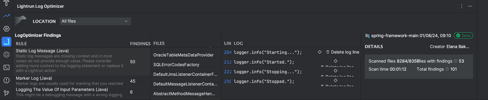
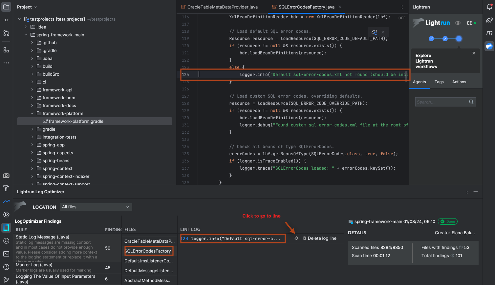
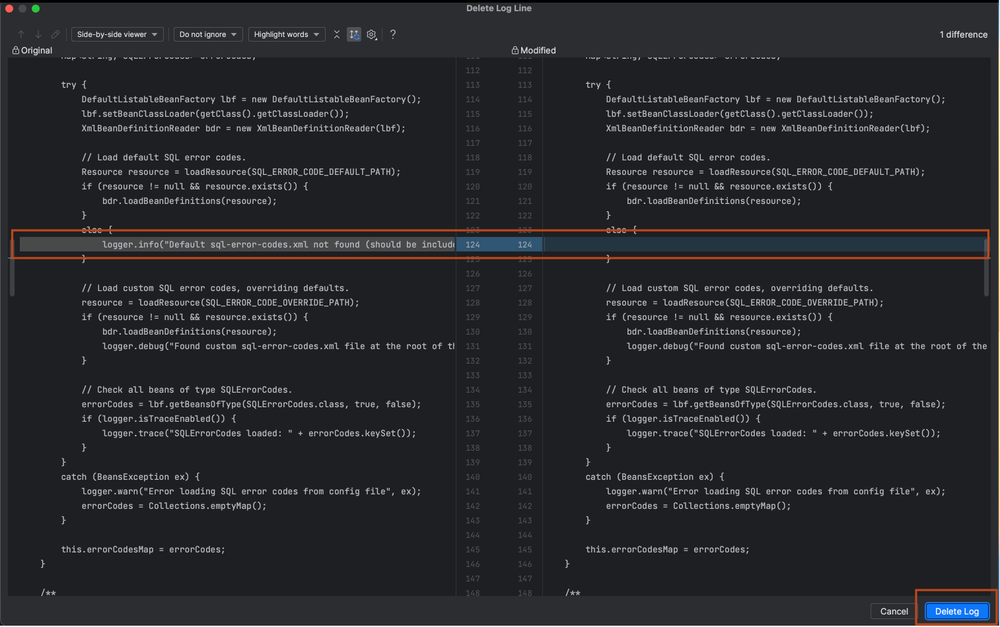

# Scan your code using Lightrun LogOptimizer

Lightrun LogOptimizer is an automated log optimization solution that scans your code, providing information about potential logging issues along with recommendations on how to address them. For more information, see [Lightrun LogOptimizer Overview](/logoptimizer/overview/).

## Prerequisites

- The LogOptimizer is available in the Lightrun JetBrains plugin and is compatible with the JetBrains suite of IDEs.
- Supported for Java, Python, Node.js, and C# projects. 
- Connection to your Lightrun server is required.
- [Docker Desktop or Docker Engine](https://docs.docker.com/engine/install/) must be running on your local machine.

## Scan your code for redundant logs

You can scan an individual file, directory, or an entire project. In the following procedure, we will focus on scanning an entire project.

1. Click the Project tab on the top left-hand side of your JetBrains IDE to open the JetBrains Project tool window for the required project.
2. Right-click on the project name to open the JetBrains context menu.
3. Click **Log Optimizer** in the JetBrains context menu.

    

4. Click **Scan This Project** to initiate the LogOptimizer scan.
   
   The LogOptimizer will begin scanning and display all output in the Lightrun LogOptimizer tool window. Note that the first time you run the LogOptimizer scan, it is expected to be longer as it pulls the LogOptimizer Docker image from Docker Hub.

After completing the scan, the results will be displayed in the Lightrun LogOptimizer tool window, providing details on the number of files scanned, the duration of the scan, and the number of logs found that meet the predefined rules.

## Analyze and delete redundant logs from your code

The Lightrun LogOptimizer tool window displays the results after completing the scanning process. 

The table describes the information included in the LogOptimizer tool window.

|Name | Description  |
|---------------------------------------------|--------------------------------------------------|
| Rule                                       | The results are grouped according to predefined rules, such as Static log messages, Marker logs, State reflecting logs, Repeated logging of the same variable, Logging the value of input parameters, and Logging method return values. For more information, see [Predefined LogOptimizer Rules Applied During Scanning](/logoptimizer/overview/#logoptimizer-rules-applied-during-scanning). |
| Findings                                    | The number of occurrences of logs that meet the selected rule.                                                                    |
| Files                                       | The file name containing the logs. Hovering over the file displays the full path to the file.                 |
| Line                                        | The line in the code where the log is located.                                                                        |
| Log Name                                    | The name of the detected log.                                                                                         |
| Go To Log file and Delete Log File icons    | Allows you to go to the line and to delete the relevant log in a dedicated window. See procedure below.                                                          |
| Details                                     | General information regarding the scan, showing the number of files scanned, the time it took to scan, and the total findings. |

##### Delete redundant logs from your code

1. In the **Files** column, select a file from the rule colum, then select log, and click on the navigation icon.

    

2. In the LogOptimizer window, click the **Delete Log file** icon.

   The code opens in a side-by-side comparison view and highlights the relevant row.

    

3. Click **Delete Log**.
   
   The log is permanently removed from the code.
   
   You can run this process repetatively and see how your log consumption has been reduced.

