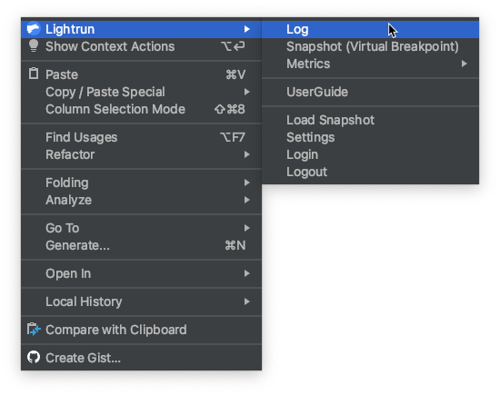
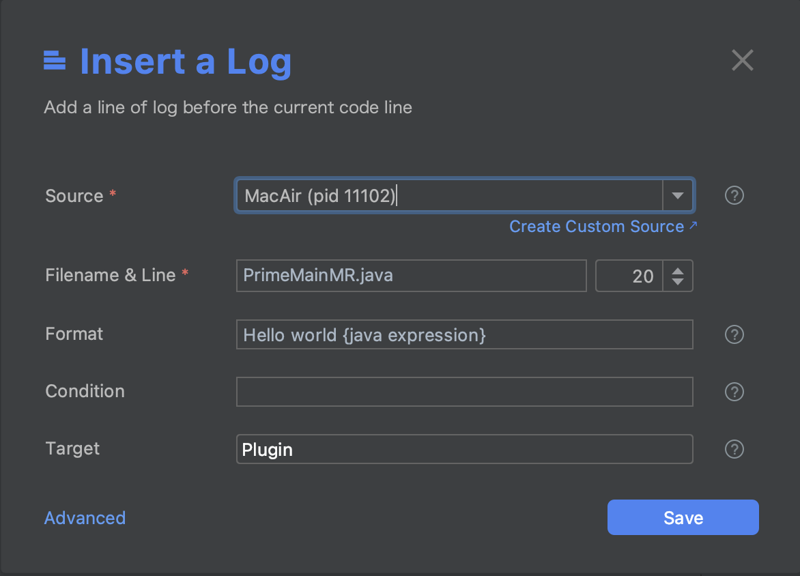
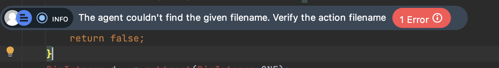
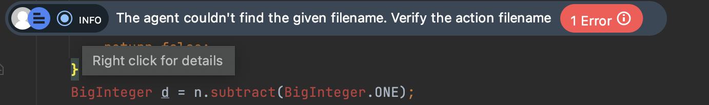
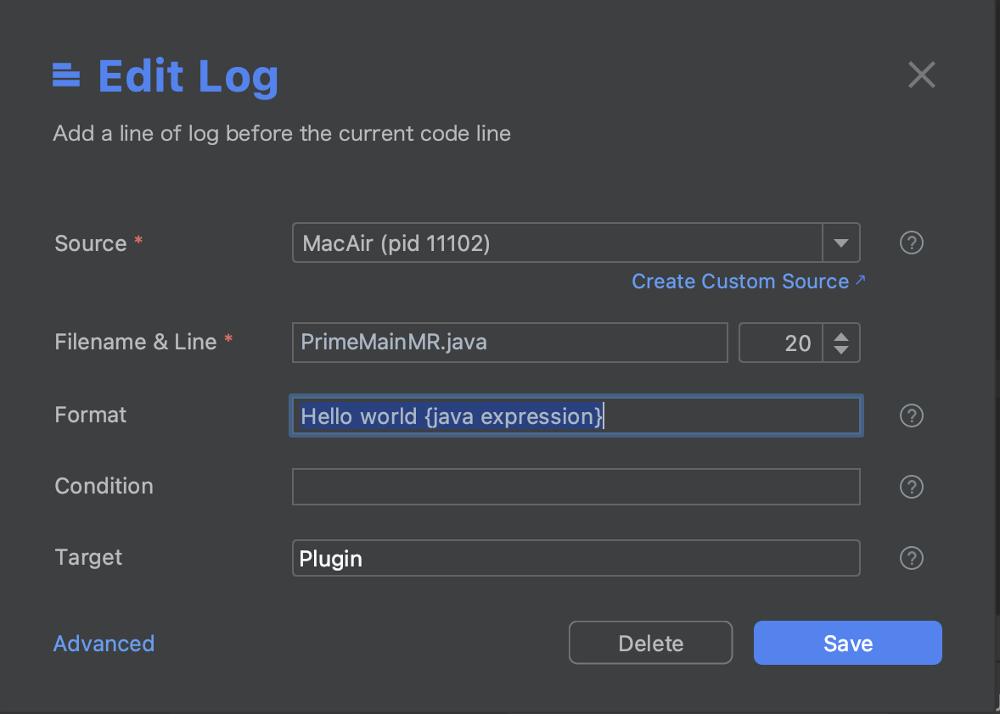
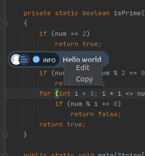
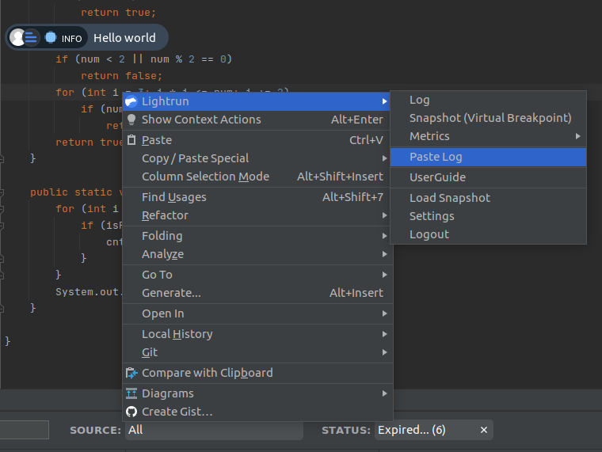

# Dynamic Logs

--8<-- "ux-reference/plugin-intellij-prereq.md"

## Adding Logs

##### To insert a Dynamic Log into your code

1. Go to the line in your application source code where you'd like to insert the log. Make sure to use the source code version currently deployed to production.
2. Right-click to open the IntelliJ context menu.
3. From the Lightrun context menu, select **Log**.
   
   The **Create Log** dialog should appear similar to the following image.
   
4. Complete the fields in the dialog as follows:

  | Fields | Description |
  |--------|-------------|
  |**Source**| From the available options in the dropdown list, bind the action to a specific agent, tag, or custom source.  Click *Create Custom Source* to create a new custom source. |
  | **Filename & Line**| The source code file into which you're inserting the action. The default path is to the source code file from which you're currently working. |
  | **Format** |The actual log string. Use expressions such as `My variable is {var}`, including method invocations such as: `Method value: {myMethod() + 5}`. |
   |**Targets**| Select your preferred action output target. You can pick either:  - **Stdout** - Logs are routed only to your application's standard output. - **Plugin** -  Logs appear in the Lightrun Console, the Lightrun Management Portal, and configured integrations. or both options at once.|
  |**Condition**| The condition of an `if` statement, used to limit the execution of the action.  For example, The condition `myVar % 7 == 0` limits the action (log, snapshot, metric) output so that it only prints for variables that are divisible by 7.|

5. Click **Advanced** to configure the following additional fields:

  | Fields | Description |
  |--------|-------------|
   |**Ignore Quota**| The quota (rate limit) is configured by the agent configurations.   Only users with `IGNORE_QUOTA` role can override an agent's quota limitation, the `IGNORE_QUOTA` checkbox is disabled for other users. |
  |**Expiry**| The time after which the action ceases to track code behavior and is automatically disabled; default = 1 hour.|
  | **Level**  | Select an appropriate log level: INFO, ERROR, DEBUG, WARN.  Once configured, logs can also be filtered by the LOG LEVEL attribute in the Lightrun console. |

6. Click **Save** to add the log to your code.

## Managing Logs

Once a log action has been inserted into your code, a log marker should appear on the code line where the action was added.

Right-click on the log marker to view more information about the log.

Click the log marker to edit or delete the log action.

<!-- !!! tip
    You can customize your profile picture as it appears in the marker, at [gravatar.com](https://en.gravatar.com/) -->

## Analyzing logs {#view-logs}

--8<-- "ux-reference/view-logs.md"

##### To copy and paste a dynamic log into your code

This procedure allows you to easily reuse existing logs in multiple locations within your code.  Note that the log is saved in the clipboard and can be pasted multiple times. 

1. Go to the line in your application source code where you'd like to copy the log.
2. Right-click on the log.
3. Click **Copy** to copy the log settings.

  

4. Go to the line of your target source code at which you'd like to insert the copied log, right-click and click **Paste Log**.
    
   

