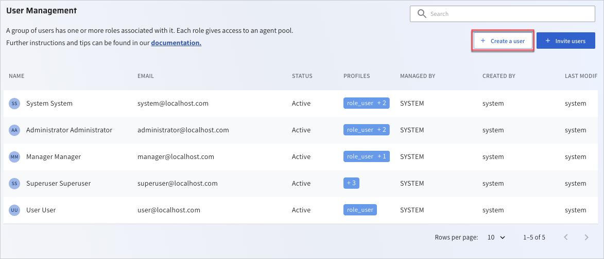
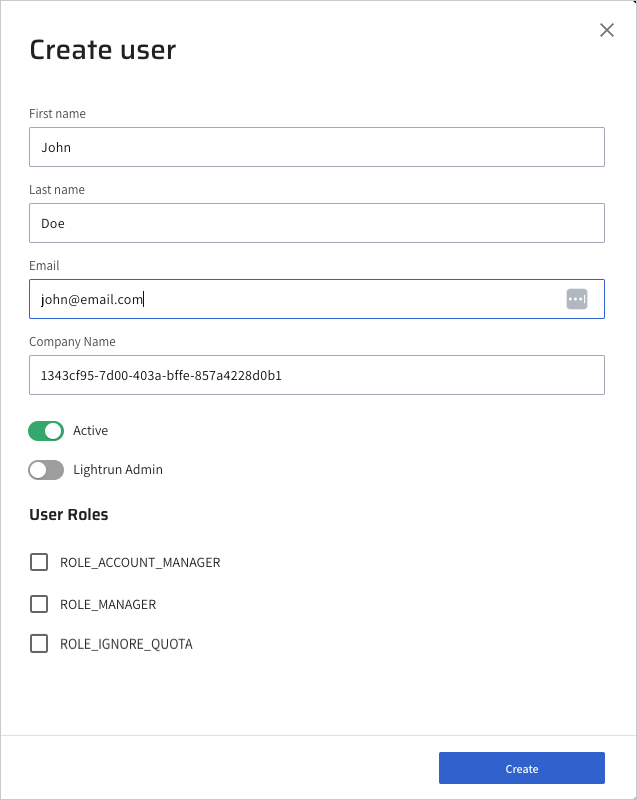
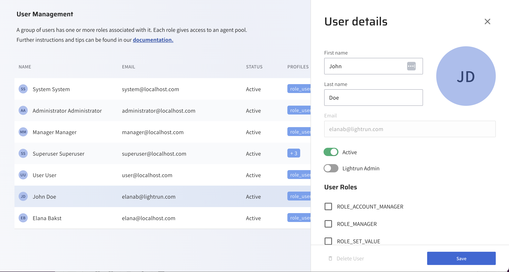

# Manage users with basic access control

To start debugging with the Lightrun plugin, users in your organization are required to be registered users and authenticated in the Lightrun Management Portal. 
Note that this article relates to users who are not working in a non-RBAC environment. To learn how to configure users with RBAC, see 

## Create a new user

You can manually add users to your Lightrun organization, one at a time. This is suitable for scenarios where you need to add a small number of users, such as when you're working in a small organization or when you want to add specific individuals.

To use this method, you would typically enter the user's details, such as their name, email address, and any other required information, directly into Lightrun's user management interface. The user will then receive an email requiring them to authenticate their credentials.

1. Log in to your Lightrun account.
2. Click **Settings** located at the bottom left corner of your Management Portal.
3. Select **Users** under **Identity and Access Management**. 
   
   The **Users Management** page opens.

    

4. Click **+ Create user**.
   
   The **Create user** dialog opens.

    

5. Fill in the user details and set the user as **Active**.
6. (Optional) Assign admin roles to the user to help you manage your users. To learn more, see Admin roles.
7. Click **Create**. 

    The user is added to the management user list and an email will be sent to the user to verify the account and then proceed to log in to Lightrun.

## Manage users

You can perform the following administrative tasks including viewing the status of your users, editing, or removing a user.

### View user status

In the **User Management** page, the following status indicators for each of the users is displayed to help know if your users are registered or not.

| Status      | Description                                                             |
|-------------|-------------------------------------------------------------------------|
| Active      | The user is active and completed the activation process.                |
| Deactivated | The user was disabled. The Active toggle is disabled in the User Details page. |
| Pending     | The user is active but has not yet completed the activation process.    |

### Edit a user

1. In the **User Management** page, click the required user in the user list.
    
    The **User details** pane opens.

    

2. Apply the changes and click **Save**.

### Delete a user

1. In the User Management page, click the required user in the user list.
    The User details pane opens.
2. Click the **Active** toggle to deactivate the user, and click **Save**.
    The **Delete User** option is active and appears in red.
3. Access the **User details** pane again and click **Delete User**.
4. Click **Save**.

