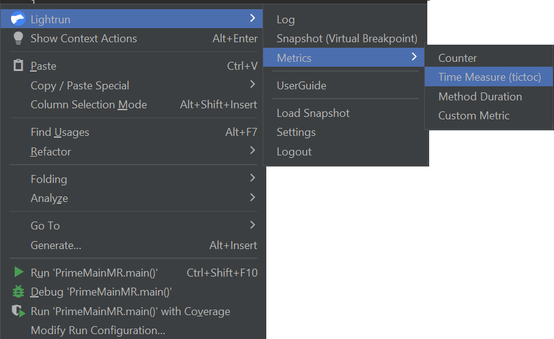
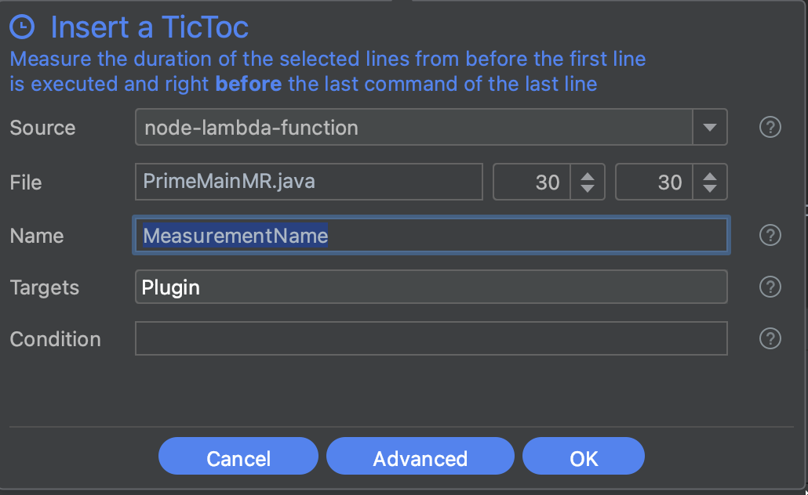

# Metrics

## Overview

!!! info "Support"
    Lightrun metrics are only available for Java/JVM applications.

The Lightrun plugin for the IntelliJ IDEA provides four different metrics for monitoring the performance of your code and identifying issues:

- [Counters](#counter) - Count the number of times a specific line of code is reached
- [Tic & Toc](#timemeasure) - Measure the elapsed time between two selected lines of code within a function
- [Method Duration](#duration) - Measure the elapsed time for a method to execute
- [Custom Metrics](#custom) - Create customized metrics, using parameters and simple or complex expressions that return a `long int` result

The following subsections describe, for each Lightrun metric, the procedures for:

- [Adding a metric action to your running application](#adding)
- [Viewing and managing a metric.](#managing)

--8<-- "ux-reference/plugin-intellij-prereq.md"

## Adding metrics {#adding}

### Counters {#counter}

A Lightrun Counter counts the number of times a specified line of code is reached and outputs the data periodically to the configured action target.

With a Lightrun Counter output, you can obtain a deeper insight into the state of your application's code, at any level of detail, from expressions and method calls to individual variables.

#### To insert a Counter into your code

1. Place your cursor at the line in your source code where you want to insert the Counter, and Right-click to open the context menu  
2. Hover over **Lightrun** and, from the **Metrics** menu, select **Counter**.
   {: style="width:50%"}
   The **Create Counter** dialog should appear similar to the following image.  
     
3. Complete the fields in the dialog as follows:

   | Fields | Description |
   |--------|-------------|
   |**SOURCE**| From the available options in the dropdown list, bind the action to a specific agent or tag. |
   |**FILE**| The source code file into which you're inserting the action. The default path is to the source code file from which you're currently working.  *Use the up/down arrows to change the line number for inserting the counter.* |
   |**NAME**| A meaningful label for the metric. |
   |**TARGETS**| Select your preferred action output target. You can pick either:  - **Stdout** - Metrics are routed only to your application's standard output. - **Plugin** -  Metrics appear in the Lightrun Console and configured integrations. or both options at once.|
   |**CONDITION**| The condition of an `if` statement, used to limit the execution of the action.  For example, The condition `myVar % 7 == 0` limits the action (log, snapshot, metric) output so that it only prints for variables that are divisible by 7.|

4. Click **Advanced** to configure the following additional fields:

   | Fields | Description |
   |--------|-------------|
   |**AGGREGATED BY**| Group the metric based on thread names. Specify the required thread name prefix, followed by an asterisk. |
   |**IGNORE QUOTA**| The quota (rate limit) is configured by the agent configurations.   Only users with `IGNORE_QUOTA` role can override an agent's quota limitation, the `IGNORE_QUOTA` checkbox is disabled for other users. |
   |**EXPIRY**| The time after which the action ceases to track code behavior and is automatically disabled; default = 1 hour.|

5. Click **OK** to add the Counter metric to your code. A  icon should appear in the left gutter of the editor next to the code line where the action was added.

### Time measures

There are two varieties of time measure metrics in Lightrun:

- **Method Duration** - The Method Duration metric measures the elapsed time during the execution of a method (function), from the entry through a method call to the exit from the return expression.
- **Tic & Toc** - The Tic & Toc metric measures the elapsed time of code execution between two specified lines, Tic (start line) and Toc (end line), in the same code block.

!!! Note
    The Tic (start line) and Toc (end line) both must be positioned inside the same code block.

#### To insert a Method Duration into your code {#duration}

1. Go to the line of your source code where the method is declared, and Right-click to open the context menu.  
2. Hover over **Lightrun** and, from the **Metrics** menu, click **Method Duration**.
   
   The **Create Measure Duration** dialog should appear similar to the following image.  
   
3. Complete the fields in the dialog as follows:

   | Fields | Description |
   |--------|-------------|
   |**SOURCE**| From the available options in the dropdown list, bind the action to a specific agent or tag. |
   |**FILE**| The source code file into which you're inserting the action. The default path is to the source code file from which you're currently working.  Use the up/down arrows to change the line number for inserting the counter. |
   |**NAME**| A meaningful label for the metric. |
   |**METHOD**| The name of the method (function) to which the Method Duration metric is to be applied.|
   |**TARGETS**| Select your preferred action output target. You can pick either:  - **Stdout** - Metrics are routed only to your application's standard output. - **Plugin** -  Metrics appear in the Lightrun Console and configured integrations. or both options at once.|
   |**CONDITION**| The condition of an `if` statement, used to limit the execution of the action.  For example, The condition `myVar % 7 == 0` limits the action (log, snapshot, metric) output so that it only prints for variables that are divisible by 7.|

4. Click **Advanced**, to configure the following additional fields:

   | Fields | Description |
   |--------|-------------|
   |**IGNORE QUOTA**| The quota (rate limit) is configured by the agent configurations.   Only users with `IGNORE_QUOTA` role can override an agent's quota limitation, the `IGNORE_QUOTA` checkbox is disabled for other users. |
   |**EXPIRY**| The time after which the action ceases to track code behavior and is automatically disabled; default = 1 hour.|

5. Click **OK** to add the Method Duration metric to your code. A  icon should appear in the left gutter of the editor, next to the code line where the action was added.

#### To insert a Tic & Toc into your code

1. Place your cursor at the code line in the code block where you'd like to insert the Tic & Toc, and Right-click to open the context menu.  
2. Hover over **Lightrun** and, from the **Metrics** menu, click **Time measure (tictoc)**.
   {: style="width:50%"}
   The **Create Time Duration (tictoc)** form should appear similar to the following image.  
   {: style="width:50%"}  
3. Complete the fields in the dialog as follows:

   | Fields | Description |
   |--------|-------------|
   |**SOURCE**| From the available options in the dropdown list, bind the action to a specific agent or tag. |
   |**FILE**| The source code file into which you're inserting the action. The default path is to the source code file from which you're currently working.  Use the up/down arrows to change the line number for inserting the counter. |
   |**NAME**| A meaningful label for the metric. |
   |**TARGETS**| Select your preferred action output target. You can pick either:  - **Stdout** - Metricss are routed only to your application's standard output. - **Plugin** -  Metrics appear in the Lightrun Console and configured integrations. or both options at once.|
   |**CONDITION**| The condition of an `if` statement, used to limit the execution of the action.  For example, The condition `myVar % 7 == 0` limits the action (log, snapshot, metric) output so that it only prints for variables that are divisible by 7.|

4. Click **Advanced**, to configure the following additional fields:  

   | Fields | Description |
   |--------|-------------|
   |**IGNORE QUOTA**| The quota (rate limit) is configured by the agent configurations.   Only users with `IGNORE_QUOTA` role can override an agent's quota limitation, the `IGNORE_QUOTA` checkbox is disabled for other users. |
   |**EXPIRY**| The time after which the action ceases to track code behavior and is automatically disabled; default = 1 hour.|
  
5. Click **OK** to add the Tic & Toc metric to your code. A  icon should appear in the left gutter of the editor, next to the code line where the action was added.

### Custom Metrics {#custom}

You can insert your own customized metrics expressions that evaluate to a long integer result.

#### To insert a Custom Metric into your code

1. Place your cursor at the line in your source code where you want to insert the Custom Metric, and Right-click to open the context menu
2. Hover over **Lightrun** and, from the **Metrics** menu, click **Custom Metric**.
   {: style="width:50%"}
   The **Create Custom Metric** dialog should appear similar to the following image.  
   
3. Complete the fields in the dialog as follows:

   | Fields | Description |
   |--------|-------------|
   |**SOURCE**| From the available options in the dropdown list, bind the action to a specific agent or tag. |
   |**FILENAME & LINE**| The source code file into which you're inserting the action. The default path is to the source code file from which you're currently working.  Use the up/down arrows to change the line number for inserting the counter. |
   |**NAME**| A meaningful label for the metric. |
   |**TARGETS**| Select your preferred action output target. You can pick either:  - **Stdout** - Metrics are routed only to your application's standard output. - **Plugin** -  Metrics appear in the Lightrun Console and configured integrations. or both options at once.|
   |**EXPRESSION**| Any expression - simple or complex - that evaluates to a numerical result.|
   |**CONDITION**| The condition of an `if` statement, used to limit the execution of the action.|

4. Click **Advanced**, to configure the following additional fields:

   | Fields | Description |
   |--------|-------------|
   |**IGNORE QUOTA**| The quota (rate limit) is configured by the agent configurations.   Only users with `IGNORE_QUOTA` role can override an agent's quota limitation, the `IGNORE_QUOTA` checkbox is disabled for other users. |
   |**EXPIRY**| The time after which the action ceases to track code behavior and is automatically disabled; default = 1 hour.|

5. Click **OK** to add the Custom Metric to your code. A Custom Metric icon  should appear in the left gutter of the editor, next to the code line where the action was added.

## Managing metrics {#managing}

Once you've added a metric, you can:

- Hover over a metrics icon in the editor gutter, to view summary information in a tooltip.
- Right-click any icon in the gutter to delete or view details.
  
- Right-click on a metric in the editor gutter to copy and then paste the metric in the new location.

!!! note

    Because a metric's state is persistent during its lifetime (including between successive runs of the applications), they cannot be edited. A configuration modification requires the creation of a new metric.

##### TO EDIT METRIC CONFIGURATION PARAMETERS

An action that was edited is considered a new action and therefore any data collected prior to editing the action will not be included in the new action.

1. Right-click the metric marker to edit the metric action.
   
2. Apply your changes and click **Save**.

##### TO COPY AND PASTE METRICS

This procedure allows you to easily reuse existing Metrics in multiple locations within your code. 

!!! note

    Tic Toc Metric guideline: You manually need to update the Toc (end line) for Tic Toc metric when you paste the metric, as the Tic (start line) and Toc (end line) are identical.

1. Go to the line in your application source code where you'd like to copy the metric.
2. Click **Copy** to copy the metric settings.   
   
3. Go to the line of your target source code at which you'd like to insert the copied metric, right-click and click Paste <metric   name>. For example, **Paste Counter**.
   
   The **Insert a Counter** dialog opens with the copied metric settings.
4. Provide a new name for the metric and click **Okay**.

## Analyzing metrics

Once a metric hit has been captured, you can view and analyze the captured hit in two places in your JetBrains IDE.

- [Lightrun Metrics tool window](#lightrun-metrics-toolwindow)
- [Lightrun Console tool window](#lightrun-console-toolwindow)
### Lightrun Metrics tool window {#lightrun-metrics-toolwindow}

The Lightrun Metrics tool window is a dedicated tool window provided by Lightrun for visualizing captured metrics hits directly in your JetBrains IDE. To open the tool window, click on **Lightrun Metrics** in the bottom part of your JetBrains IDE. The Lightrun Metrics tool window should appear similar to the following image.

See [JetBrains plugin quick tour](/getting-around/#metrics) to learn more about the Lightrun Metrics tool window.

### Lightrun Console tool window {#lightrun-console-toolwindow}

--8<-- "ux-reference/view-logs.md"

## Understanding metrics data

--8<-- "ux-reference/metrics-data.md"