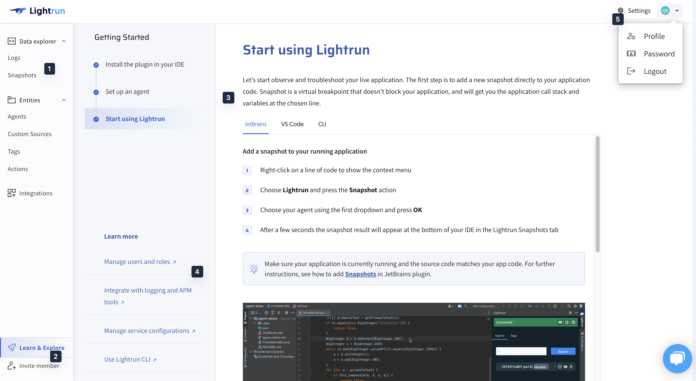
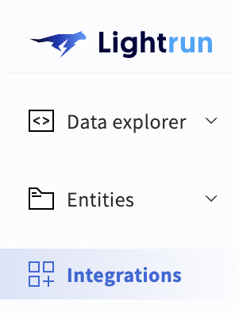
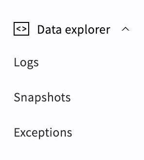
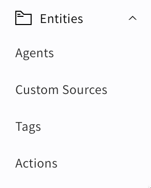
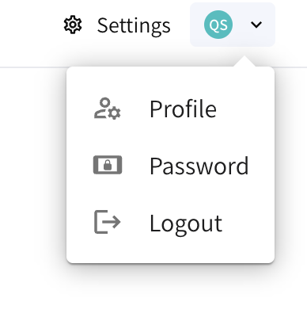
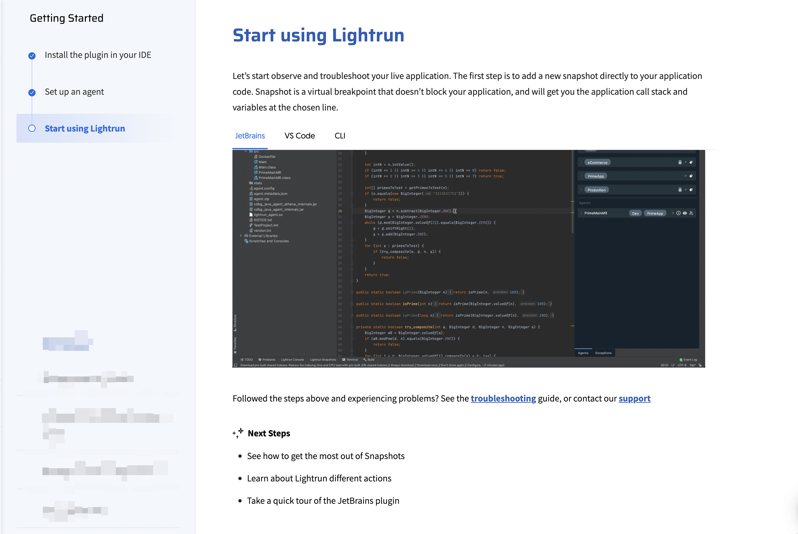

# Management Portal Quick Tour

The Lightrun Management Portal allows all users to: 

- Access instructions and commands for setting up Lightrun
- View output from the instrumentation you've added
- Manage your account 

In addition, users with `ROLE_MANAGER` permissions can: 

- Manage Lightrun users, logs, services and more
- Configure PII redaction and blocklisting
- Send data to email recipients

Once logged into your Lightrun account, you will gain access to the [Getting Started](https://app.lightrun.com/) page:

The following table describes the sections of the interface as numbered above:

 

| Sections | Description                                                  |
| ---- | ------------------------------------------------------------ |
| 1    | **Menu** - Gain access to the data and features available in the Management Portal.|
| 2    | **Invite member** - Invite new users to your Lightrun organization. |
| 3    | **Getting started** - Instructions and code samples to help you get started quickly and easily with Lightrun. |
| 4    | **Learn more** - Learn more about Lightrun.      |
| 5    | **Account and Settings** - Update your personal details, users, password, etc. |

The following sections describes the different parts in detail: 

- [Menu](#menus)
- [Account and Settings](#account-menus)
- [Getting started](#getting-started)

## Menu {#menus}
The menu section provides access to the data and features available in the Lightrun management portal.

There are three main menu items.

- [Data explorer](#data-explorer)
- [Entities](#entities)
- [Integrations](#integrations)

#### Data explorer {#data-explorer}
The **Data explorer** menu appears similar to the following:

The following table describes the different options available in the Data explorer menu:

| Item                                                    | Description                                                  |
| ------------------------------------------------------- | ------------------------------------------------------------ |
| Logs | View all active logs in the system. |
| Snapshots | View all active snapshots in the system. |
| Exceptions | View all exceptions thrown by Lightrun. |

#### Entities {#entities}
The **Entities** menu appears similar to the following:

The following table describes the different options available in the Entities menu:

| Item                                                    | Description                                                  |
| ------------------------------------------------------- | ------------------------------------------------------------ |
| Agents | View all active Lightrun agents. |
| Custom Sources | View and create new custom sources. |
| Tags | View all existing tags in the system. |
| Actions | View all actions for all active agents added by all users in this account. |

#### Integrations {#integrations}
Lightrun offers integrations for multiple monitoring, alerting, and communication platforms. The Integrations menu displays the list of supported platforms and the configurations for each platform.

## Account and Settings {#account-menus}

The account and settings section provides access to your personal details, and settings.

The following table describes the items in the account section.

| Item                                                    | Description                                                  |
| ------------------------------------------------------- | ------------------------------------------------------------ |
| Personal details | Update your personal details, password, and log out of Lightrun. |
| Settings | Manage your users, security, notifications, and compliance.  |

## Getting started {#getting-started}

The getting started section helps to fast-track your Lightrun installation. The section keeps track of the installation steps that you have already taken and provides instructions and code that will help you complete the remaining steps.

The getting started section has 3 major steps.

| Steps                                                   | Description                                                  |
| ------------------------------------------------------- | ------------------------------------------------------------ |
| Install the plugin in your IDE    | Instructions on how to install the Lightrun plugin in your IDE. |
| Set up an agent   | Instructions on how to install Lightrun agent to run alongside your application to enable Lightrun realtime intrumentation.|
| Start using Lightrun    | Instructions on how to create your first action.|

