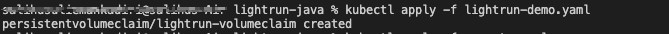
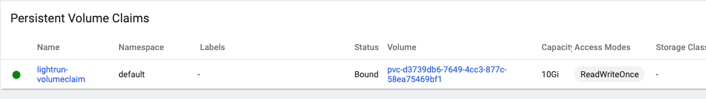
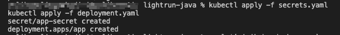
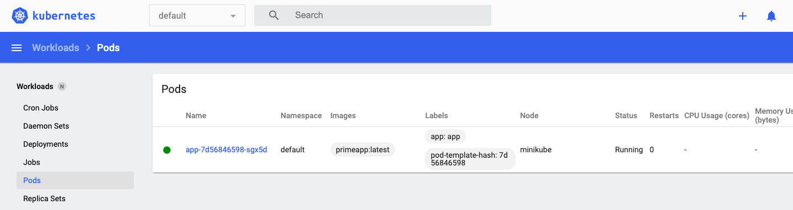
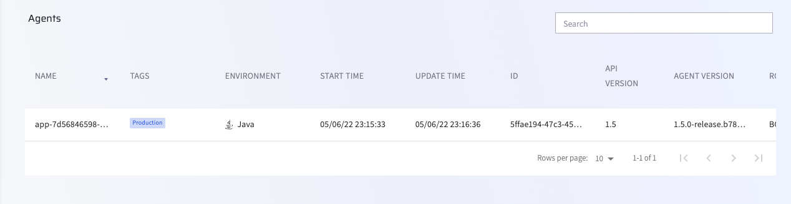
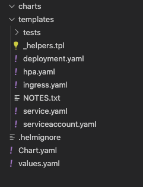
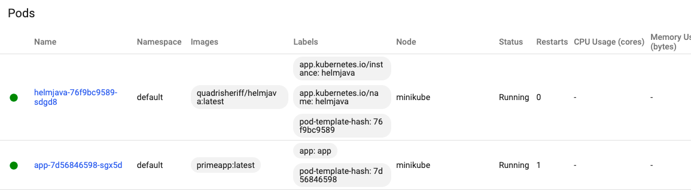
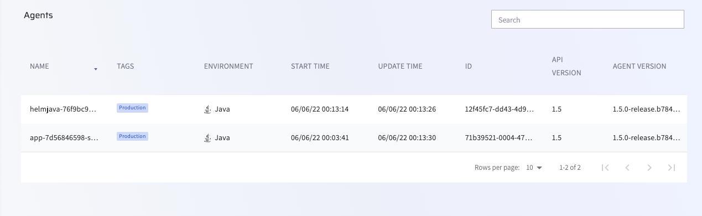

# Lightrun on Minikube

[In our last tutorial](/minikube/), we learned how to install Lightrun in Kubernetes at the orchestrator level using an Init Container.  An `emptyDir` volume was used in the deployment, and a Lightrun agent was downloaded and supplied by the Init Container to the main application via Shared volume.

However, using an `emptyDir` volume for Lightrun installation in a Kubernetes cluster is not always optimal. `emptyDir` volumes are the simplest types of volumes in Kubernetes; they are created when a pod is created and destroyed when it dies. To use Lightrun with `emptyDir` volume throughout your entire cluster, you will have to install Lightrun with an Init Container in every pod present in the cluster.

In this tutorial, we will learn how to install Lightrun in Kubernetes with another type of volume called persistent volumes.  A persistent volume is a cluster-wide resource that is available to all pods present in the deployment; hence, using a persistent volume instead of an emptyDir volume makes it possible to install Lightrun with an initContainer in a single pod and make it available to every pod in your cluster. We will also demonstrate this by installing a separate Helm chart powered application into our cluster and then supplying a Lightrun agent to the application using our persistent volume resource.

!!! note
	The Lightrun best practice is to install Lightrun directly inside the Docker image itself and not at the orchestrator level or lower infrastructure tiers. As we're an application-level tool, it makes sense for our agents to live next to the application.

## Prerequisites

This tutorial assumes that you have:

- [Installed Minikube on your local machine](https://minikube.sigs.k8s.io/docs/start/)
- [Started a local Kubernetes cluster](https://minikube.sigs.k8s.io/docs/start/)
- [Launched the Minikube dashboard](https://minikube.sigs.k8s.io/docs/handbook/dashboard/)
- [Installed Helm on your local machine](https://helm.sh/docs/intro/install/) 


## Create a `PersistentVolumeClaim`

The first step in this tutorial will be to create our persistent volume resource. Minikube provides a [default Storage Provisioner Controller](https://minikube.sigs.k8s.io/docs/handbook/persistent_volumes/#dynamic-provisioning-and-csi), which dynamically creates a `PersistentVolume` object of type `hostpath` when we make a storage request using a `PersistentVolumeClaim`. Hence, we don’t need to create a `PersistentVolume` object in this tutorial.

To create a `PersistentVolumeClaim`, add a `lightrun-demo.yaml` file to your project with the following YAML.


```yaml
kind: PersistentVolumeClaim
apiVersion: v1
metadata:
 name: lightrun-volumeclaim
 annotations:
   volume.beta.kubernetes.io/storage-class: standard
spec:
 accessModes:
   - ReadWriteOnce
 resources:
   requests:
     storage: 10Gi
```

The `lightrun-demo.yaml` file creates a `PersistentVolumeClaim` using the Minikube dynamically provisioned storage class. Apply the claim to your cluster with the following command. 

```shell
kubectl apply -f lightrun-demo.yaml
```



Once the claim is ready, you should see it in your Minikube dashboard.



## Deploy your Application

The application we'll use in this tutorial is a [simple prime number checker](https://github.com/lightrun-platform/lightrun/blob/main/examples/k8s/docker/PrimeMain.java) - it goes through a range of numbers, and outputs the number of prime numbers in that range at the end of the application’s run.

The first step will be to containerize the application. You can get a copy of the Dockerfile [here](https://github.com/lightrun-platform/lightrun/blob/main/examples/k8s/docker/Dockerfile). Note that we have not installed the agent just yet - we'll take care of that using an Init Container later in the deployment:

```dockerfile
FROM openjdk:11
WORKDIR /app
COPY PrimeMain.java /app
RUN javac -g PrimeMain.java
RUN jar --create --file /app/PrimeMain.jar --main-class PrimeMain PrimeMain.class
ENTRYPOINT ["java", "-jar"]
```

Now that we have our Dockerfile, we need to build it.

Note that Minikube ships with its own Docker daemon with its image registry. We can make that registry the default registry by running the following command:

```shell
eval $(minikube -p minikube docker-env).
```

This process will allow us to build the image locally and have it accessible to Minikube, preventing us from the need to use Docker Hub or any other external repository.

We can now build the image and push it to the local registry:

```shell 
docker build -t primeapp .
```

Let's now add your organization details as secrets - save the following file as `secrets.yaml` or download it [from here](https://github.com/lightrun-platform/lightrun/blob/main/examples/k8s/deployment.yaml#L1-L7):

```yaml
apiVersion: v1
kind: Secret
metadata:
  name: app-secret
stringData:
  lightrun_key: <LIGHTRUN_KEY>
  lightrun_company: <LIGHTRUN_COMPANY_ID>
```

You should have received your `LIGHTRUN_KEY` and `LIGHTRUN_COMPANY_ID` during the onboarding process. If not, you can get them again from the web console's agent setup page:

  <figure>
    
     <figcaption>Get your organization details</figcaption>
   </figure>

Now it's time to prepare our Kubernetes deployment - save it as a file called `deployment.yaml`:

```yaml hl_lines="17 18"
apiVersion: apps/v1
kind: Deployment
metadata:
 name: app
 labels:
   app: app
spec:
 replicas: 1
 selector:
   matchLabels:
     app: app
 template:
   metadata:
     labels:
       app: app
   spec:
     securityContext:
       runAsUser: 1000
     initContainers:
       - name: lightrun-installer
         image: curlimages/curl
         env:
           - name: LIGHTRUN_KEY
             valueFrom:
               secretKeyRef:
                 name: app-secret
                 key: lightrun_key
           - name: LIGHTRUN_COMPANY
             valueFrom:
               secretKeyRef:
                 name: app-secret
                 key: lightrun_company
         command: ["/bin/sh", "-c"]
         args:
           [
             "curl -o /tmp/deployment.sh -L https://app.lightrun.com/download/company/$LIGHTRUN_COMPANY/install-agent.sh?platform=linux; cd /tmp; sh /tmp/deployment.sh",
           ]
         volumeMounts:
           - name: init-script
             mountPath: /tmp/
     containers:
       - name: app
         image: primeapp:latest
         args:
           [
             "-agentpath:/lightrun/agent/lightrun_agent.so",
             "/app/PrimeMain.jar",
           ]
         imagePullPolicy: IfNotPresent
         volumeMounts:
           - name: init-script
             mountPath: /lightrun
     volumes:
       - name: init-script
         persistentVolumeClaim:
           claimName: "lightrun-volumeclaim"
```

The most important part of the `deployment.yaml` file is the `securityContext` spec that is highlighted above. [Applying a `runAsUser` field of 1000 ensures that for every container in the pod, all processes are run with a user ID of 1000](https://kubernetes.io/docs/tasks/configure-pod-container/security-context/). This helps prevent permissions issues that may arise when the containers try to access the persistent volume resource. 

Finally, we can apply both of these resources to the cluster:

```shell
kubectl apply -f secrets.yaml
kubectl apply -f deployment.yaml
```



Once the pod has been initialized, you should see it up and running in your Minikube dashboard:



Confirm that agent is connected by checking your Lightrun management portal.



## Install a Helm chart application into the Kubernetes cluster

Similar to the last step, the first thing to do is containerize our application. The application we will be using in the step is a [simple prime number app that counts all prime numbers less than 1 billion](https://github.com/lightrun-platform/agent-demo/blob/main/java/PrimeMainMR.java).

Create a Dockerfile and add the following to the Dockerfile.

```dockerfile
FROM openjdk:11
WORKDIR /app
COPY PrimeMainMR.java /app
RUN javac -g PrimeMainMR.java
RUN jar --create --file /app/PrimeMainMR.jar --main-class PrimeMainMR PrimeMainMR.class
ENTRYPOINT ["java", "-jar"]
```

Compared to the last step, we will be deploying our application to DockerHub rather than assigning it to the Minikube image registry. First, build the docker image.

```shell
docker build -t helmjava .
```
Then authenticate your docker account and push the image to DockerHub.

```shell
docker login
docker tag helmjava <username>/helmjava
docker push <username>/helmjava:latest
```

`<username>` is your Docker account username. 

After deploying the application's image to DockerHub, the next step will be to generate a skeleton helm application.

```bash
helm create helmjava 
```

A folder named `helmjava` will appear in your root directory. The folder file structure should appear similar to the following image.



Update the `values.yaml` file with the following YAML.

```yaml hl_lines="7 8 9 10 11 12 13 15 16 17 38 39 40 41 42 43 44 46 47"
# Default values for helmjava.
# This is a YAML-formatted file.
# Declare variables to be passed into your templates.

replicaCount: 1

image:
 #change <username to your docker username
 repository: <username>/helmjava
 pullPolicy: IfNotPresent
 tag: latest
 volumeMountsName: init-script
 mountPath: /helmjava

volumes:
   name: init-script
   claimName: "lightrun-volumeclaim"

imagePullSecrets: []
nameOverride: ""
fullnameOverride: ""

serviceAccount:
 # Specifies whether a service account should be created
 create: false
 # Annotations to add to the service account
 annotations: {}
 # The name of the service account to use.
 # If not set and create is true, a name is generated using the fullname template
 name: ""

podAnnotations: {}

podSecurityContext:
 {}
 # fsGroup: 2000

securityContext:
 # capabilities:
 #   drop:
 #   - ALL
 # readOnlyRootFilesystem: true
 # runAsNonRoot: true
 runAsUser: 1000

persistence:
 enabled: false

service:
 type: ClusterIP
 port: 80

ingress:
 enabled: false
 className: ""
 annotations:
   {}
   # kubernetes.io/ingress.class: nginx
   # kubernetes.io/tls-acme: "true"
 hosts:
   - host: chart-example.local
     paths:
       - path: /
         pathType: ImplementationSpecific
 tls: []
 #  - secretName: chart-example-tls
 #    hosts:
 #      - chart-example.local

resources:
 {}
 # We usually recommend not to specify default resources and to leave this as a conscious
 # choice for the user. This also increases chances charts run on environments with little
 # resources, such as Minikube. If you do want to specify resources, uncomment the following
 # lines, adjust them as necessary, and remove the curly braces after 'resources:'.
 # limits:
 #   cpu: 100m
 #   memory: 128Mi
 # requests:
 #   cpu: 100m
 #   memory: 128Mi

autoscaling:
 enabled: false
 minReplicas: 1
 maxReplicas: 100
 targetCPUUtilizationPercentage: 80
 # targetMemoryUtilizationPercentage: 80

nodeSelector: {}

tolerations: []

affinity: {}
```

The `values.yaml` contains the default values for a chart. I have highlighted the important values for our deployment in the YAML above. The application’s image details are added to the `image` key, the persistent volume details are added to the `volumes` key, and the `runAsUser` key in `securityContext` is set to 1000 - same with that of the original init container pod. 

Note that `persistence enabled` is set to `false`. Helm chart creates a persistent volume resource for all applications installed with it, and since we have an active persistent volume resource that we will like to plug in to, we will have to disable this option.

Open the `templates/deployment.yaml` file and update the file with the following YAML.

```yaml hl_lines="33"
apiVersion: apps/v1
kind: Deployment
metadata:
 name: {{ include "helmjava.fullname" . }}
 labels:
   {{- include "helmjava.labels" . | nindent 4 }}
spec:
 {{- if not .Values.autoscaling.enabled }}
 replicas: {{ .Values.replicaCount }}
 {{- end }}
 selector:
   matchLabels:
     {{- include "helmjava.selectorLabels" . | nindent 6 }}
 template:
   metadata:
     {{- with .Values.podAnnotations }}
     annotations:
       {{- toYaml . | nindent 8 }}
     {{- end }}
     labels:
       {{- include "helmjava.selectorLabels" . | nindent 8 }}
   spec:
     {{- with .Values.imagePullSecrets }}
     imagePullSecrets:
       {{- toYaml . | nindent 8 }}
     {{- end }}
     serviceAccountName: {{ include "helmjava.serviceAccountName" . }}
     securityContext:
       {{- toYaml .Values.securityContext | nindent 12 }}
     containers:
       - name: {{ .Chart.Name }}
         image: "{{ .Values.image.repository }}:{{ .Values.image.tag | default .Chart.AppVersion }}"
         args: ["-agentpath:/helmjava/agent/lightrun_agent.so", "/app/PrimeMainMR.jar"]
         imagePullPolicy: {{ .Values.image.pullPolicy }}
         volumeMounts:
           - name: {{ .Values.image.volumeMountsName }}
             mountPath: {{ .Values.image.mountPath }}
     volumes:
       - name: {{ .Values.volumes.name }}
         persistentVolumeClaim:
           claimName: {{ .Values.volumes.claimName }}
     {{- with .Values.nodeSelector }}
     nodeSelector:
       {{- toYaml . | nindent 8 }}
     {{- end }}
     {{- with .Values.affinity }}
     affinity:
       {{- toYaml . | nindent 8 }}
     {{- end }}
     {{- with .Values.tolerations }}
     tolerations:
       {{- toYaml . | nindent 8 }}
     {{- end }}

```

Note that we added instructions for installing an agent with the `args` key. Please check the highlighted part of the YAML above.

Now that we are done with the configuration, package the helm chart.

```shell 
helm package helmjava 
```
Install the packaged file.

```shell 
helm install helmjava helmjava-0.1.0.tgz
```

Check your Minikube dashboard to confirm if the application was installed successfully.



Confirm that a Lightrun agent was supplied to the Helm chart application by checking your Lightrun management portal.



And now you've got a Lightrun agent up and running! [Install our plugin](http://docs.lightrun.com/plugin/) to get started adding [Lightrun Actions](http://docs.lightrun.com/actions/) to your application.