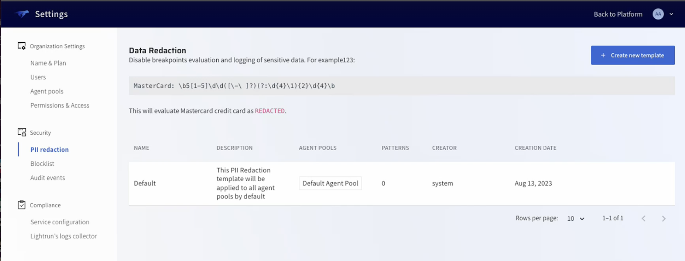
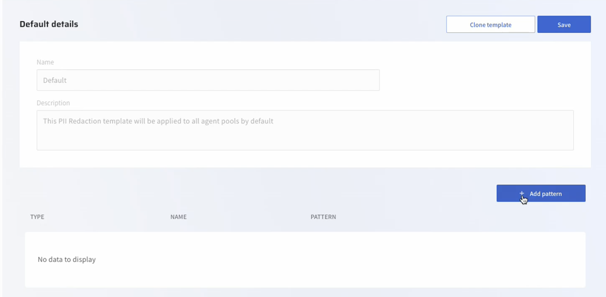
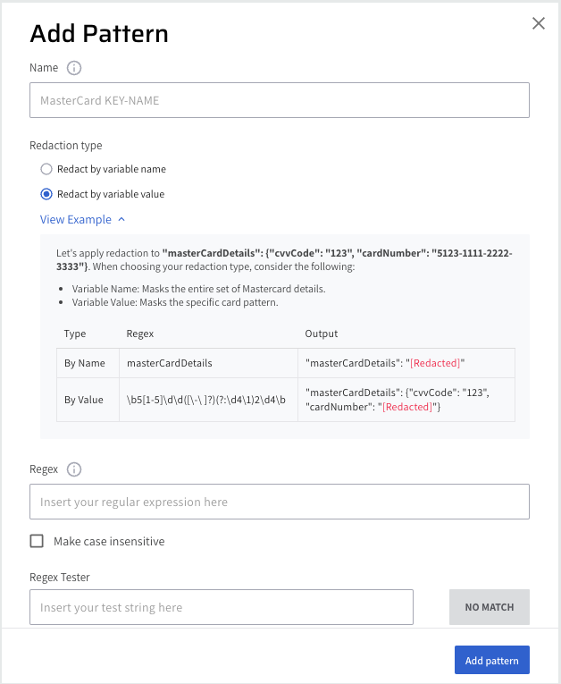
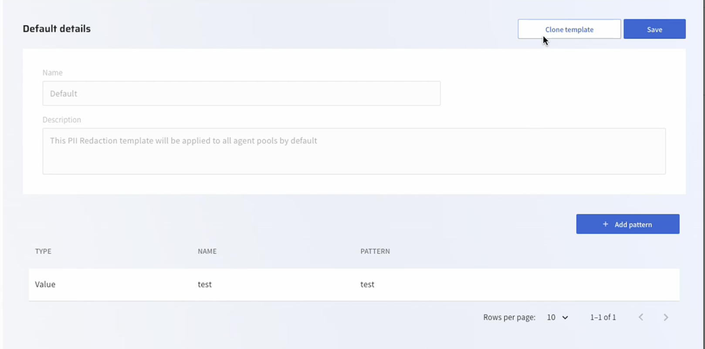
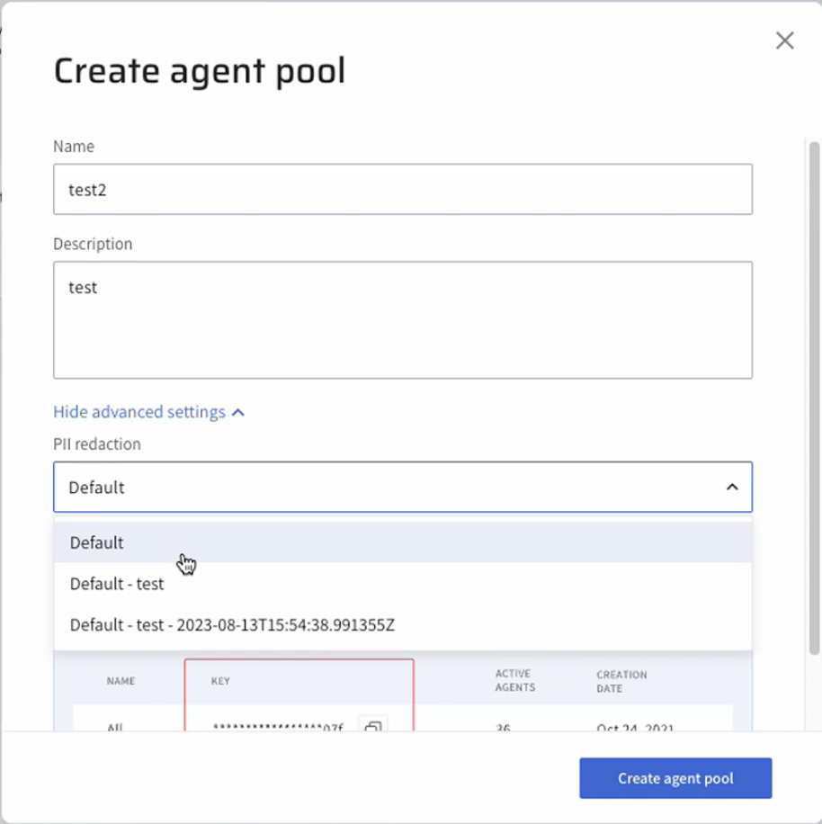
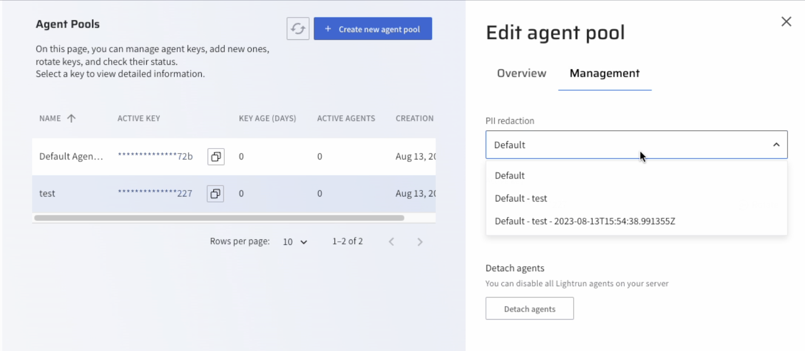

# Manage PII Redaction templates for Agent Pools
## Overview

!!! Note
      The Lightrun PII Redaction Templates for Agent Pools feature is only available to users on our Enterprise plan; please contact our [support team](https://lightrun.com/) for more information.
      
Lightrun promotes data security through the utilization of PII (Personally Identifiable Information) Redaction. This feature allows you to control retrieval of sensitive data in instrumented code using predefined patterns. For best practices on setting up PII Redaction, see [Lightrun PII Redaction Best Practices](/piiredaction/pii-redaction-best-practices/).

Lightrun supports creating a list of PII Redaction patterns on all your agents or alternatively creating and assigning different PII Redaction templates to different agent pools. For example, if you would like to apply PII Redaction only on a Production environment and not on Development or Staging.

To help you get started with configuring your PII redaction on agent pools, we provide a single Default template on the PII Redaction page which serves as a starting point for creating your templates. Note that it does not contain any predefined patterns and is not assigned to any agent pools.

The process of assigning PII Redaction to an agent pool includes these steps:

1. Create your PII Redaction template.
2. Create or access an existing agent pool and assign the PII Redaction template to the agent pool.

## Set up your PII Redaction templates

You can set up your PII Redaction template using one of the following:

- Edit and save the default template and use it as a basis for all future templates.
- Create a new template from scratch.
- Clone an existing template, apply changes and rename with an intuitive name.
##### TO CREATE A PII REDACTION TEMPLATE

1. Log in to your Lightrun account.
2. Click **Settings** on the top right hand side of your screen to navigate to the Settings dashboard.
3. Select **PII Redaction** under **Security** in the Settings dashboard sidebar.
   The **Data Redaction** window opens.
4. To help you create your initial template, you can set the patterns on the default data redaction template or you can click **Create new template**.
     
    The **PII Redaction template** opens.
5. Provide a name for your template and click **Add Pattern**.
    
    The **Add Pattern** dialog box opens.

    

6. In the **Name** text field, enter a unique name for the added pattern.
7. Select your preferred data redaction type:
   - Redact by variable name: Data is redacted based on variable name. Any variables which match the supplied pattern will be excluded from the data Lightrun captures. For example, adding a pattern apiToken will prevent Lightrun from logging data from any variable which includes apiToken in the variable name. So variables `my_apiToken`, `theOtherapiToken`, and `someapiTokenVariable` will all be redacted.
   - Redact by variable value: Data is redacted based on a specified regex pattern. The regex pattern is matched to a value, not a variable name. For example, the following regex pattern`\b5[1-5]\d\d([\-\ ]?)(?:\d{4}\1){2}\d{4}\b` will redact all Mastercard debit or credit card data from Lightrun.
8. Enter Regex pattern depending on the mode you selected.
9. (Optional) Enable the Make case insensitive option to support case insensitive values. The default  is set as case sensitive.
    From Lightrun version 1.14, the Variable name pattern is set by default as case sensitive. By enabling the **Make Case Insensitive** field when specifying accountName, data will be redacted from `ACCOUNTNAME`, `accountname`, and `AccountName` variables.
10. To verify the pattern, in the Regex Tester field, enter a test string corresponding to the pattern specified in the previous step.
Pattern verification is confirmed when the **MATCH** button is active.
11. Click **Save**.

## Clone an existing PII Redaction template

Cloning an existing PII Redaction template is useful if you would like to create multiple templates with minor variations, such as changes to the patterns or the environments in which the PII redaction occurs.
###### TO CLONE AN EXISTING PII REDACTION TEMPLATE

1. Log in to your Lightrun account.
2. Click **Settings** on the top right hand side of your screen to navigate to the Settings dashboard.
3. Select **PII Redaction** under **Security** in the **Settings** dashboard sidebar.
   The **Data Redaction** window opens.
4. Select an existing PII Redaction template and click **Clone template**.
   
5. Apply your changes and click **Save**.

## Assign a PII Redaction template to an Agent Pool
1. Log in to your Lightrun account.
2. Click **Settings** on the top right-hand side of your screen to navigate to the **Settings** dashboard > **Identity and Access Management** tab.
3. Select **Agent pools** in the Settings dashboard sidebar to open the **Agent Pools** page.
4. Click the **+ Create new agent pool** button on the top right-hand side.
5. In the **Create agent pool** dialog, click **Show advanced settings** and from the **PII Redaction** list, select your predefined PII Redaction template.
    
6. Click **Create agent pool** and select your predefined PII redaction template from the **PII redaction** list. 

## Manage PII Redaction templates on Agent Pools

You can view and/or change the PII template assigned to an agent pool in the **Management** tab located under the agent pool.

1. From the **Agent Pool** list, click anywhere in the line to select an agent pool.
   The **Edit Agent Pool** dialog opens.
2. Click the **Management** tab, and select an alternate option from the **PII Redaction** list.
   
3. Click **Save and close**.  
4. (Optional) Navigate to **Security > PII Redaction** page, to verify that your agent pool was assigned to the modified PII redaction template.

