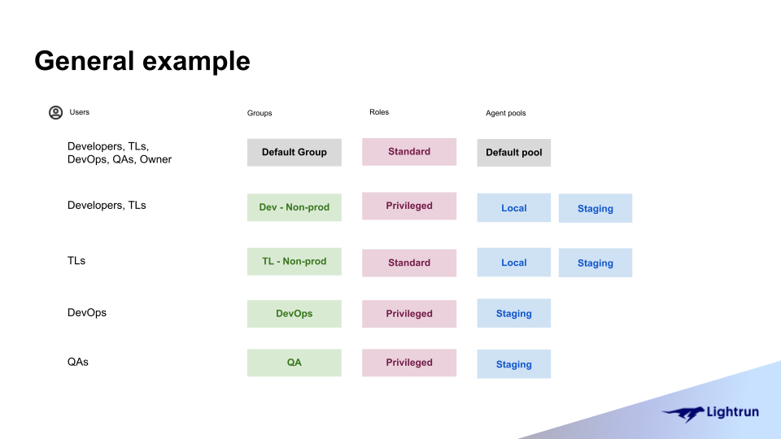
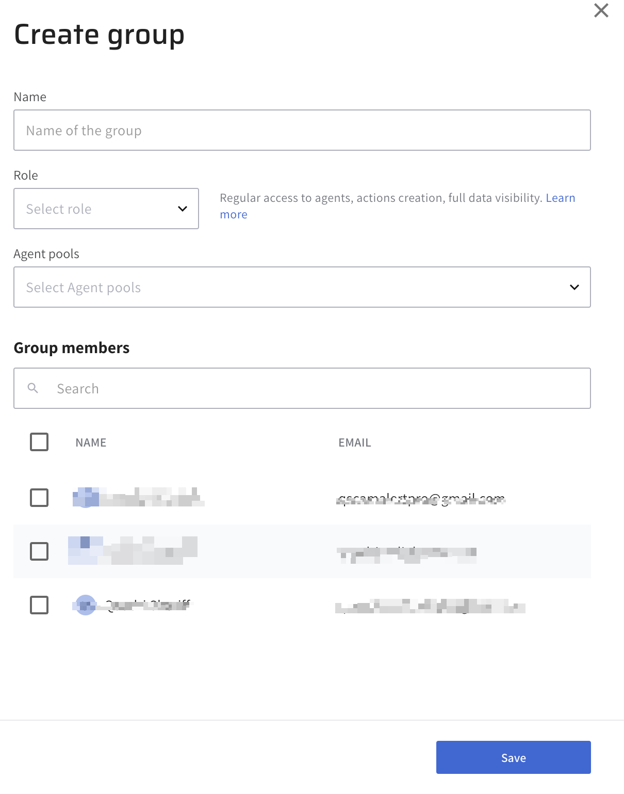
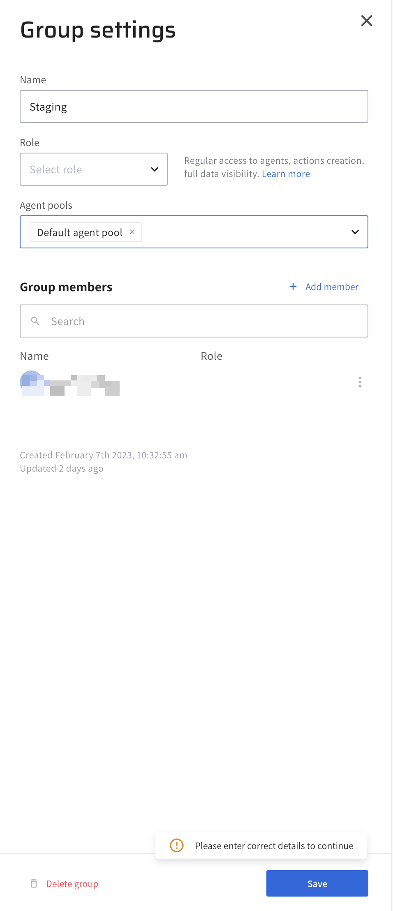
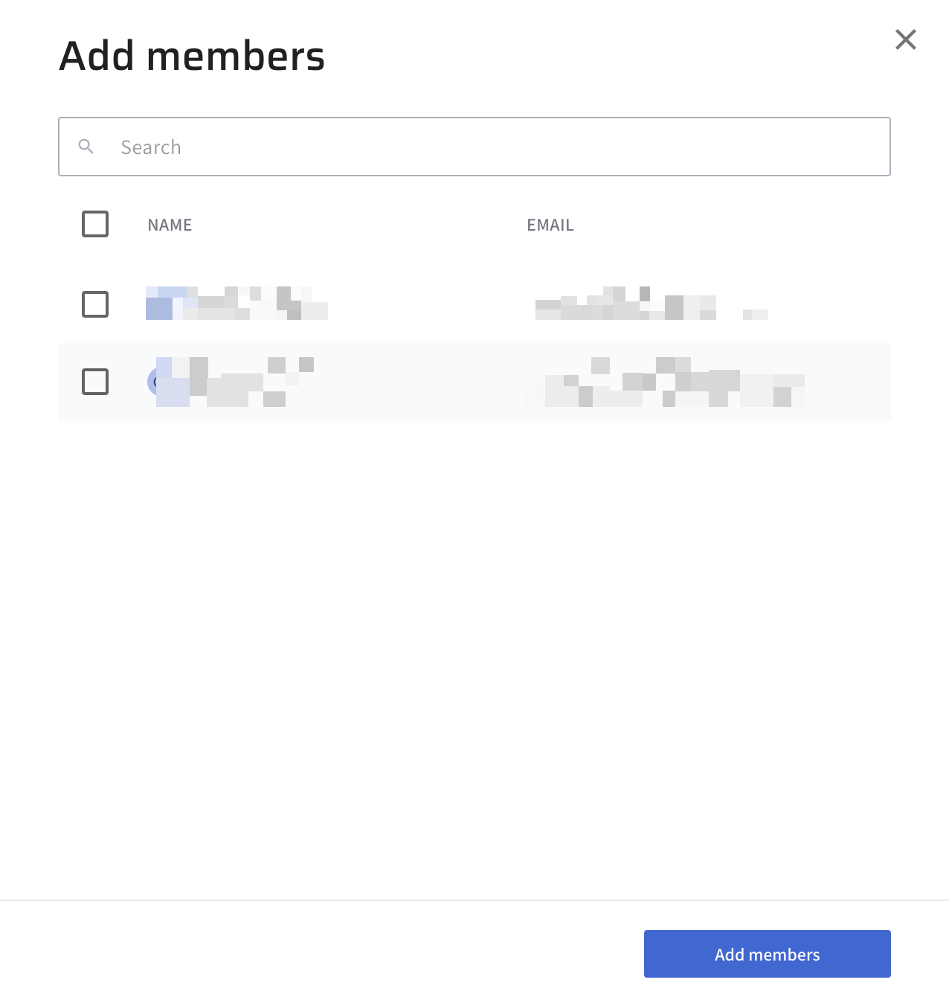

# Manage groups in Lightrun with RBAC

In Lightrun, a group represents a collection of users who share specific permissions and access to resources. Groups are a fundamental part of [Role-Based Access Control (RBAC)](/rbac/overview), enabling administrators to efficiently manage user permissions.

## What are groups in Lightrun?

Groups in Lightrun allow administrators to assign and manage permissions for multiple users at once. Instead of setting permissions for each user individually, you create a group and grant it access to specific resources, such as agent pools. This simplifies the process of managing access controls, especially for teams that require the same level of access.

When you create a Lightrun account for your organization, a default group is created, comprising all users within your organization. Users with the System Admin role have the authority to create, manage, and delete groups. They can also delegate group management by assigning Group Admin roles to other users, who can then help manage specific groups.

## Group related-roles overview

Before a user can access agents in an agent pool, they must be part of a group that has access to that agent pool. The level of access a user has depends on the role assigned to their group. In Lightrun, there are two roles: 

- **Standard Role** - The standard role grants regular access to an agent pool. This includes creating Lightrun actions with the agents in the agent pool, full access to action data, etc. 

- **Privileged Role** - The privileged role grants a group the ability to ignore agent quota limitations in addition to the permissions granted by the Standard role. 

!!! note
	Lightrun roles are predefined and are not editable.

As illustrated in the following example, all the users in the organization belong to the Default Agent Pool and are granted the Standard privilege role. However, developers also possess access to Dev- Non-Prod with the Privileged role. Meanwhile, team leaders (TLs) hold the standard role in the Default agent pool but also hold priviledged roles for both Dev-Non-Production and TL-Non-Production enviroments simultaneously.

In addition to the role assigned to a group, individual users can also be assigned elevated roles. Elevated roles grant group members more privileges than others. A DevOps group might have a standard role, but a single user can be granted an elevated privileged role. This elevated privileged role allows them to perform certain actions, like ignoring the preset agent quota limitations, which other group members cannot.

## Create a group {#create}

1. Log in to your Lightrun account.
2. Click **Settings** on the top right-hand side of your screen to navigate to the Settings dashboard > **Identity and Access Management** tab.
3. Select **Permissions & Access**.
	
	The **Permissions & Access** page opens with the Groups and Roles tab.

4. Click on the **Groups** tab to access a list of existing groups.
5. Click the **+ Create new group** button to open the **Create group** dialog.

	

6. Complete the fields with the relevant details.

  * Name: Enter a unique name for the new group.
  * Role: Select the group’s role. A role determines what permissions a group has to its agent pools.
  * Agent Pools: Allow access to one or more agent pools.
  * Group members: Optional, Add users to the group.

7. Click **Save** to create the group.

## Manage groups

### Edit a group {#edit}

1. Log in to your Lightrun account.
2. Click **Settings** on the top right-hand side of your screen to navigate to the Settings dashboard > **Identity and Access Management** tab
3. Select **Permissions & Access**.
	
	The **Permissions & Access** page opens with the Groups and Roles tab.

4. Click on the **Groups** tab to access a list of existing groups.
5. Click on the group you want to edit to open the **Group settings** side sheet.

	

6. Complete the fields with relevant details.
7. Click **Save** to save your changes.
8. Click the **Delete group** button on the bottom left corner of the side sheet to delete the group.

### Add users or remove users from a group {#add-or-remove}

1. Log in to your Lightrun account.
2. Click **Settings** on the top right-hand side of your screen to navigate to the Settings dashboard > **Identity and Access Management** tab.
3. Select **Permissions & Access**.
	
	The **Permissions & Access** page opens with the Groups and Roles tab.

4. Click on the **Groups** tab to access a list of existing groups.
5. Click on the group to open the **Group settings** side sheet.

	

6. Click **+ Add member** on the right-hand side of the **Group members** label to open the **Add members** dialog.

	

7. Enter the user name or email in the search field. 
8. Tick the checkbox next to the user, and click **Add members** to add the selected user to the group.
9. Click **Save** to save your changes.

###### To remove a user from a group
1. Log in to your Lightrun account.
2. Click **Settings** on the top right-hand side of your screen to navigate to the Settings dashboard > **Identity and Access Management** tab.
3. Select **Permissions & Access**.
	
	The **Permissions & Access** page opens with the Groups and Roles tab.

4. Click on the **Groups** tab to access a list of existing groups.
5. Click on the group to open the **Group settings** side sheet.

	

6. Click the vertical ellipsis icon next to a user.
7. Click **Remove** in the dialog that appears to remove the user from the group.
8. Click **Save** to save your changes.

### Promote or remove users as a Group Admin {#promote-or-remove}

1. Log in to your Lightrun account.
2. Click **Settings** on the top right-hand side of your screen to navigate to the Settings dashboard > **Identity and Access Management** tab.
3. Select **Permissions & Access**.
	
	The **Permissions & Access** page opens with the Groups and Roles tab.

4. Click on the **Groups** tab to access a list of existing groups.
5. Click on the group to open the **Group settings** side sheet.

	

6. Click the vertical ellipsis icon next to a user.
7. Click **Promote as a Group Admin** or **Remove as Group Admin** in the dialog that appears to promote or remove a user from the group admin role.
8. Click **Save** to save your changes.

### Grant a group access to an agent pool {#grant}

1. Log in to your Lightrun account.
2. Click **Settings** on the top right-hand side of your screen to navigate to the Settings dashboard > **Identity and Access Management** tab.
3. Select **Permissions & Access**.
	
	The **Permissions & Access** page opens with the Groups and Roles tab.

4. Click on the **Groups** tab to access a list of existing groups.
5. Click on the group to open the **Group settings** side sheet.

	

6. Select the preferred agent pool in the **Agent pools** dropdown.
7. Click **Save** to save your changes.
