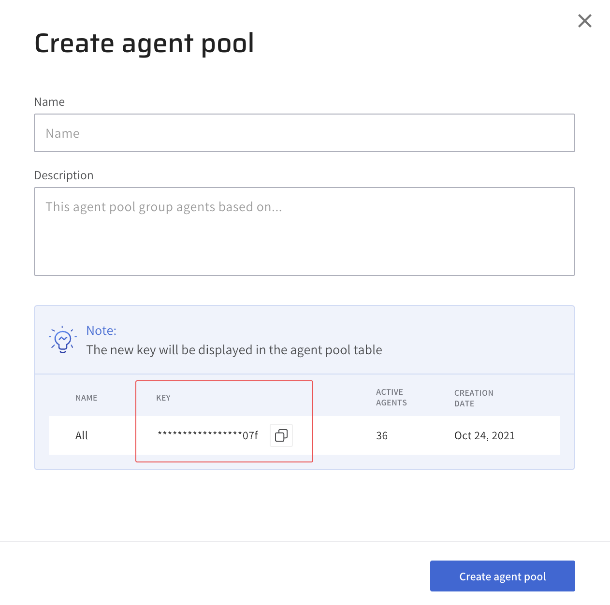
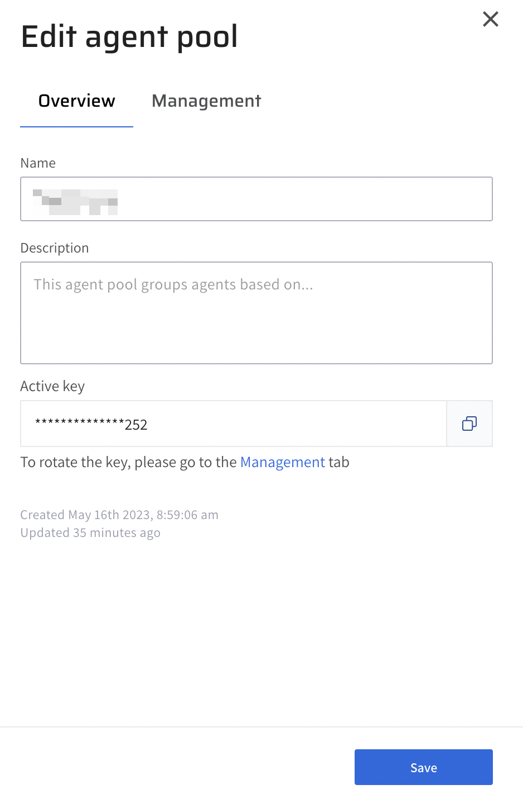
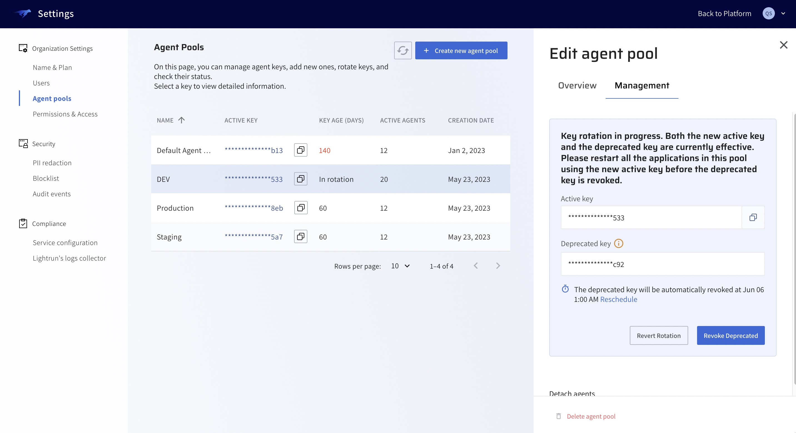
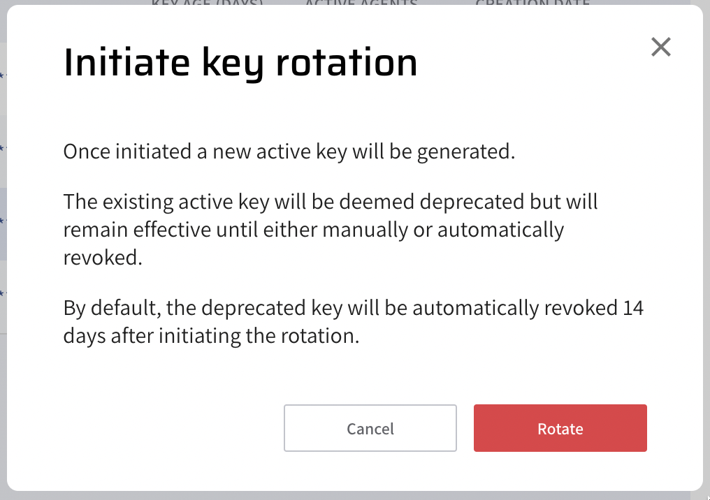
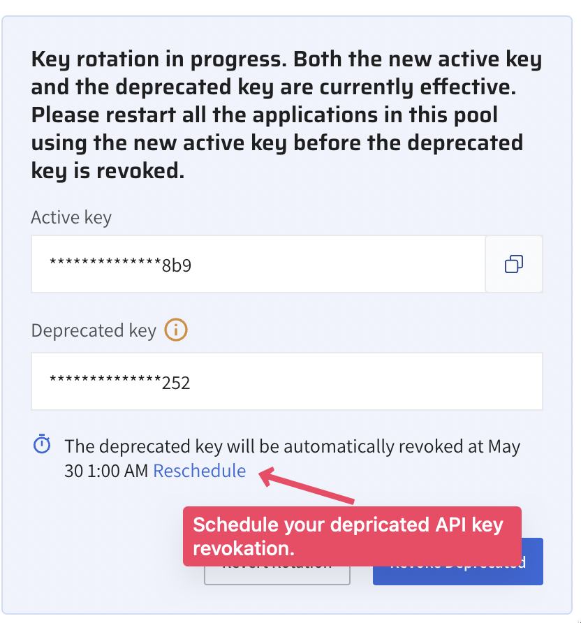
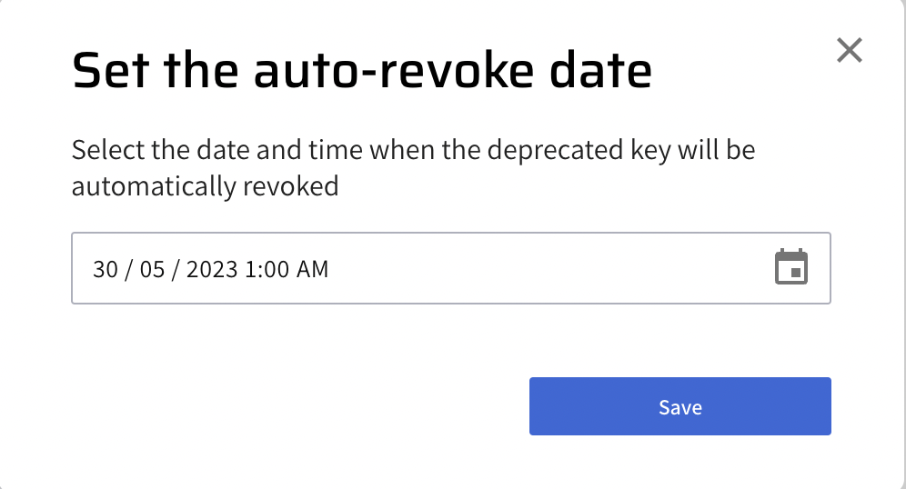

Lightrun users with the System administrator or Group administrator role can:

- [Create agent pools](#create)
- [Manage agent pools](#manage)
- [Agent Pool Key Rotation](#key-rotation)

!!! note
	Users with Group administrator role can only create or manage agent pools assigned to groups they are associated with.

## Create agent pools {#create}

###### To create a new agent pool

1. Log in to your Lightrun account.
2. Click **Settings** on the top right-hand side of your screen to navigate to the Settings dashboard > **Identity and Access Management** tab.
3. Select **Agent Pools** to open the **Agent Pools** page.
4. Click the **+ Create new agent pool** button on the top right-hand side of your screen to open the **Create agent pool** dialog.

	

5. Complete the fields with the relevant details.

  * Name: Enter a unique name for the agent pool.
  * Description Optional, Enter a description for the agent pool.

6. Click **Create Agent Pool** to create the new agent pool.

## Manage Agent Pools {#manage}

###### To edit an agent pool
1. Log in to your Lightrun account.
2. Click **Settings** on the top right-hand side of your screen to navigate to the Settings dashboard > **Identity and Access Management** tab.
3. Select **Agent Pools** to open the **Agent Pools** page.
4. Click on the agent pool you want to edit to open the **Edit agent pool** side sheet.

	

5. Complete the fields with relevant details.
6. Optional, click the **Detach agents** button to disable all agents currently associated with the agent pool. 
7. Click **Save** to save your changes.

## Agent Pool Key Rotation {#key-rotation}

Lightrun supports rotating Agent Pool API keys to improve security and protect agent data. When an Agent Pool API key is rotated, a new API key is generated, and the old key is deprecated. This allows admins enough time to replace the old key with the new API key across their systems, after which the old key is revoked.

###### To initiate Agent Pool Key rotation

1. Log in to your Lightrun account.
2. Click **Settings** on the top right-hand side of your screen to navigate to the Settings dashboard > **Identity and Access Management** tab.
3. Select **Agent Pools** to open the **Agent Pools** page.
4. Click on the agent pool whose API key you want to rotate to open the **Edit agent pool** side sheet.
5. Click the **Management** tab to display the Agent Pool's active API key.
6. Click **Rotate** on the right side of the active API key.

	The Intiate Key Rotation dialog opens.
	

7. Click **Rotate** to start the API key rotation process.

A new API Key will be generated, while the former active key will be deprecated and scheduled for revocation. Note that your deprecated API key is still effective until revocation; this is to allow admins enough time to replace the old key with the new API key across their systems.

###### To reschedule your API key revocation

1. Click **Reschedule** to open the **Set the auto-revoke date** dialog
	

2. Select a specific date and time.
	

3. Click **Save** to reschedule the deprecated key revocation.

!!!note
    Once a deprecated agent key has been revoked, agents using the deprecated key will no longer be able to connect to the Lightrun server.

###### To manually revoke your deprecated API key

1. Update your servers with the new API key.
2. Click the **Revoke Deprecated** button to revoke the deprecated API key manually.

###### To revert key rotation

- Click **Revert Rotation** to revert the key rotation process.

	When you revert your API Key rotation:

   - The new active key is revoked, and agents using it can no longer connect to the Lightrun server.
   - The deprecated key reverts to the active key.
