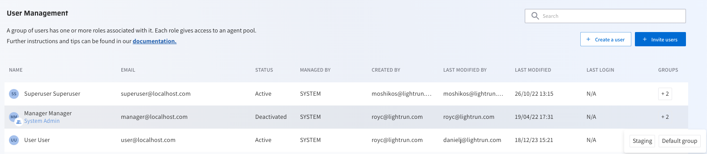
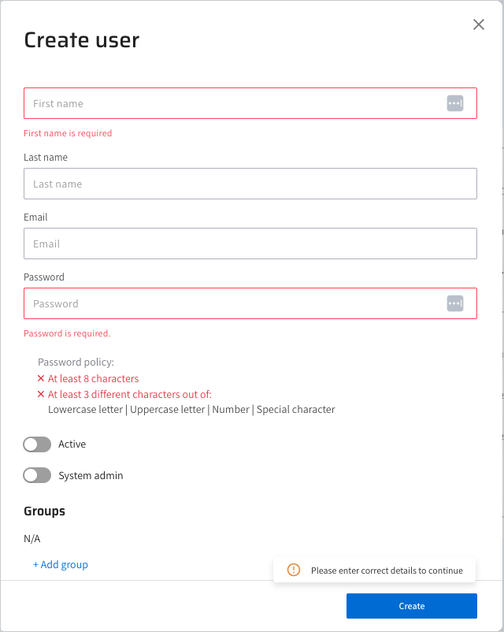
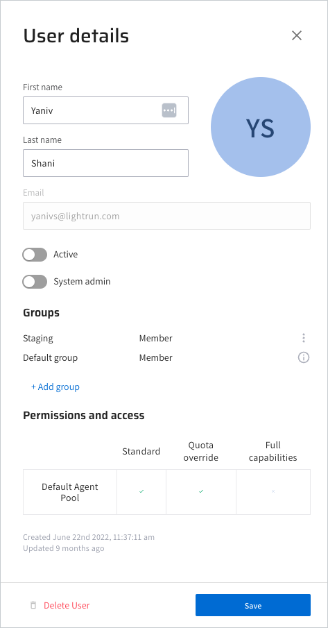

# Manage users with RBAC

--8<-- "ux-reference/manager-role-only.md"

!!!Note 
    This topic pertains to users operating in an RBAC environment. For information on configuring users in a non-RBAC environment, see [Manage Users with Basic Access](/manage-users).
 
[Lightrun Role-Based Access Control (RBAC)](/rbac/overview) helps you manage how users in the organization access resources and use Lightrun. With RBAC, you can control who has access to your Lightrun resources (such as agents), what level of access they have (e.g, setting agent quota limitations), and which resources they can access. 

When you add and activate a user, they are associated with the default group. This group is linked to the default Agent Pool and inherits its associated roles. To grant users additional permissions to a user, add them to a predefined group that includes the desired roles. For more information, see [Manage groups using RBAC](/rbac/manage-groups).

## Create a new user

You can manually add users to your Lightrun organization, one at a time. This is suitable for scenarios where you need to add a small number of users, such as when you're working in a small organization or when you want to add specific individuals. Lightrun also supports adding multiple to your organization using an email invite or a dedicated URL. For more information, see [Invite a New User](invite-a-user.md).

When adding users manually, you would typically enter the user's details, such as their name, email address, and any other required information, directly in the Lightrun Management Portal . The user will then receive an email requiring them to verify their credentials.

1. Log in to your Lightrun account.
2. Click **Settings** located at the bottom left corner of your Management Portal.
3. Select **Users** under **Identity and Access Management**. 
   The **Users Management** page opens.

  

1. Click **+ Create a user.**
   
   The **Create user** dialog opens.

  

4. Complete the fields with the relevant details.
5. Toggle the **Active** button to green to enable the new user.
6.  (Optional) Toggle the **System admin** button to green to grant the new user system administrator privileges.
7. (Optional) Click **+ Add group** and select a group from the dropdown menu that appears to add the new user to an existing group. For more information, [Manage groups using RBAC)(/rbac/manage-groups.md)

8. Click **Create**. 
  The user is added to the management user list and an email will be sent to the user to verify the account and then proceed to log in to Lightrun.

## Manage users

You can perform the following administrative tasks including viewing the status of your users, editing, or removing a user.

### View user status

In the **User Management** page, the following status indicators for each of the users is displayed to help know if your users are registered or not.

| Status      | Description                                                             |
|-------------|-------------------------------------------------------------------------|
| Active      | The user is active and completed the activation process.                |
| Deactivated | The user was disabled. The Active toggle is disabled in the User Details page. |
| Pending     | The user is active but has not yet completed the activation process.    |

### Edit a user

1. In the **User Management** page, click the required user in the user list.
   
   The User details pane opens.

  

1. Apply the changes and click **Save**.

### Delete a user

1. In the **User Management** page, click the required user in the user list.

  The User details pane opens.

2. Click the Active toggle to deactivate the user, and click **Save**.
3. Access the User details pane again.

  The **Delete User** option is active and appears in red.

4. Click **Delete User**.
5. Click **Save**.

## Next steps

Add users to groups to assign roles beyond the standard ones. For more information, see [Manage groups using RBAC](/rbac/manage-groups).

