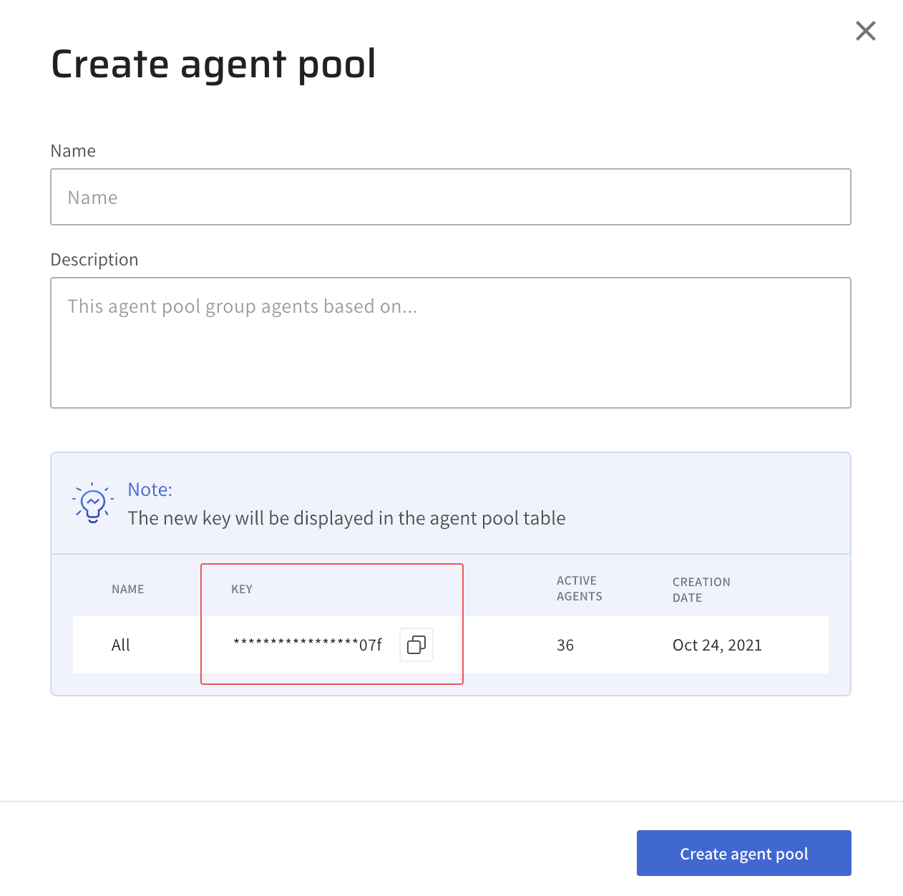

# Set up your Lightrun organization

This tutorial will walk you through setting up a Lightrun account for your organization.

## Before you begin

- This guide is for managing users with the Lightrun Role-based access control feature.
- The Lightrun Role-based access control feature is only available to users on our Enterprise plan; please contact our [support team](https://go.lightrun.com/contact-us) for more information. 
- Make sure to read the [User management concepts](/rbac/concepts/) guide before starting this tutorial to have a basic understanding of how user management works in Lightrun.

## Get your Lightrun account

The first step in this tutorial is to get a Lightrun account set up for your organization by a Lightrun representative.

You are assigned a default group and agent pool when you set up your Lightrun account. The default group has a standard role with access to the default agent pool. When you add a new user to your organization, the users are automatically assigned to the default group. The guide will teach you how to create more groups and agent pools.

## Add users to your Lightrun Organization

The next step after getting a Lightrun account for your organization is to add your team members to the Lightrun organization. You can create a user for each team member or send them an email invite.

??? info "Create a user"
	To create a new user:

	1. Log in to your Lightrun account.
	2. Click **Settings** on the top right-hand side of your screen and navigate to the **Identity and Access Management** tab.
	3. Select **Users**.

		The **User Management** page opens with a list of existing users.

	4. Click the **+ Create a user** button to open the **Create User** side sheet.

		

	5. Complete the fields with the relevant details.

	  * First name - The first name of the new user.
	  * Last name - The last name of the new user.
	  * Email address - The email address of the new user.
	  * Password - A secured password for the new user. Note - The password must have eight characters, and at least three characters must be a lowercase letter, uppercase letter, number, and special character.
	  * Optional, Toggle the **Active** button to green to enable the new user.
	  * Optional, Toggle the **System admin** button to green to grant the new user system administrator privileges.
	  * Optional, Click the **+ Add group** button and select a group from the dropdown menu that appears to add the new user to an existing group.

	6. Click **Create** to create the user.

??? info "Invite a user"
	You can access the Invite new users page in two ways:

	1. Log in to your Lightrun account.
	2. Click **Invite member** at the bottom left corner of your Management Portal to open the Invite new users page.

	**OR**

	1. Log in to your Lightrun account.
	2. Click **Settings** on the top right-hand side of your screen and navigate to the **Identity and Access Management** tab.
	3. Select **Users**.

	The **User Management** page opens with a list of existing users.

	4. Click the **+ Invite users** button to open the **Invite new users** page.

	

	The invite new users page has two sections.

	- **Invite new users**
	- **Pending Invites**

	1. Copy and send the invite link to the users in a secure manner of your choice, or
	2. Enter the intended email addresses separated by commas and then click **Send**

	Once the user receives the invitation, by mail or through the invite link, they will be redirected to a registration page. They can create their account and log in to access their Management Portal.

	Invited users who have registered their accounts can be seen on the **User Management** page. The list of your pending invitations can be seen in the **Pending Invites** section.

## Create groups and assign roles

A group represents a group of users in Lightrun. With groups, you can manage access to agent pools for multiple users instead of each user. For example, you can create a group for your RnD team and grant access to specific agent pools related to RnD activities in your system.

The amount of access a group has to an agent pool depends on role assigned to the group. There are two roles provided by Lightrun.

- Standard role
- Privileged role

For more information about roles and how to work with Groups, see [Groups](/rbac/groups/).

??? info "Create a group"
	To create a group:

	1. Log in to your Lightrun account.
	2. Click **Settings** on the top right-hand side of your screen and navigate to the **Identity and Access Management** tab.
	3. Select **Permissions & Access**.
		
		The **Permissions & Access** page opens with the Groups and Roles tab.

	4. Click on the **Groups** tab to access a list of existing groups.
	5. Click the **+ Create new group** button to open the **Create group** dialog.

		

	6. Complete the fields with the relevant details.

	  * Name: Enter a unique name for the new group.
	  * Role: Select the group’s role. A role determines how much access a group has to its agent pools.
	  * Agent Pools: Optional, Allow access to one or more agent pools.
	  * Group members: Optional, Add users to the group.

	7. Click **Save** to create the group.

??? info "Add users to a group"
	To add users to a group:

	1. Log in to your Lightrun account.
	2. Click **Settings** on the top right-hand side of your screen and navigate to the **Identity and Access Management** tab.
	3. Select **Permissions & Access**.
		
		The **Permissions & Access** page opens with the Groups and Roles tab.

	4. Click on the **Groups** tab to access a list of existing groups.
	5. Click on the group to open the **Group settings** side sheet.

		

	6. Click **+ Add member** on the right-hand side of the **Group members** label to open the **Add members** dialog.

		

	7. Enter the user name or email in the search field. 
	8. Tick the checkbox next to the user, and click **Add members** to add the selected user to the group.
	9. Click **Save** to save your changes.

## Create Agent Pools and assign access

Agent Pools are isolated groups of agents with a unique name and an API key. Lightrun agents can only be assigned to a single agent pool; hence agent pools provide a convenient way to securely isolate a group of agents from other agents in your system. For tips on what to know before creating and working with agent pools, see [Agent Pools](/rbac/pools/).

To allow users in a group to debug with agents in an agent pool, the group must have access to the agent pool. Lightrun users with System administrator or Group administrator roles can create new agent pools or grant a group access to an agent pool.

??? info "Create Agent Pools"
	To create a new agent pool:

	1. Log in to your Lightrun account.
	2. Click **Settings** on the top right-hand side of your screen and navigate to the **Identity and Access Management** tab.
	3. Select **Agent Pools** to open the **Agent Pools** page.
	4. Click the **+ Create new agent pool** button on the top right-hand side of your screen to open the **Create agent pool** dialog.

		

	5. Complete the fields with the relevant details.

	  * Name: Enter a unique name for the agent pool.
	  * Description Optional, Enter a description for the agent pool.

	6. Click **Create Agent Pool** to create the new agent pool.

??? info "Assign agent pools to groups"
	To grant a group access to an agent pool:

	1. Log in to your Lightrun account.
	2. Click **Settings** on the top right-hand side of your screen and navigate to the **Identity and Access Management** tab.
	3. Select **Permissions & Access**.
		
		The **Permissions & Access** page opens with the Groups and Roles tab.

	4. Click on the **Groups** tab to access a list of existing groups.
	5. Click on the group to open the **Group settings** side sheet.

		

	6. Select the preferred agent pool in the **Agent pools** dropdown.
	7. Click **Save** to save your changes.

## Complete your set up
To complete the setup, we will add agents to our agent pool.

To add agents to an agent pool:

- Change your Lightrun secret key to the agent pool API key on the server where your application is running. 
- Save the Changes and restart your application to apply the new changes.
- Re-run your Lightrun agents to apply the new configuration. 

## Verify things are working
Ideas for checking that your users are configured correctly:

- Go to your **Permissions & Access** page to confirm if your users and agent pools are assigned correctly and everything makes sense.
- Have your users log in to their Lightrun account to see if they have access to agent pools associated with their assigned groups.
- Have your users confirm that they do not have access to agent pools that are not associated with their assigned groups.
