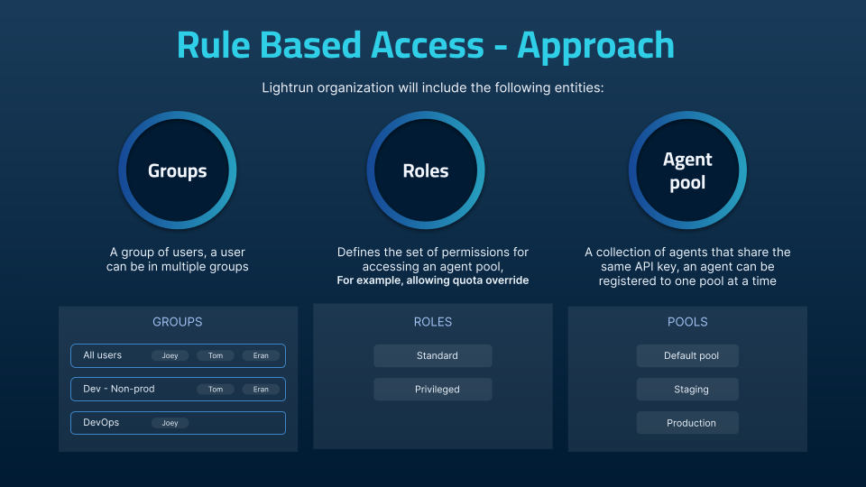

# Lightrun Role-Based Access Control (RBAC)

!!! Note
    
    You need a Lightrun Enterprise plan to use the Role-Based Access Control (RBAC) functionality. For more information, see [Pricing](https://lightrun.com/pricing/).

!!! role "Permissions"

    Security management requires administrative permissions.    

Lightrun introduces an enterprise-grade security functionality through its Role-based Access Control (RBAC) feature. Designed to enhance both the security and governance of users and agents in your organization.

Lightrun role-based access control (RBAC) helps you manage how users in your organization access and use Lightrun. You can control who has access to your Lightrun resources (like agents), how much access they have (I.e., can limit agent quota limitations), and what resources they can access.

The benefits of implementing Lightrun RBAC in your organization are as follows:

- Enhanced Security: Lightrun introduces an enterprise-grade security functionality with the RBAC feature and was designed to enhance both the security and governance of users and agents in your organization.

- Efficient Resource Allocation: By assigning roles and permissions with Lightrun RBAC, administrators can ensure that employees can perform their job functions while limiting access to unnecessary resources.

- Enforced Separation of Duties: RBAC can help organizations enforce the principle of separation of duties, which is critical for maintaining security and preventing fraud. With RBAC roles and permissions can be precisely assigned to distinct individuals.

## Lightrun RBAC practical use cases

The following are a number of use cases illustrating what you can achieve with the Lightrun RBAC feature:

- Replicate your organization’s hierarchy in Lightrun: You can organize your Lightrun users into groups based on their position in your organization and assign group-based access. For example, you can create a group for your Product team and grant them Privileged access to all agent pools in your organization.

- Control access to Agents: By organizing your Lightrun agents into agent pools, you can regulate who has access and the extent of the access to the agent pools using groups and roles.

- Allow user groups in your organization to debug independently:Organizing your users and agents into groups and agent pools allows users to debug independently from other users. This streamlined approach makes scaling and managing of troubleshooting efforts easier, particularly as your team expands

## Understanding groups, roles, and agent pools

To debug with Lightrun, you must have a Lightrun agent running alongside your application. As your organization and codebase grow, so will the number of agents and users. It is important to be able to effectively manage how users in your organization interact with the Lightrun agents running in your system.
For new users in your organization to debug with Lightrun, they must be part of a group with access to an agent pool. The amount of access a group has to an agent pool depends on the role assigned to the group.

### Groups

A group represents a group of users in Lightrun. With Lightrun groups, you can manage users that all need the same access and permissions to a particular resource, like an agent pool. For example, you can create a group for your DevOps team and grant privileged access to all DevOps-related agent pools to the group instead of adding permissions for each individual user.
When you register a Lightrun account for your organization, you are assigned a default group that comprises every user in your organization. Users with a System admin role can create, manage, and delete groups. System admin users can also assign other users in their organization Group admin roles to help manage a group. 

#### Lightrun built-in group roles

Lightrun group roles are predefined and are not editable. With Lightrun group roles, you can configure a Group's permissions to its agent pool. There are two group roles currently available in Lightrun:

- Standard Role: The standard role grants regular access to an agent pool. This includes creating Lightrun actions with the agents in the agent pool, full access to action data, etc.

- Privileged Role: The privileged role grants a group the ability to ignore agent quota limitations in addition to the permissions granted by the Standard role.

In addition to the role assigned to a group, individual users can also be assigned elevated roles. Elevated roles grant group members more privileges than others. For example, a DevOps group might have a standard role, but a single user can be granted an elevated privileged role. This elevated privileged role allows them to perform certain actions, like ignoring the preset agent quota limitations, which other group members cannot.

To learn more about groups, see [Manage RBAC Groups](/rbac/manage-groups/).

### Agent Pools

Agent Pools are isolated groups of agents with a unique name and an API key. Lightrun agents can only be assigned to a single agent pool; hence agent pools provide a convenient way to securely isolate a group of agents from other agents in your system.

You are assigned a default agent pool when you create a Lightrun account for your organization. Lightrun users with a System admin or Group admin role can create new agent pools, or grant groups access to an existing agent pool. To add agents to an agent pool, use the API key assigned to the agent pool as your Lightrun secret key. The agent will be assigned to the desired agent pool by the Lightrun server.

To learn more about Agent Pools:

- [Get Started with Agent Pools](/rbac/pools/) 
- [Manage Agent Pools](/rbac/manage-pools/)

## How does RBAC group access work?

1. By default, when users are added to the organization, they are assigned to the Default Group and have standard privileges to the default pool.

2. To create additional granularity, you can create different groups who can have access to specific Agent Pools and can have different roles on the allocated agent pool.

3. In addition to the role assigned to a group, individual users can also be assigned elevated roles. Elevated roles grant group members more privileges than others. A DevOps group might have a standard role, but a single user can be granted an elevated privileged role. This elevated privileged role allows them to perform certain actions, like ignoring the preset agent quota limitations, which other group members cannot.
   
Let’s see an example, the following organization has 5 groups of users - Developers, TLs, DevOps, QAs and the Owner. All the users belong to the Default Group, have the standard role and have access to the Default Pool.

- Developers and TLs (Team Leads) are both assigned to the Dev-Non-pro group and are assigned Privileged roles to the Local and Staging Agent Pools. 

- DevOps and QAs are members of different groups - DevOps and QA but both have Privileged roles on Staging.

## What’s next

- [Manage users with RBAC](/rbac/manage-users/)
- [Manage groups with RBAC](/rbac/manage-groups/)
- [Agent Pools overview](/rbac/pools/)
- [Manage Agent Pools](/rbac/manage-pools/)

