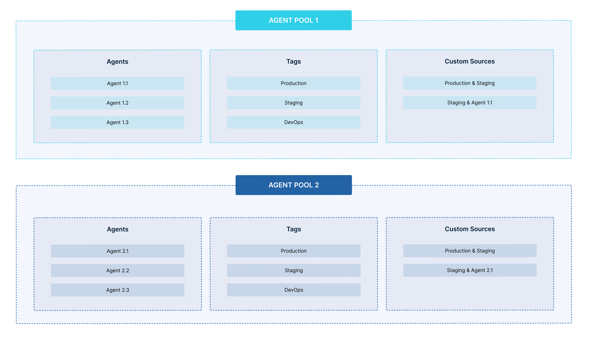

# Agent Pools

Agent Pools are isolated groups of agents with a unique name and an API key. Lightrun agents can only be assigned to a single agent pool; hence agent pools provide a convenient way to securely isolate a group of agents from other agents in your system. 

You are assigned a default agent pool when you create a Lightrun account for your organization.  Lightrun users with System admin permissions can create new agent pools, and grant groups access to an agent pool. To add agents to an agent pool, use the API key assigned to the agent pool as your Lightrun secret key. The agent will be assigned to the desired agent pool by the Lightrun server.

## What to know before working with agent pools

### Groups grant users access to agent pools

Before a user can access agents in an agent pool, the user must be part of a group with access to that agent pool. The amount of access the user has to the agent pool depends on the role assigned to the group. There are two roles in Lightrun.

- **Standard Role** - The standard role grants regular access to an agent pool. This includes creating Lightrun actions with the agents in the agent pool, full access to action data, etc. 

- **Privileged Role** - The privileged role grants a group the ability to ignore agent quota limitations in addition to the permissions granted by the Standard role. 

!!! note
	Lightrun roles are predefined and are not editable.

### Tags and Custom sources are unique to agent pools

Tags and Custom sources are unique to agent pools. Actions added to a tag in an agent pool will not reflect in another tag with the same name in a separate agent pool. Agent pools are fully isolated from one another.

